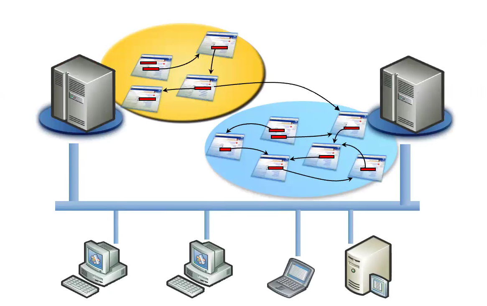
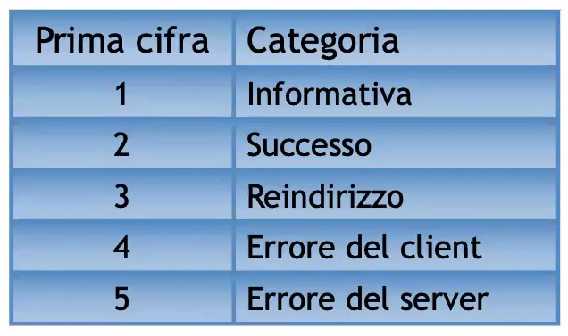
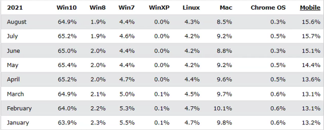

# Description

30 sept. 2025 - Introduction

## Past projects and "Concorso Accattivante Accessibile" presentation

Extensive look at the course project, its past editions and the "Concorso Accattivante Accessibile" contest.

## Summary

1. Hypertext, WWW and Internet concept.

2. W3C (World Wide Web Consortium)

3. Client-Server architectures and Internet Protocols

## Internet

INTERconnected NETworks: interconnected webs of webs; 
We call "best effort" Internet the current state of the Internet: using TCP/IP protocol we can guarantee a reliable but not efficient communication

ISP (Internet Service Provider) is the entity who provide the physical connection service

Web: a huge set of softwares and protocols installed on different computers; in an abstract way we can define it as a set of interconnected documents.

The more distributed the infrastrcature gets the slower it tends to become.

## HTTP Protocol

It's pretty simple, it establishes a connection between client and server in order to exchange documents; 
Every document is uniquely identified via an URL: these linkings can be inside the document, between same-server documents and even different-servers documents.

When we type an URL into our brower's address bar it automatically send to the destination server a GET command with the URL we typed and the protocol version

Others:
1. POST: execute specified document
2. HEAD: return head-relative informations
3. PUT: replace the specified document with attached data 
4. DELETE: delete the specified document

When the server receive our request it replies with:
1. The requested resource
2. Current state
3. Verbose error 

The possible state are:

4** and 5** errors code are the ones we must treat in some way

Static pages are only computed on server-side, on the counterhand dynamic pages are also computed on client-side (JS or similar): clearly, this introduce some differences in efficency and speed;
We should delegate as much as possible compute to the client-side (JS sanity checks, error detection etc..) to avoid server-side bottlenecks.

W3C is an independent organization which comphrends a lot of big players in software devolpment for the web such as  Google, Intel, AOL, Apple etc...
It proposes large spectrum standard for a great number of web-related technologies: HTML, XHTML, CSS,...

It usually offers:
1. Standard definition: reccomendation
2. A test suite for the implementation (testsuite)
3. Validation service

## OS, Browser and Resolution statistics

W3C bases these statistics are "false" because they are mainly from developers
This tells us a good practice: never develop for a "specific" type of OS or Browser because they tend to evolve during a website lifespan.

At this point in time we do not need to disable JavaScript support to test our website!
(Only for security purpose and ranking)

