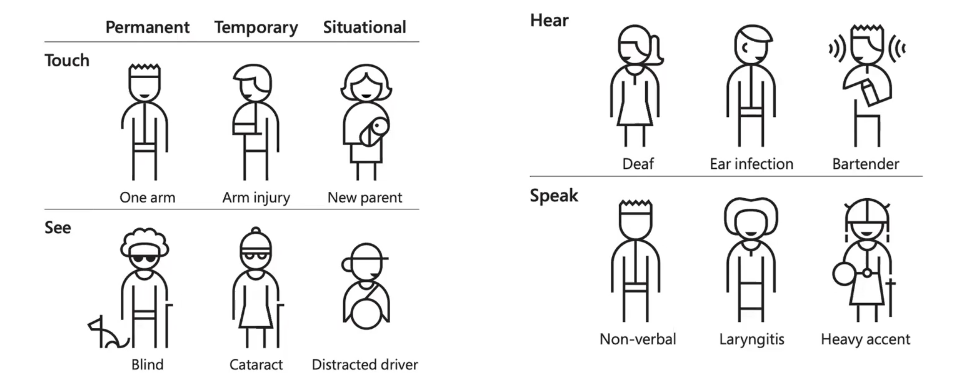

# Description

28 oct. 2025 - Accessibility part 2

## Accessibility

This is the definition of Microsoft for inclusive design

### Disadvantaged user classes

1. Blind, deaf, move, or unable to interact with a certain type of data
2. Text reading/comprehension difficulties
3. Unable to use mouse/keyboard
4. Having small screen or a slow connection
5. Not fluent in the document's language
6. Unable to use their senses in certain type of situations (eg. handbags, dirty hands, disco, bar, pool, etc...)
7. Old OSes/Browsers

### Cognitive disabilities
1. Intellectual disabilites
2. Autistic-spectrum disabilities
3. Attention-span disorders(ADHD) / hyperactivity
4. Specific learning disorders 

## Accessibilty and legislation

Accessibility is usually seen as a good practice to apply when developing a website which allows EVERY user to be able to consult it;

For the governative website, accessibility become a mandatory target:
1. Italy, for example, forces every public administration to make their website accessibile (WCAG 2.1)
2. In Europe, WCAG 1.0 and 2.0 are standards for accedssibility rating

### Obligations for public administrations

1. Every public administration must publish its "accessibilty goals" for the current year by the 31st of March
2. Every public administration must conduct a comprehensive analysis about their webpages and to fill out the "accessibility declaration"
    - it must be reachable by the website footer
    - it must contain a feedback mechanism

### Obligations for privates

Every private entity with a 3-years average sales of 500mln€ has to:
1. Fulfill the "accessibility declaration" by 2030
2. Make every new product or service accessible-ready by 2030

They must then adapt every product/service antecedent to 28th of June 2025 to the new accessibility standards.

## WAI (Web Accessibility Initiative)

It is one of the most relevant initiatives in the accessibility field, it is part of W3C and its core purpouse is to make the web universally accessible;
Its purpouse is to:
1. Define guidelines (reccomendations) to ensure an accessible web;
2. Ensure that W3C proposed standard and technologies are accessible (Flash wasn't approved by WAI)
3. Promote research and formation about this topic

### WAI Reccomendations

Every guideline is composed by:
1. The number
2. The goal
3. The logic behind the guideline and some categories of interested people
4. A list of accessibility criteria

Every list is composed by:
1. The number
2. The goal
3. The priority
4. Side notes, examples and crossed references
5. A section about its implementation

We would only learn the principle behind some of them to understand the logic.

### Priority
The priority level is based upon the impact on accessibily:
1. Priority 1: the developer MUST adhere to the accessibility criteria (no access at all)
2. Priority 2: the developer SHOULD adhere to the accessibility criteria (some access)
3. Priority 3: the developer COULD adhere to the accessibility criteria (better experience)

The conformity level goes from nothing (unacessible), and from A to AAA (respects every priority level)

The priority level required is AA because AAA is too expensive (cost wise and developing wise), often apply to a single category of users and others would be damaged.

## WCAG, 4 principles
A web service is accessible when it is "POUR":
1. P: Percivable
4. O: Operable
2. U: Understandable
3. R: Robust

- Percivable: images must have an alt-text and videos must have subtitles 
- Understandable: menu must keep the same order
- Robust: must adhere to the standards and must be used on every device (and accessible-friendly eg. screen-readers), how it handles errors (no standard 404, but instead use custom error pages)
- Operable: it regards the interaction between the user and the website (keyboard, mouse, touch etc...)

## Design principles (Principi di progettazione)

1. Ensure an elegant transformation: the website must adapt to every situation that means having a solution for images, big vs small screens etc...
    - Structure must be separed from its presentation
    - Always provide a text alternative for every non-textual media
    - Create documents that can be understood even if the user can't hear or see (using other senses)
    - Do not create hardware-specific solutions
2. Make the content understandable and browsable (navigabile): it primarly means to understand the target and how to interact with it (crystal-clear language, easily understandable mechanisms, don't confuse the user etc...)
    - Provide the page with navigational aids and orientation aids (eg. tab navigation)
    - Remember that not everyone is able to use visual indications such as scrollable bars, attached frames, etc...
    - Remember that big tables, menus or lists can't be fully understood by people who use maginifer, small screens etc..
