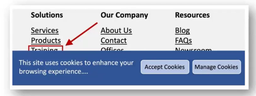

# Description

3 Nov. 2025 - Accessibility part 3

## Accademical project

This first section of the lectrure was mainly focused on explaining the project's core, limitations and constraints.

## Equivalent content

Two or more contents are called "equivalent" when they provide the same outcome for the user (more or less, with inability limitations included), and they are particularly important for people affected by disabilities;

Since the text content can be presented to the end user via vocal synthesis, braille or visual text, the guidelines require "equivalent content" even for graphical and audible content.

Non-textual "equivalent contents" (eg. audible descriptions (music, background noise, etc..),  hands gesture video explaining the content etc..) improve accessibility for other categories of people like blind individuals, cognitive inable individuals, etc...

The worst case is CAPTCHA which is not accessible.

## Guidelines for POUR

### Perceivable

1. Provide text alternatives for audio/video
    - Provide equivalent content that has the same meaning as the audio/video content
    - Provide alternativves for sounds, images, films etc..
    - Providing equivalent non-textual content (images, videos, audios) is beneficial for some users especially illiterates and people with reading disease
2. Do not rely on the color only
    - eg. using colors to mark visited links might be unaccessible for people with b/w monitors or daltonic peole
3. Mark documents with correct structural elements: using table for impagination denies accessibility and navigation for specific softwares

### Understandable

4. Clarify natual languages use
    - Use markers to make pronunciation and interpretability easier for abbreviated or foreign texts. This helps vocal synthesis softwares and braille devices which can automatically select the new language
    - Developers should spell out the abbreviations
5. Provide documentation for contestualizing and understand complex pages or elements
    - It can be difficult for people with cognitive or visual disabilities to understand complex pages
6. Provide clear navigation mechanisms
    - Provide navbars, website maps, more informations etc.. can be helpful for the user to find what he's looking for

### Roubst

7. Ensure that pages using new technologies are transformed in an elegant way 
    - Web pages MUST be accessibile even if new technologies are disabled or not supported
    - Using newer technologies isn't always the best practice
8. Create tables that transforms in an elegant way
    - Use correct marking for tables which must be used only for truly tabular data
    - Ensure the table navigation for interpeters
9. Use temporary solutions
    - Use technologies that allows assistive technologies to work properly
10. Use W3C technologies and reccomendations
    - Many non-W3C formats like shockware and PDFs requires plugin or standalone applications

### Operable

11. Ensure that the user can control content changes across the visit
    - Moving, flashing, scrollable or self-updating content must be temporarely or definitely stopped (max 3 update per seconds, screenreaders can't read them)
12. Ensure direct accessibility to embedded user interfaces
    - Every functionalit must be independent from the device used, possibility to interact using keyboard, vocal commands etc... also for embedded objects

## WCAG 2.2

WCAG 2.2 introduces 9 new criteria:
1. Always show focus positioning
2. Focus must be perceived by anyone and should be understood when it gets moved
3. Minimum dimensions for interactive elements
4. Autocomplete for redaundant informations
5. Accessible drag&drop
6. Consistent aids
7. Accessible authentication

Bad example for 1st criteria

