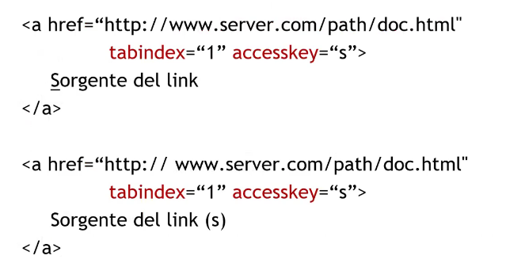

# Description

4 Nov. 2025 - Accessibility part 4

## Accessibility: from theory to practice

### Texts
---
1. Use semantic markup correctly
2. The language used must be as clear as possible
3. Use:
    - Bulleted list explanations
    - Interline (1.4.12 (Perceivable), 1.5 interline level AA)
4. Avoid:
    - Scrolling o flashing text
    - Complex fonts
    - Underline non hypertextual text
    - Useless redacted text 
    - Pay attention to dimensions and colors
 
In order to correctly choose the font for your website rely on this parameters:

### Correct headings
---
Headings must respect their numerical order to define priority into the pages and can be visually edited via CSS. It is very important to respect their order for accessibility and navigation.

2.4.6 (Operable) level AA

### Numbers
---
Numbers, like texts, can be source of problems for people affected by dyscalculia which can have trouble with:
1. A payment, calculate the change correctly
2. Time and appointments management
3. Read and understand percentages, fractions, very long numbers etc...

Use the following points as suggestion for number's accessbility:

1. Use integers instead of floats when no decimals are used (eg. 20€ vs 20.00€)
2. Very big numbers must be written by text
3. Use accessible fonts (eg. one that marks the difference between 0 and O)
4. Avoid percentage because they're less accessible (4 out of 10 instead of 40%)
5. Provide reminder for saved appointments 
6. Do not remove or plan a last minute meeting
7. Do not use timeout for forms fulfillment, instead promote autocomplete features

### Links
---
1. Users MUST be able to recognize links he alredy visited
2. It is very important to use appropriate anchor definitions:
    - "Click here"
    - "Continue"
3. Introducing some differenciators can help the user to estimate the time needed or the destination:
    - Internal vs external links
    - Typed links (link tipizzati?)
    - Show file dimensions in case of a download link
4. Links MUST be uniquely recognized
    - Half-closed eyes test (Drue Miller)
5. Avoid pop-ups
6. Links MUST be accessible for users with disabilities or with older devices:
    - Correct use of images
    - Define a correct tabulation
    - Use of accessKey

Tabindex and accessKey:

