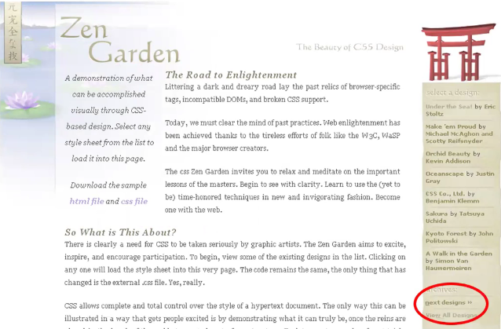
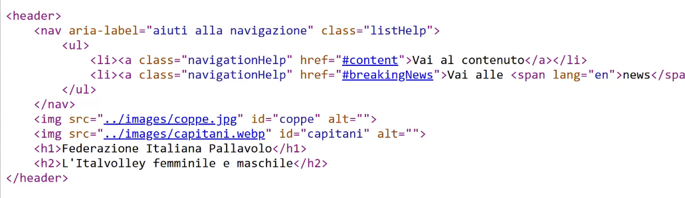
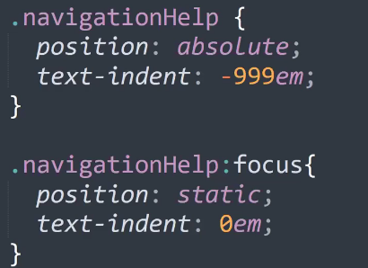
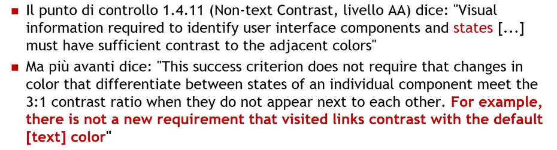
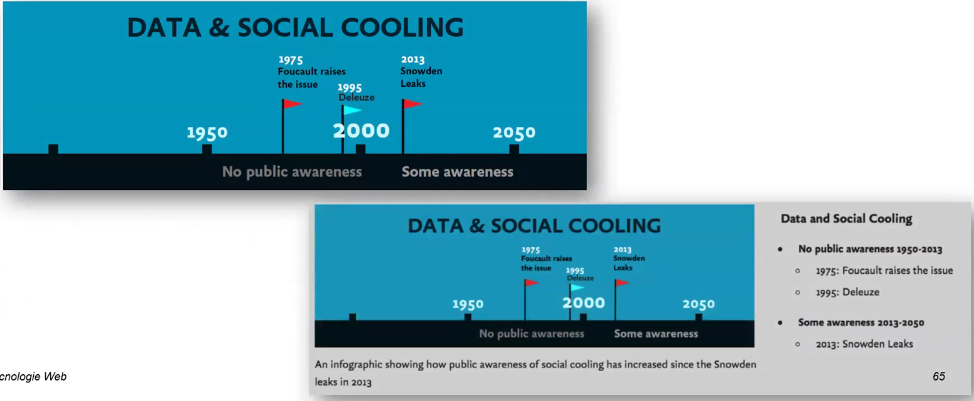
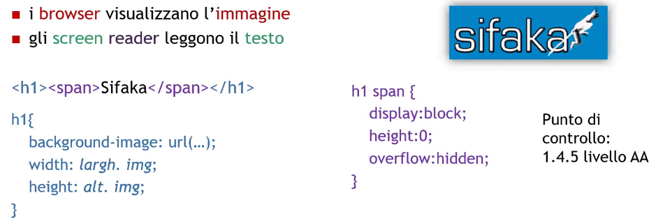

# Description

5 Nov. 2025 - Accessibility part 5

## accessKey example

Today its use is no longer promoted since in the past few year every software, operating system etc.. deployed their own keybinds which makes harder for us to decide a new key to associate to our accessKey

## Other suggestions for screenreaders

Inside the header we can define a class "navigationHelp" using an unordered list we can skip directly to the page sections (doing so we help screenreaders dont letting them read the header every time we switch page)

If we want this to active only on the tab pressure we can use the :focus state in CSS to move it from an hidden default location (text-indent = -999em) to a visible location

1. REQUIRED: ability to skip header and menu
2. Adjacent links MUST be separed by at least a blank

## Distinguish between visited and unvisited links

This is a WCAG grey area

For the accademical project you must use different colors between visited and unvisited links, the contrast ratio must be at 3:1

## Buttons

There are 4 ways to create a button (but only one is preferrable):
1. input type="submit"/ >
2. button type="submit" />
3. Using a + CSS + javascript
4. Using div + CSS + javascript

Only the first two works using the space button;

Divs do not receive focus on tab pressing (only if using tabindex) and requires more work in Javascript to allow it to sent modules and interact with the keyboard. 

Both "a" and "div"s require the role="button" to be accessible, etc..

## Images

Only images related to the content should be inserted using img tag, on the other hand, every image that is related just to the layout should be inserted as a background image.

You must always define meaningful atl attributes:
1. Logo
2. Empy alt for layout-only images
3. Do never trust autogenerated alts

Do not use maps images, especially on the server-side

On this example the first one obviously need an alt-text, wheter the second one explains everything and an alt-text would be redoundant

## Image replacement
 
It is a tecnique used to provide a graphic alternative for a text, replacing it using CSS images

PROs: 
1. The page remains accessible and easy to index
2. The graphic is preserved
3. We use web standards instead of ad-hoc solutions
4. It is possibile to edit images just by editing the sylesheet

### First solution
The first solution is:
1. Base idea: hide the text and place an image as background image for the empy container
    - Browsers show the image
    - Screen readers can read the text

