# Description

10 Nov. 2025 - Accessibility part 6

## Image replacement

### Second solution
The second solution is to:
1. Keep the separation bewteen content, structure and presentation (only h1)
2. Add a background-image in CSS 
3. Move the text-indent to -999em

PROs: 
1. Still indexed by SEOs and readable by screen readers
2. Keep the separation

CONs:
1. If the images are disabled nothing will work (doesn't happen that often)

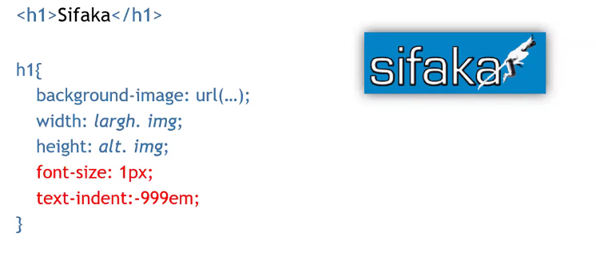

### Third solution
The third solution is to:
1. Create an h1 and a span
2. Set the h1 position to relative and font-size via CSS
3. Set the span position to absolute and align on the top:0 to cover the text 

PROs:
1. Fixes the disabled images problem

CONs:
1. Declare a useless span

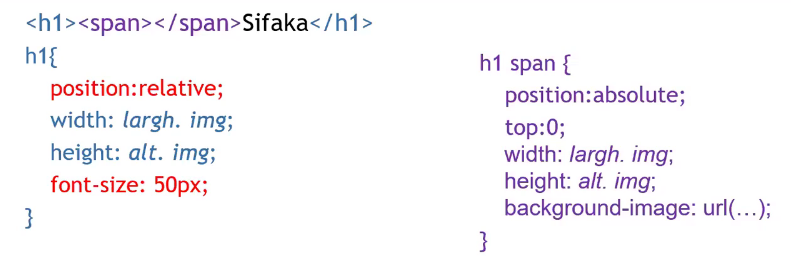

### Fourth solution

Equivalent to the second one:

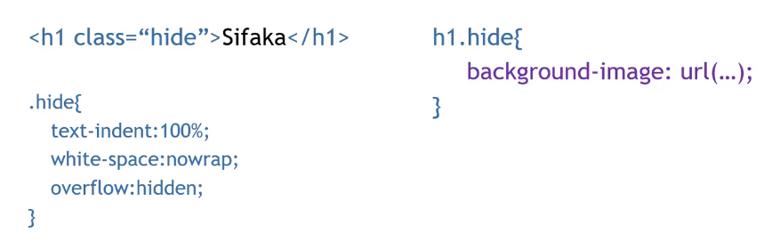

## Tables

Is always a good practice to avoid using tables to create a website layout.

The most relevant problem with tables is their two-dimensionality: understanding a cell's meaning just by the cell itself is really hard if we don't know anything about the table headings (screen readers linearize this tables making them impossible to understand using those tools);

Some suggestions:
1. Add an "aria-describedby" (HTML5) attribute to describe the table content 
2. Associate the headers to the cells ("scope" attribute)
3. Associate the cells to the headers ("headers" attribute)
4. Define abbr for headers ("abbr" attribute)

### Accessible table example

This is what we want to create:
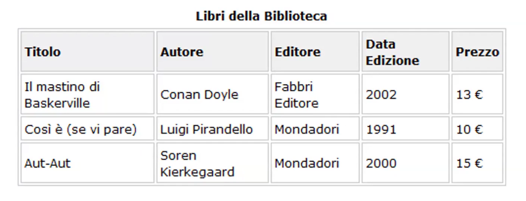

How to implement it in XHTML:
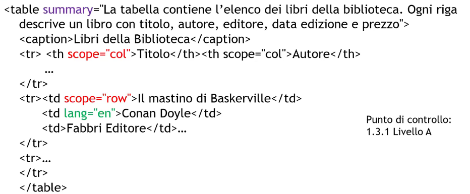

And finally how to implement it in HTML5:
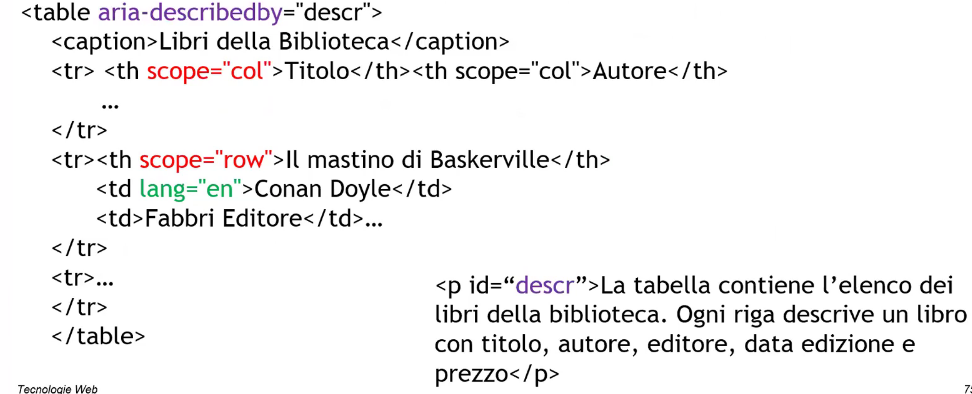

Scope is much more supported by the screen readers (and also is the only one required for the exam);

It is very important to use abbreviations even when using "scope" to make the screen reader act faster, preferably use scope and abbr on just the headers because it gets read many times.

## Responsive table (Aaron Gustafson)

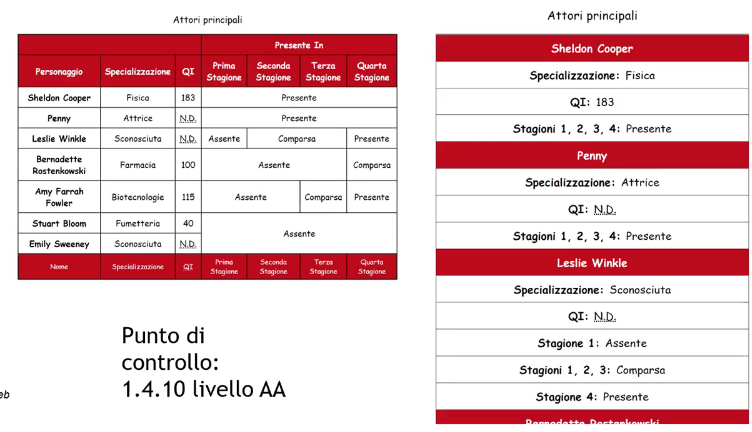

1. Every cell has a "data-title" attribute that represent the column heading
2. On smaller screens, CSS:
    - Transform every "tr" and "td" into a block element so that they can be seen one for each row (display:block)
    - Don't show headers (thead)
    - Add an heading to each cell using the "data-title" attribute (with the content property)

Here is an example of HTML implementation:
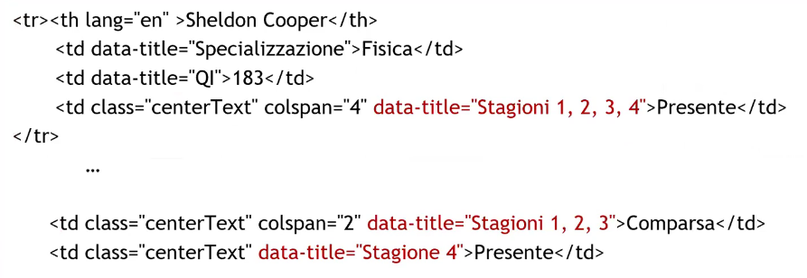
And its CSS implementation:
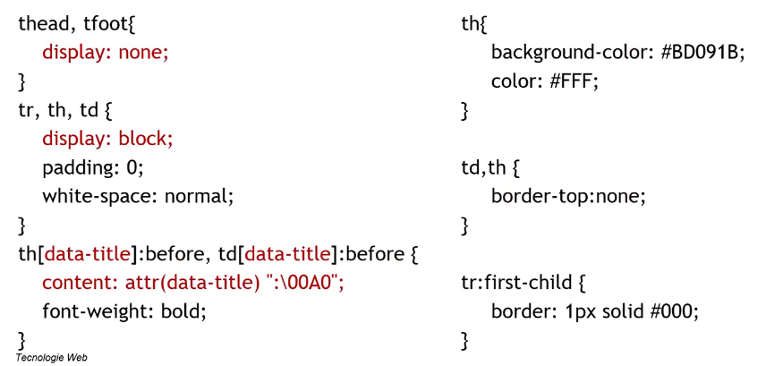

This allows us to make a two-dimensional table act like a mono-dimensional one

## Forms
In order to create an accessible form you have to:
1. Always add a label (label) for each form's field, and it is very important for radio buttons and checkboxes
2. Group entries with optgroup and fieldset
3. Use tabindex and accessKey in an appropriate manner in "input", "textarea" and "select" tags
4. Use "title" to provide more informations
5. Provide contextual aids (mandatory fields explanation, wrong input explanation etc...)
6. Ensure that every error is revertable

### Pay attention to the mandatory fields

Using only * to force the user into fulfilling those fields isnt enough without a proper implementation ("aria-required", "required" preferred)

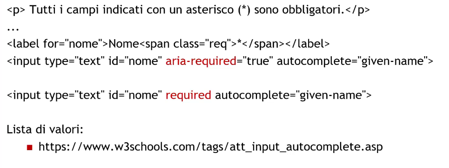

## Colors

Colors are one of the most controversial topics, make sure to:
1. Check if the page is accessible even for color-blinded people
2. If an information is only understandable by colors make sure to reinforce it (eg. bold or italic for links)
3. Avoid referencing colors within the text (eg. "Click on the yellow button")
4. The contrast ratio is always at least 3:1 or even better 4.5:1

Colors must be only for an aesthethic reasons!

Some useful websites: 
https://www.topal.com/designer/colorfilter, https://color/a11y.com/

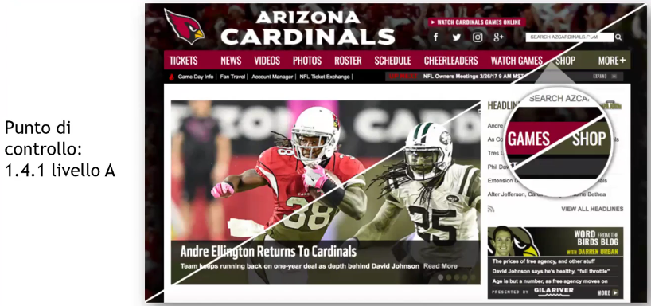