# Description

11 Nov. 2025 - Accessibility part 7

## Color properties

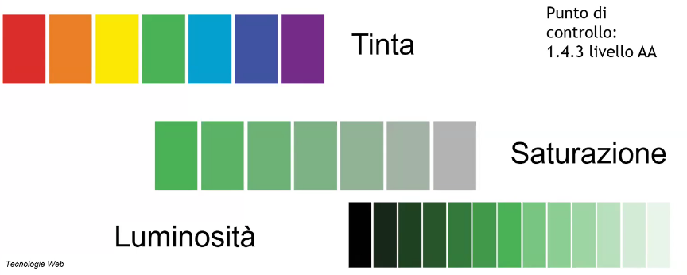

The text is bigger than 24pt the required contrast is 3:1 

Those two seems to be completely different colors but in reality their contrast ratio is only 1:1, to fix it you should raise the contrast settings on one of them and lower it on another.

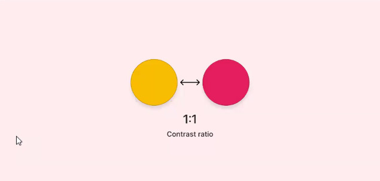

Those followings are the different types of contrast we can get:

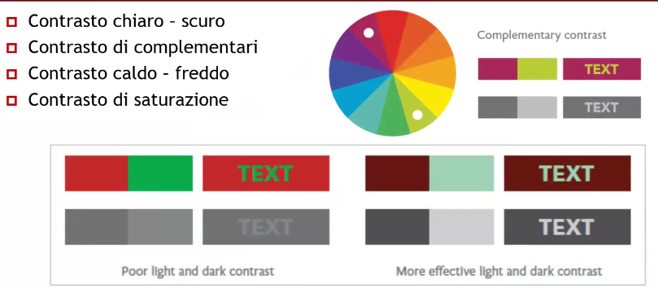

Using the following example we can see how people with colorblindness experience it:

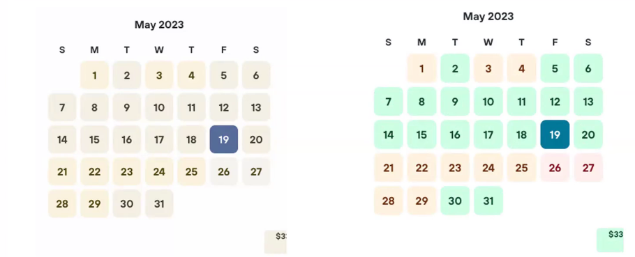

Here we can see how choosing 2 colors on the same side colorwheel behaves when make them B/W 

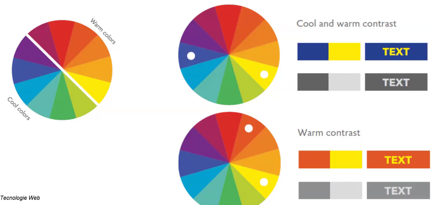

Using saturations as a way to differntiate colors doesn't work well:

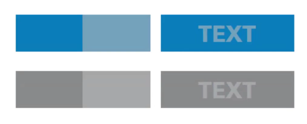

### CUDO - Color Universal Design Organization palette

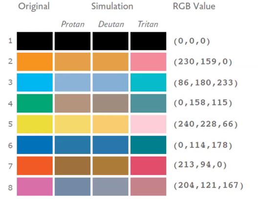 

Using each column as a palette we have an 8 colors palette that provide a good contrast, and their visualizations by colorblinded people

### Brian Suda palette

The following palette helps colorblinded people and behaves well on printings due to its grey tones degradation

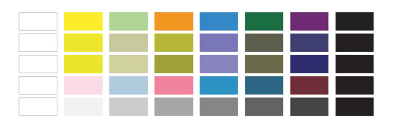 

## Stronger contrasts

We should avoid using much contrasting colors (eg. black text on white background) because it stresses our eyes way too much. 

Instead use grey text on white background to easen the contrast step.

Dark modes provide better contrast by default and use less power on OLED screens.

## Pay attention to images

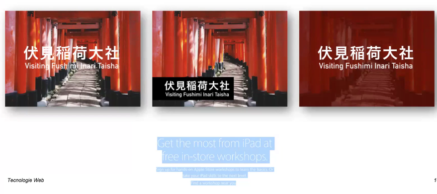 

We cannot be assured that the text placed above an image is going to stay there in every situation, therefore we can use both solutions seen in the previous example:
1. Add a background box just for the text area so that we can confidently trust that the contrast will always remain the same
2. Add an overlay covering all the image size

Remember that if we are using an image as background to set the page color to a similar color so that in case of a network failure etc... causing the image to not be properly displayed we can be assured that the contrast ratio will be preserved!

You can use this tools to test colors:

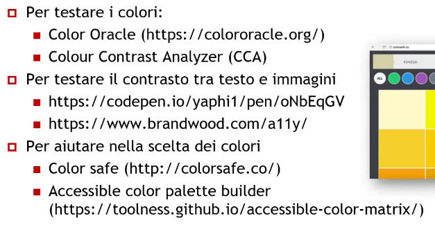 

## Animations

2.2.2 and 2.3.3 accessibility criteria require that the user have full control over the animations

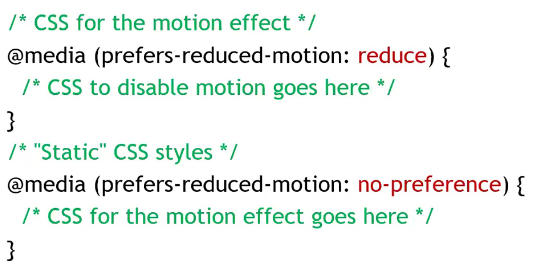 

Those are browsers parameters set by the user, we should then incapsulate our animations code inside those 2 blocks to provide both alternatives!

## WAI-ARIA

Web Accessibility Initiative - Accessible Rich Internet Applications is a W3C standard

It is particularly indicated for interactive webpages, developed using HTML5, Javascript and Ajax to ensure their compatibility with screenreaders.

They define rules, states and property for every interactive widget and assign a semantic role to every page component;

Their main focus is to provide additional information for general tags (eg. to create a creative button you cannot use a button tag but instead a div and Javascript: WAI-ARIA allows you to define that generic div to be read and interacted from screenreaders like normal buttons do)

### Roles

Every HTML element has its own implicit role, eg. link

The role attribute allows us to make it explicit, it defines which is its role and in many cases it duplicate the semantic HTML tags;
eg. role=enavigatione (nav>), complementary (aside), etc..

Or you can define new roles: role="banner", "search", "tabgroup", "tab", etc...

Using HTML5 tags is always preferrable.

Some examples:
1. alert: it indicates the contents which must be istantly reported to the user
    - eg. forms compilation errors togheter with aria-relevant
2. alertdialog: as the previous one but the focus is shifted towards an internal element
3. presentation: it elides the semantic value of an element. It is primarly used to hide elements from assistive techs (doesnt work on "a" and "button")
    - eg. a map with its description aside can be hidden by the presentation attribute
4. menubar, menu, menuitem
5. img, math
6. Full roles list on https://www.w3c.org/WAI/PF/aria/roles

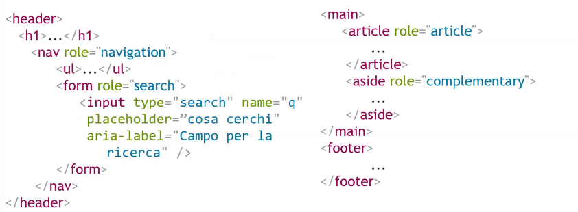 

### States

States define special properties that describe the current element conditions;
eg. aria-disabled="true", aria-relevant="all"

States can generally vary during the software lifecicle tipically using Javascript.

### Properties

Elements properties can be used to add meaning to the element itself:
1. aria-required = "true"
2. aria-labeledby = "label" allows to assign and ID to an element and then use that element as a label for every other element in the page, even for multiple elements at the same time;
3. aria-label
4. aria-describedby: used to describe relations between elements
5. aria-selected: used to indicate a selected item (eg. tab)

### Accessibile table in HTML5

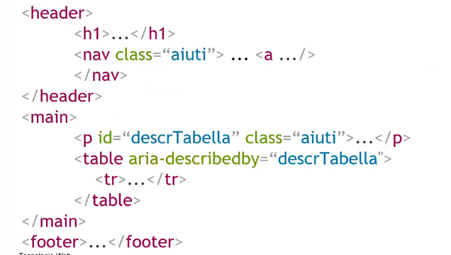 

## ARIA rules
1. If you can use a specific HTML element or attribute is preferrable over every generic element with ARIA role
    - eg. main> instead of div role="main">
2. Do not change and element semantic if not strictly necessary
    - eg. div role="tab">h2> tab text /h2> /div>
3. Every ARIA interactive elements must be keyboard-friendly
    - eg. make sure that everything that has role="button" role, it must be reachable by the keyboard
4. Do not use role="presentation" or aria-hidden="ture" on elements that can be reached by focus, otherwise users can land their focus on null elements (use tabindex="-1" instead)
5. Every accessible element must have an accessible label (label> or aria-label)

## CAPTCHA 

They must be avoided in any way possibile because they're totally unacessibile!

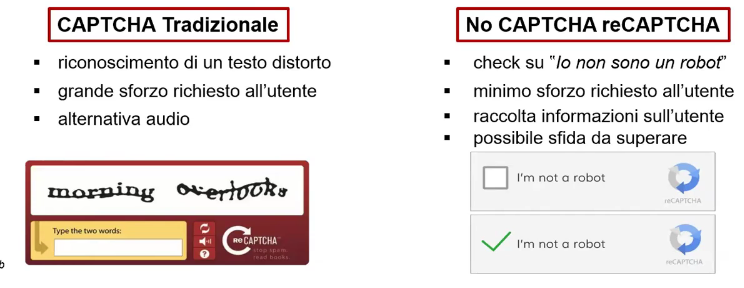 