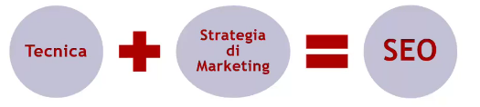
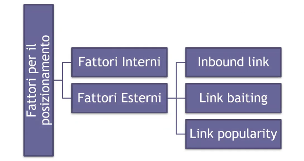
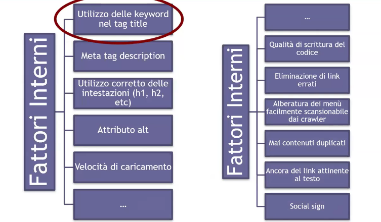
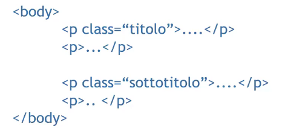
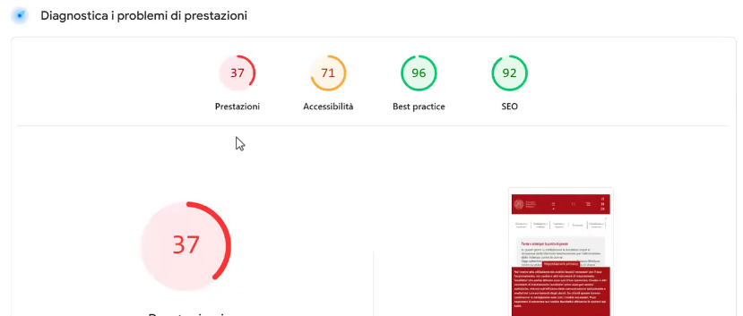
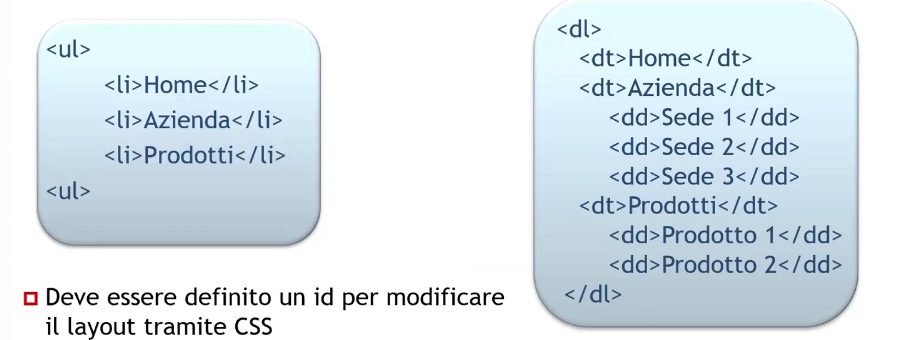
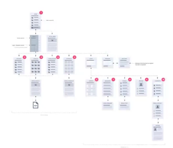
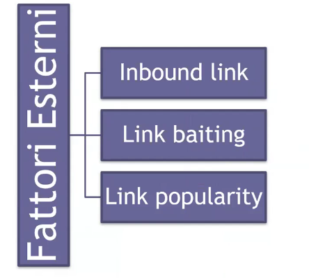

# Description

17 Nov. 2025 - SEO and web design part 1

## SEO - Search Engine Optimization

SEOs defines every optimization activity we do on a website in order to achive better rankings on search engines

SERP: Search Engine Response Page

### Website optimization

The optimization process can be devided into 3 phases: 
1. Technical optimization: this activity allows search engines to access and index the website contents
2. Content creation
3. Content promotion: every activity involving link gathering form trust-worthy sources

## Positioning meaningful factors

Positioning meaningful factors can be devided into 2 catregories:

## Internal factors

Titles and description should be optimized too:
1. Title metatag optimization:
    - Max 55 chars (blanks included)
    - Insert a keyword at the beginning
    - Write in a captivating way
2. Description metatag optimizations:
    - Max 145 chars
    - Must be short and should include a call-to-action
    - Must contain keywords 

### Correct text formatting

Some bad habits:
1. Using br/> tag
2. Edit p> style to emulate headings 
3. etc..

Text mark must be coherent with its semantic meaning, avoid doing this:

### Page loading speed

Google offers "PageSpeed Insights" which helps developers get some insights about their page's loading time.

The most important metrics on this tool is the speed parameters especially for mobile!

Example: 

### Navbar

A navbar is basically a list of links and you should define an ID to be able to edit the presentation via CSS

### Pages hierarchy

The website structure should be as flat as possible, allowing to reach every page in a just a few clicks.

Alternatively, the most relevant pages must be on the upper levels to allow them to be reachable from many links.

## External factors

### Inbound links

Typically, upon a website relase many other websites will talk about it, link it in some ways etc... this creates a long-tailed curve which is the most typical function for a website release.

In case of a spike during the long-tail trait Google (or others SE) would investigate about it: if that spike can be explained by organic reasons everything is fine, otherwise SEs can even ban you.
    - Paticular events 
    - UI redesign
    - New feature etc...

### Link baiting

"Click here to know more about the A4 accident happened today.." and then there's no accident!

If SEs notice this they can obviously ban you.

### Link popularity

Inbound links also are featured with a popularity score based upon link referencing:
eg. UniPD math website could be displaying everything they want because it has an inbound link from UniPD website which it has and inbound link from MIUR

Clearly this links chaining suggests SEs that UniPD math website is really trust-worthy!

## Website design

44.12 min
