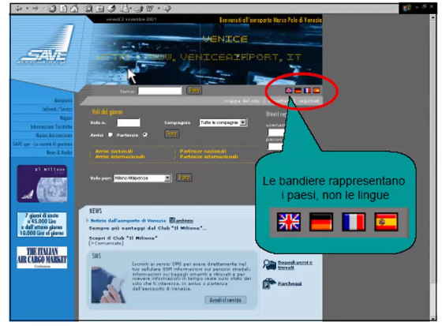
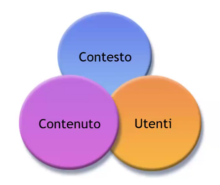

# Description

18 Nov. 2025 - Web design part 2, Web Design Principles part 1

## Designing 

### Models and Metaphors

A mental model (or conceptual model) is a physical system representation inside an executing software with a sequence of cause-and-effect association between input and output;

A model is not necessarely accurate but helps the user to foresee what's going to happen in certain situation.

The model is used for contextual analisys, understandings and decision making.

### Web mental models

Each user, during its navigation time carry on some sort of mental model:
1. Interactivity model (eg. big scrollbar means the document is short, small scrollbar instead we have a lot of scrolling to reach the document ending)
2. User expectations 
You have to keep in mind that the navigation is influenced by three main factors:
1. Document structure
2. Provided navigation tools
3. Browsing strategy:
    - Breadth first
    - Depth first
    - Random

The main rules are: 
1. It is very important to know external agreements and possibily stick to them
2. Use different agreements only if the return is worthy
3. Alway respect internal agreements (must be preserved between the website navigation)
4. Facilitate the creation of a mental map

Keep in mind that the click counter is fundamental in order to reach the target!

### Global and Local audience

1. Globalization or Internationalization
    - Process of creating a document that can be effective within different cultures, countries and markets without modifications
    - When the same website could be used in any country
2. Localization
    - Designing a document which aspect and content makes you think it was created from a person living in that specific country
    - When local versions of the same website are created

Changes:
1. Languages
2. Alphabets
3. Reading direction
4. Currencies
5. Addresses
6. Date and time formats
7. Measurements system
8. Culture
9. Social agreements

Here is an example:

 
Here is another one where flags are used for country referencing:

REMEMBER: Never use flags for language selection!

Regarding the accademical project we do not need any translation, we are just fine with the italian version.

## Web Design principles

Web Design action field is about content structuring and how the users can iteract with it;

Information Design is the combination of organization, storing, labeling, reseach and navigation systems for websites.

Internet give everyone the ability to publish informations and the responsability to organize it;

The core elements for Information Design are:

### Context, contents and users
1. Context:
    - A website architecture design should provide a tangible image of the promoting organization (mission, goal, strategy, etc...)
2. Contents: 
    - Including documents, applications, services, schemas and metadata
    - Worth-noting parameters are the author and the owner of the contents, their format, granularity, metadata and volumes
3. Users:
    - Exist a lot of personal preferences and relative behaviours for information research