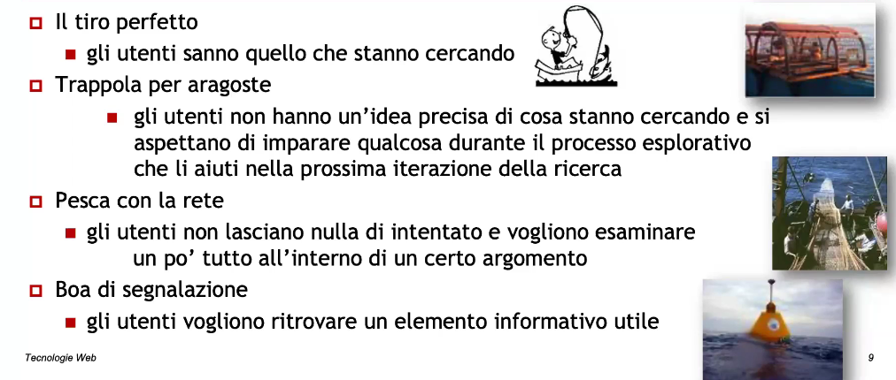
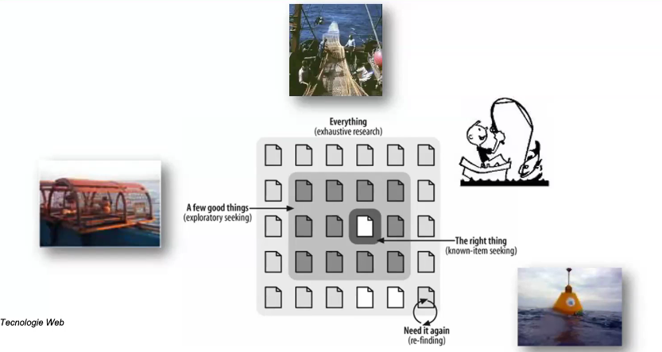
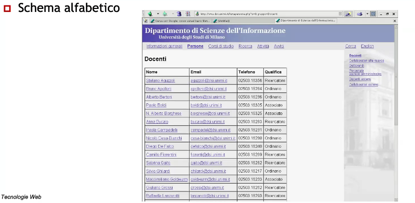
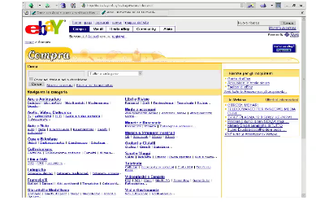
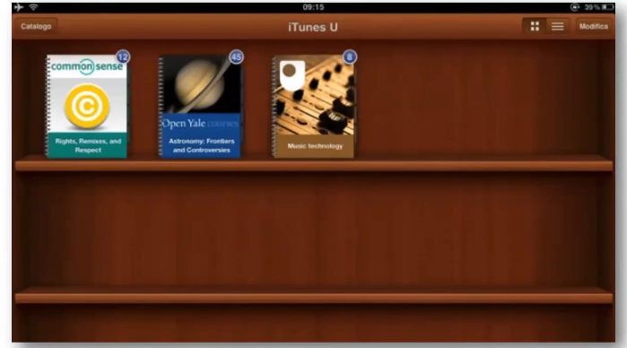

# Description

24 Nov. 2025 - Web Design Principles part 2

## Disorientation and cognitive overload
 
An excess of links and exploratory paths can discourage the user and cause them to lose sight of the purpose of the search.

### Users behaviour

The "too-simple" model:
1. The user asks for a question
2. Something happens (search or navigation)
3. The user gets a reply
4. Search ends

Limitations:
1. Users not always know what they actually want
2. Usually the search ends unsucessfuly or leaving the user only partially satisfied
3. Context gets ignored

### Fishing metaphor: what do users want?

IMPORTANT for the exam:

### How is the information found?

1. From the actual search
2. Exploring the website
3. Asking questions

Search and navigation must be integrated to support the user during his browsing;

Iteration: usually approximate results are found from the first search and informative needs may vary during the browsing.

Three fundamental steps:
1. Ranking
2. Navigation
3. Labeling

## Organize information
1. Organizational schemas:
    - They allow you to split the informational objects into logical grouping
    - Schemas can either be exact or ambiguous
2. Organizational structures:
    - Define the relation type between single objects (or groups) across the informational universe

### Exact organizational schemas

Informations are divided into mutually exclusive sections, which implies an easier design and maintenance;

Problem: it requires users to know the specific name of what they are looking for

For example: 

Alphabetical schemas

Other examples are: geographical schemas, conologically-ordered schemas, etc..

### Ambiguous organizational schemas

Informations are divided into sections, which implies an harder effort to catalgoue;

Its success depends on the initial design and the effort put into keeping the ranking system up to date, they are generally more useful than exact organizational schemas when the user doesn't what he is actually looking for.

Serendipity: the attitude for making fortunate and unexpected discoveries
1. The information research is always iterative and interactive
2. What we first found during our research process affect future iterations

Example: 

By topic

Other examples are: tasks, audience, methaphor driven (used to understand new links and familiar concepts)

### Hybrid schemas

The power of an hybrid scheme is to deliver an easy-to-understand mental model; 
When using hybrid schemas is mandatory to preserve every scheme integrity, presenting them in different ways across the page.

### Organize information drawbacks

1. Ambiguity:
    - Ranking systems are built upon a language that can be ambiguous
    - Ranking object and abstract concepts can be difficult
2. Heterogeneity:
    - Homogeneity allows a simple creation process for structured ranking systems (eg. library catalogue)
    - Many websites are heterogenous: they provide access to different level documents, granularity, and even using muliple formats.
3. Differences in perspective:
    - It is fundamental to put yourself in the users' shoes 
4. Political differences:
    - The ranking system choice can lead to a meaningful impact on a company perspective promoting the website

