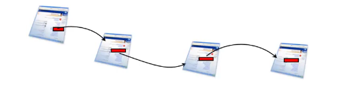
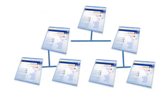
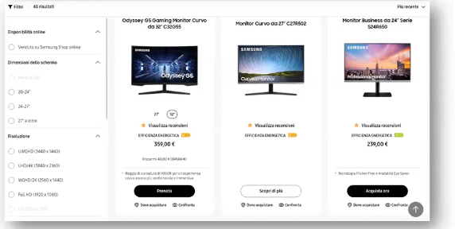
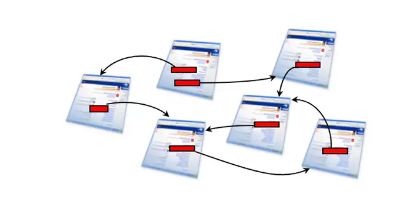
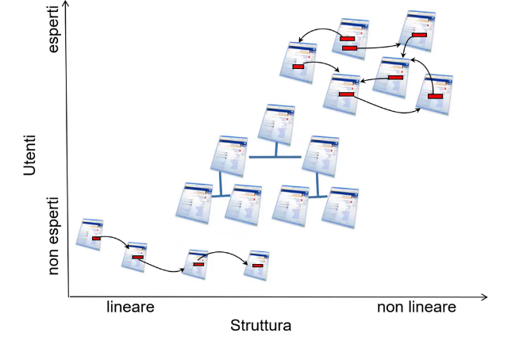
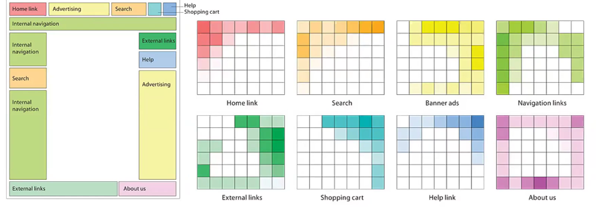
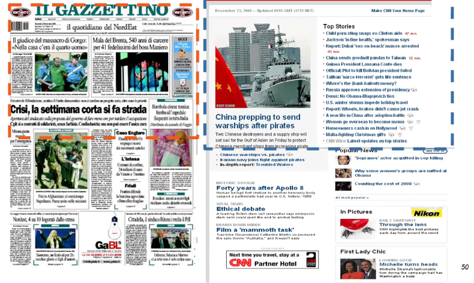
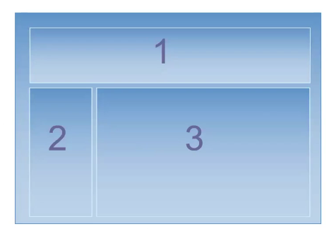

# Description

25 Nov. 2025 - Web Design Principles part 3

## Schemas vs Stuctures

Scheme: divides the different informational units into categories;

Structure: tells you how to navvigate between categories or within the same category;

Structure can be mainly based on 4 prototypes:
1. Sequence
2. Hierarchy
3. Matrix
4. Hypertext

### Sequence
The sequence structure is the most simple one and usually used on educational websites or wizard that guides you to the payout:

### Hierarchy
A well designed hierarchy structure is a magnificent informational architecture. The mutually exclusive sections and the father-son relations are simple and familiar.

If you use it for a website allows an easy-to-understand structure for users to build up their mental model 

It is mainly used for the main structure of the website so then you have to find a balance between width and depth of the structure:
1. Wider hierarchies lead to cognitive overload (never use more than 10 options in the main menu)
2. Deeper hierarchies lead to an excessive click counts (never go beyond 4 or 5 hierarchy levels)

Suggestion: wider and shallower hierarchies are easier to maintain

### Matrix
Every information within the website can be seen from different perspectives because it has many attributes that define it

Eg. a t-shirt can be catalogued base on its type, or its size, material, color etc..

### Hypertext
It is an innovative informational structure, should never be used as the core structure of the website because it is not linear (difficult for the user to create its own mental model), and links can connect informational units using a hierarchy or not

### Summary
---

### Schemas

1. Exact schemas are best suited when the user knows what he is looking for
2. Ambiguous schemas are best suited for navigation and associative learning and the user has a not-so-clear idea about what he is looking for

### Structures

1. Use the hierarchy structure as core structure
2. Adderess the sequence structure
3. Recognize homogenous and structured collections and use the hierarchy model on them
4. Use the hypertext structure to enhance the total structure flexibility
5. A matrix structural approach allows the access to the information from different point of view

## Hick's Law

This law establish that in order to take a decision the total number of possible choices (quantity) is less relevant than how those choises are presented (quality):
1. If there is a convenient way to organize the structure for the user, those structure should be wider rather than deeper
2. If that is impossible:
    - Unravel the menu upon different levels in order to be able to store coherent sub-items
    - Edit the menu in order to display only few relevant options

## The web designer job

The UI design regards two strongly linked aspects:
1. Layout design
2. Organize information

The schemas we've seen so far are mainly related to the second one but it is also very important that web designer and information designer work toghether.

On the other hand is only web designer duty to implement the UI and layout.

### Interface coherence 
Interfaces must be simple.

Designing for the web is very different from the printings:
1. Variable page dimensions
2. Heterogeneous hardware and software
3. Non-linear usage
4. Audience heterogenity

Interface should also be consistent: 
1. Predictable behaviour
2. Do not require to quit the environment to complete the task
3. Do not use mnemoic shortcuts

This following image shows where users expect to find the elements

### Displayed area issue

On a newspaper the upper half of the first page is the most visible, it is technically called "above the fold": most relevant informations are there shown and the advertisement there is much pricier

On the webpages this area corresponds to the visible portion on every device without using the scroll feature (which is the safe area on so much screen size possibilities?)

So what should be placed in here?
1. Fundamentals informational elements (core contents)
2. Fundamentals interactive elements (search box, hamburger menu)
3. Graphical identity items (logo)

### 3-panels-model: creating the context

Those panels answers the following questions:
1. Where am I?
    - Usually this information is found on the title
    - A well-chosen title (particular->general and short titles) can enhance the probabilities to be chosen
2. Where can I go?
    - Set of links within the page
    - In the 3-panels-model those are grouped on the navbar
    - Do not betray the user expectations (eg. The CSS language [pdf 100kb] => download link)
    - Navigation tools
3. What's the topic?

Other important (but not fundamental) questions to answer:
1. How I managed to get here?
2. Who manages this page?
3. Where can I find additional informations?
4. Other website-related informations