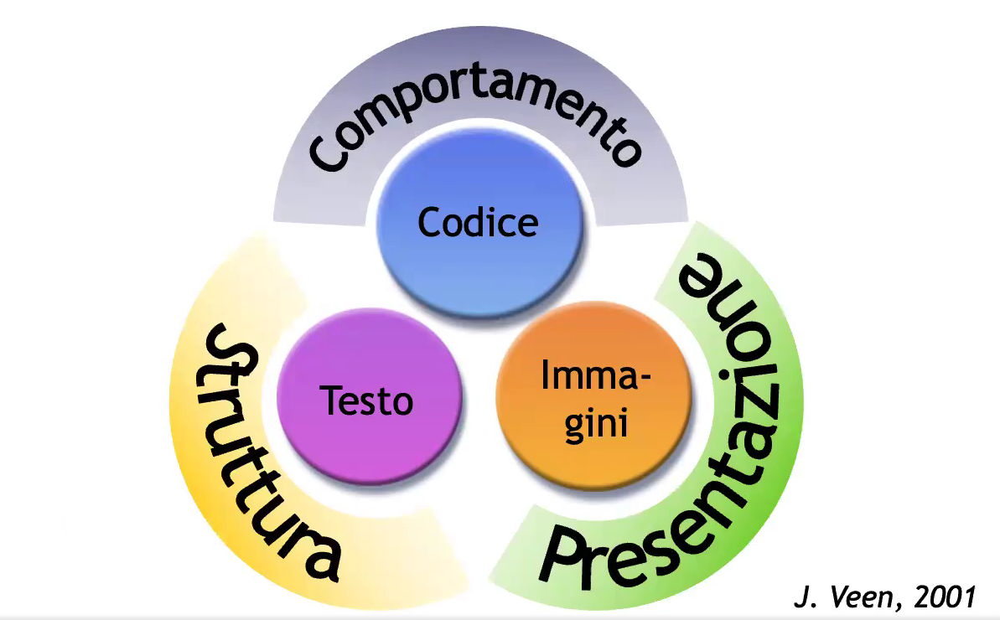
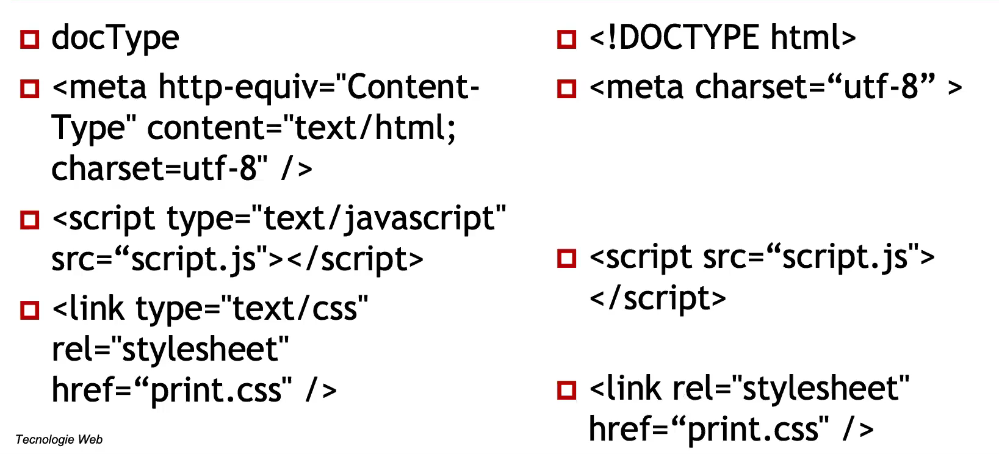
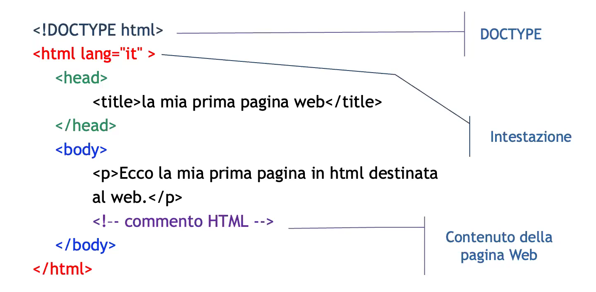
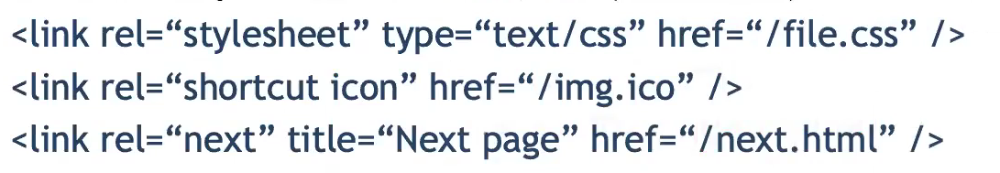
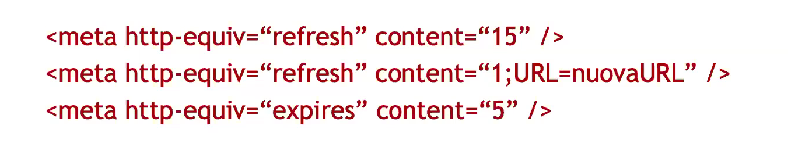

# Description

1 oct. 2025 - HTML5

## History

On January 2000 XHTML 1.0 gets defined and subsequently revised in 2002;
On July 2006 we get a working draft for XHTML 2.0: it had no backwards compatibility;
On July 2008 the XHTML Basic 1.1 became "reccomendation" for handeld and general web;

XHTML Strict is basically the core for the current HTML 5 standard.

## HTML5

WHATWG is a working group which created HTML5 in response to XHTML 2 which was a disaster in terms of compatiblity and non well oriented towards web applications.
Eg. GPS, Forms, Gyro, etc...

HTML5 is oriented towards webapp and making the web way more interactive giving birth to Gmail, calendars, many games etc...

It also introduced a new paradigm which is "In case of conflict, consider user over authors over implementers over specifiers over theoretical purity." that means "don't give a s*** about code theoretical purity";

The core objective is user quality of life rather than code "efficiency". 

caniuse.com is very useful to understand which platform and browsers can effectivily run your website smoothly.

## Innovations

1. Less strict syntax rules
2. Standard errors management
3. Canvas: interactive drawing area which are very useful when we want to display auto-updatable graphs 
4. API integrations
5. Embedded video and audio playback without any plugin
6. Standardized GeoLocation API by W3C
7. Supported Javascript multithread
8. Enabled off-line mode for pages/application use
7. Secure way to acccess a local database (eg. client-saved cart)

## Website elements

Structure/Content: HTML (text)
Presentation: CSS 
Behaviour: Javascript 

Backend: PHP 

This sort of standardization brings some advantages:
1. Browsers compatibility
2. Futureproof compatibility
3. Centralized control over presentation
4. Device independence
5. Better search engine positioning
6. Lighter pages
7. Accessibility 
8. (Better placement in the "web developer" market)

## XML syntax inherited from XHTML to HTML5

Tags and attributes are case sensitive;
Tags must always be closed (even the empty ones), and in the correct order;
The attributes insertion order is irrelevant and their value must always be written between "";
Every attribute must have a value.

Some semplification are: 

Ignored tags:
1. Breakline non identified by " " and not contained inside a "<pre>" tag
2. Multiple tabs
3. Nested "
" tags
4. Unrecognized tags
5. Comments (except for "--" which is an error)

Base HTML5 structure:

We as developer must define while into the first 512 lines the charset which for HTML5 is:
"<meta charset="UTF-8" />"

## Head section

Everything we define inside the Head section (except for the Title) are just instructions for the browser and won't be displayed to the user

1. Title (mandatory), link, meta, base, style and script
2. Link: defines the links with external resources (CSS, shortcut icon, etc..)
    - most common ones are "href", "rel" 
    - 
3. Base: defines the base link route (eg. " <base href="/myfolder/"/> ")

### META tags

The head section contains a lot of commands (called MetaCommands) which do no provide any visible page variation but are mandatory for others activities like validation and search-engine reading;
Those commands add more information about the content of the document we are creating, suchj as the author.

Do not exist any limitation regarding the number of MetaCommands

There are 2 types of META tags:
1. http-equiv
2. name

<meta name = "viewport" content= "width= device-width" /> to correctly adapt the viewport and CSS handling for mobile

#### http-equiv

The information gets processed as if it was coming from an reply header of a HTTP server, that means before the document

#### name

1. Description: brief description about the page contents. Mainly used when the page contains few text (eg. statistics)
2. Keywords: set of keywords, separed by commas
3. Copyright
4. Author
5. Robots: used to prevent page indexing. Value: index, noindex, follow, nofollow, all, none
6. Rating: content ranking

KEYWORDS MUST BE USED IN THE ACCADEMIC PROJECT

## Body section

The part between the <body> tags is called the document body; This section contains the real page itself. Here are inserted images, sounds, videos, text, links, etc..

The body section contains all the necessary tags for describing the structure of the document: MUST NOT be used elements that are relativve to the presentation

The core attributes (every tag can use them):
1. class: specify the class which the tag is from (it can be repeated between the same page)
2. id: just a label (unique for each page)
3. title: add a title to an element
4. style: CSS in-line instructions
5. event attributes in response to Javascript trigger: onclick, ondblclick, onmousedown, onmouseup, etc.. (ontouch to use onclick on smartphones)

id is more specific than classes, and can be used as an anchor directly from the URL 