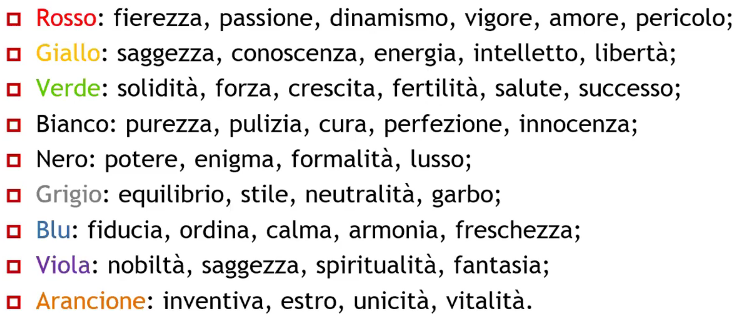
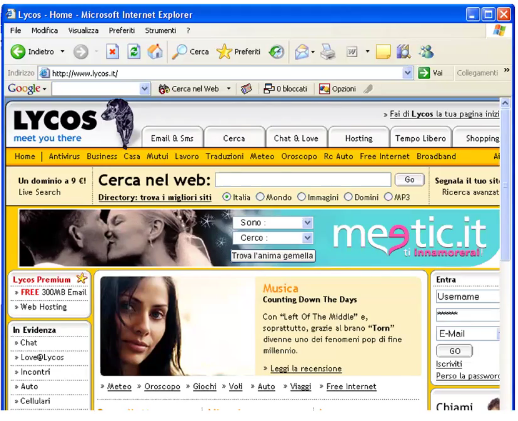
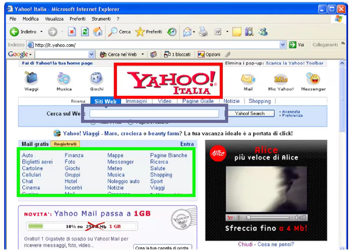
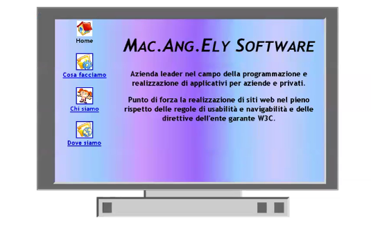
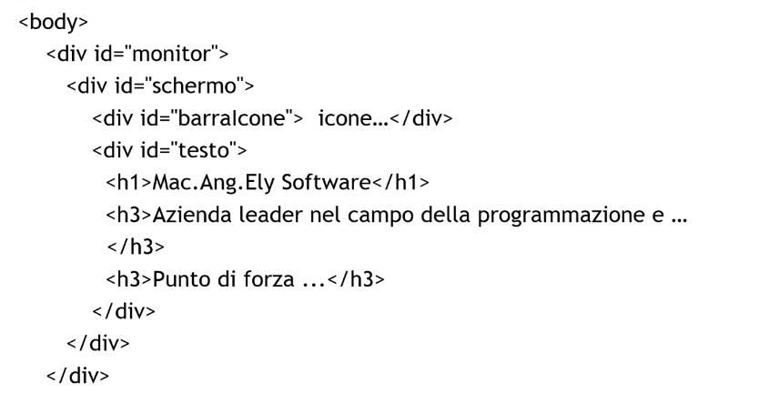
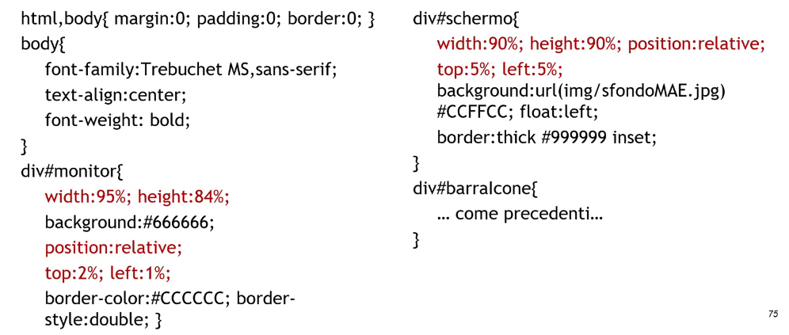
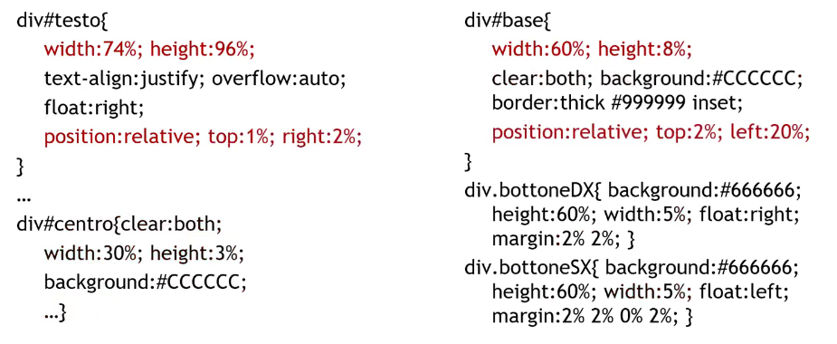
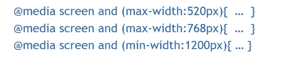
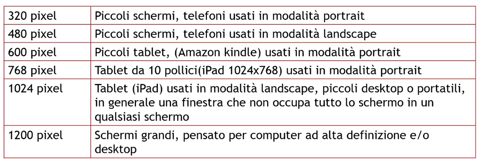
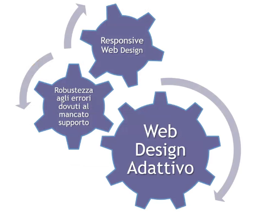

# Description

27 Nov. 2025 - Web Design Principles part 4

## Colors and cultures (West)

## Interfaces

### Tabs interface

It is a very commonly used convention because its recognizable by users (eg. photoshop), tipically every tab represent a different aspect of the same task:
1. Amazon: items to buy
2. Lycos: specific service

Users must have clearly in mind what they are looking for, keep it in mind!

You also have to pay attention to the tab placements because it can often happen (especially if there are many tabs) that you'd have to deal with the horizontal scrolling (AVOID!)

### LSD design interface

The directory services purpouse is to create a reasonable map about what's present on the web.

It is organized into:
1. Categories
2. Sub-categories

LSD stands for Logo, Search and Directory and it was based on simplicity (one learnt you can re use it on many website)

Eg. Yahoo

Today this layout is deprecated because managing directory became a mess since so many new topics appeard and made it impossible to fit all of them in a single page, for example Google is now only displaying LS (Logo and Search)

The search bar size suggests the user how long the input should be, so please be careful with it comes to deciding its dimensions!

## Fluid design

A fluid (or liquid) design give you the possibility to have different device specs and keep the page usability steady.

Every item is defined in % or em;

May vary:
1. Page dimensions
2. Supported characters
3. Supported colors
4. Supported images format

The solution it provides:
1. Relative positioning
2. Dynamic pages

### Other layouts

Hybrid layouts:
    - They use a mix of different measurments units for areas and characters
    - Advantages and drawbacks depend on the specific configuration used

Elastic layouts: they are pretty similar to the fluid designs but they use relativve measures that depends on users preferences about em. They so adapt very well to the user preferences rather than the page dimensions; they also can be implemented with some fixed sections which size is determined using px.

Responsive design: dimensions may vary within a fixed range

This following example is about a 20-yo responsive simple website:

### Layout strategy to adopt 

They strategy to adopt is influenced by many factors:
1. Service type
2. Users type
3. Controlled environment (eg. intranet or kiosk)

Generally speaking fluid designs are always the best practice because they provide more accessible websites.

Genral rules:
1. Split the page up in homogeneuos area for content and features
2. The most relevant informations and the navigtion system must be inside the safe area
3. Keep a coherent layout across the whole website

### Responsive design
---
It solves many problems:
1. Breakpoints gets defined
2. A layout is created for each interval
3. Every created layout must be accessible

Drawbacks:
1. Hard-to-define breakpoints
2. Disjointed or overlapped intervals

### Rules

1. Consider smaller and bigger screens
2. Consider both portrait and landscape view
3. Consider the printable option

This is th CSS for screen dimensions definition

Common breakpoints are: 

## Adaptive Web Design

1. Contents are fundamental:
    - It is very important to write significant and convincing text
    - Write for real people as if you have to create a bond between the user and the website
2. Semantic markup is the first improvement
3. Visual design is another improvement:
    - Use fluid layouts and hide CSS rules for unsupported browsers
    - Consider alternative devices
4. Interaction is yet another improvement:
    - Well-managed failures/errors

One of the most important rule to know is to take a mobile-first approch to avoid fit a full desktop layout into a smaller device. This practice forces you to deeply think about which are the most meaningful contents!
