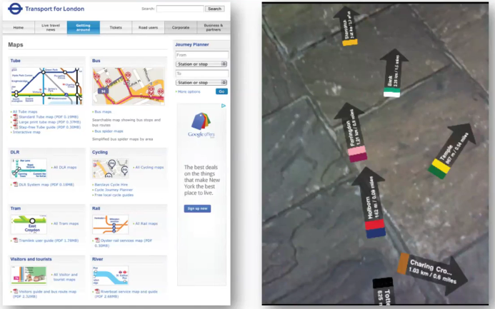
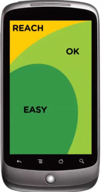
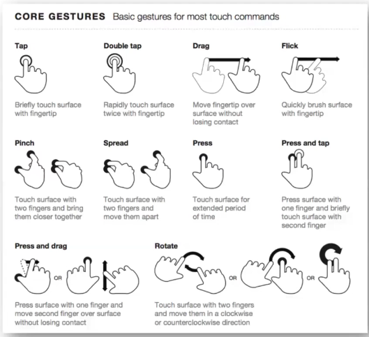
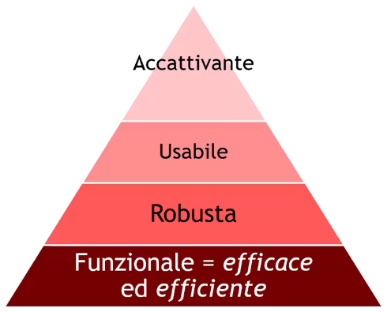
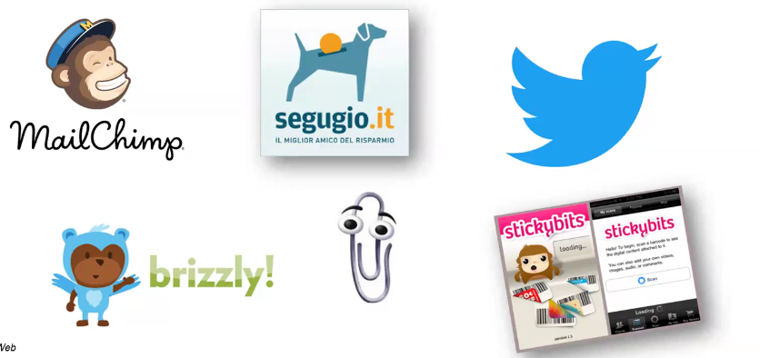
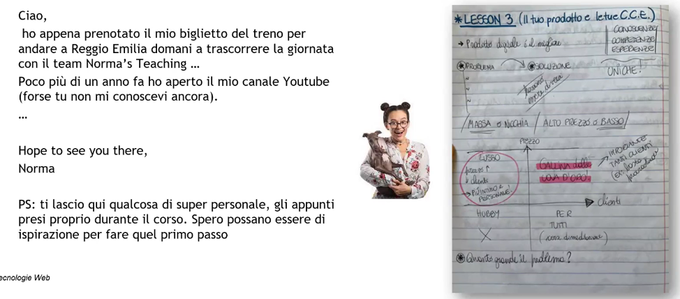

# Description

1 Dic. 2025 - Web Design Principles part 5

## Mobile-first approach

The mobile-first approach was created to overcome a physical limitation which affected mobile devices: very small screen estate.

So, its easy to understand that we need to pay more attention towards the content and feature to be displayed; doing so, we also simplify the bigger view interface.

For example this is the london metro website for desktop and mobile view:

### Rules for interface organization

1. The interface goal is to align with the user needs
2. User = 1 eye + 1 thumb
3. You firstly need to focus on content and then on the navigation system
4. A good naviagtion system placement is fundamental
5. Always insert ONLY the relevant navigation choices
6. Simple interface: users are generally in a hurry!

This following is an example of the reachability scheme for a mobile device:

### Core mobile gestures

### Faster rendering for mobile

Mobile devices usually come with reduced computing power compared to their PC counterpart;

Here are some rules to try in order to achieve faster rendering time on mobile:
1. Save more images in a single file and just show the necessary part each time (one transfer, than cached)
2. A single CSS file and a single JS file, you can even use minifier for JS and CSS sources.
3. Avoid using heavy JS libraries
4. Use cache.manifest and canvas where appropriate
5. Use few grids
6. Use fewer images in favor of CSS3 rules (eg. gradients)

### Feedback and Feedforward

They're not part of the UI but they influence the overall user experience;

Feedback: the information returned by the system following a user action (eg. welcome messages, confirmation messages, etc..)

Feedforward: is a predictive information about what's going to happen following a user action. We try to anticipate an interaction effect (eg. preview, status bar URL, file dimensions on download link, etc..)

They should be always present because:
1. Without feedbacks the user keep repeating the same action
2. Without feedforward the user feels insecure and, consequently, immobilized

### Emotional design
The following pyramid allows us evaluate and interface based on these keypoints:

A emotional curated design can transform a casual user into an avid reader/customer.

Some examples: 

### Emotions to use
1. Contrast:
    - It represents the interruption of a known pattern
    - There are 2 types of contrast:
        - Visual (differences in shapes, aspect, color, etc..)
        - Cognitive (differences in memories, past experience, etc..)
2. Surpise: 
    - Similar to the contrast
    - It usually come along a sense of pleasure and immediate reply
        - Avoids excessive thought processes
        - Widely used to reinforce the impulsive shopping
    - Do not betray the user on this emotion
3. Pleasure
4. Teasing:
    - Use this formula only when you are rock-solid assured you won't disappoint the user
    - Use the feedback on the shown part to enhance the product and its design
    - Limiting the anticipation to a restricted set of user lead to exclusivity
5. Status/Exclusivity:
    - 
6. Rewards:
    - It's a way to encourage the user to make a purchase or use a service by promising them a "reward"
        - It is the core mechanism on slot machines
        - eg. Groupon, greeting from MailChimp

### Emotions can't be ignored 

The use of emotions to enhance the design is interesting but can be inappropriate (government website can't use a mascotte like MailChimp).

Not every emotion can be used in any context, for example surpise and pleasure are much more difficult to implement widely!

There are no universal rules but emotions must be considered.
