# Description

2 Dic. 2025 - Web Design Principles part 6, PHP part 1

## When emotions can't be used

There are some cases where emotional design can't be used but instead you can use it for managing errors!

## Common usability errors in Web Design

1. Unclear menu entries, buttons, widgets and texts
2. Different elements identified by a single label
3. Partial updates
4. Don't let the user know what he will need to complete the task 
5. Forget to highlight clickable options
6. Neverending scroll
7. Be unclear about what is going to do a certain action
8. Forget the attention focus problem
9. Bad-managed user errors
10. Do not establish visual hierarchies

### Inclusive design

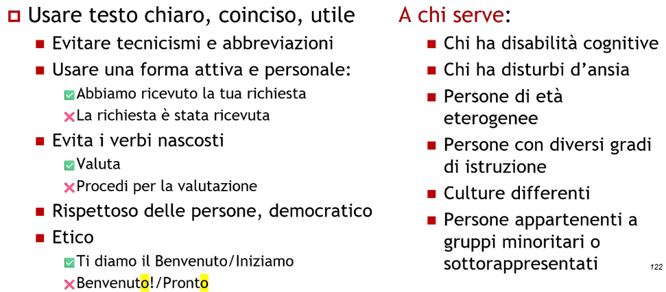

### Pay attention to forms 
1. Pay attention to international characters:
    - eg. Francoise, Danish characters, etc...
2. Pay attention to the input length
    - eg. too short names (Yu, Li), or too long names (Maria Giovanna)
3. Pay attention to the amount of information you ask for

The suggestion should be below the input box, using the hint will disappear once we start typing.

### Errors management

This is a bad example of errors management:

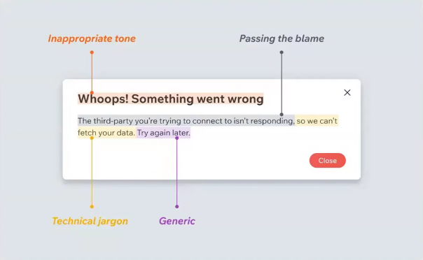

This instead a well implemented error mangement system:

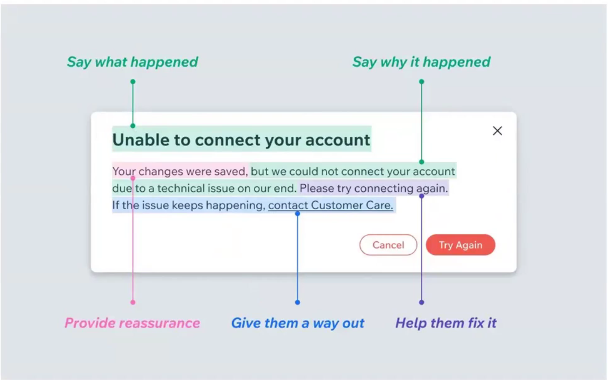

## PHP

This course focus on PHP as main server-side programming language over Python beacuse it still has (2 dec 2025) a grand total of 73% market share.

It takes its syntax from C and Perl, supports object-oriented programming and it is at weak typing.

### PHP Scripts

PHP scripts can be placed in any server directory (eg. http://www.server.it/folder/script.php) and can be ran using the interpreter (php myScript.php, in this case it will print its output on a shell)

<?php All the PHP code is placed inside a tag ?> which allows to include PHP on any other language

If the PHP script is on a dedicated file you can omit the tag closing:
1. The execution ends after the last instruction
2. No extra line or unwanted output

### Configuration file

The PHP parameters are defined inside the php.ini file which is read each time the server restarts, it can include:

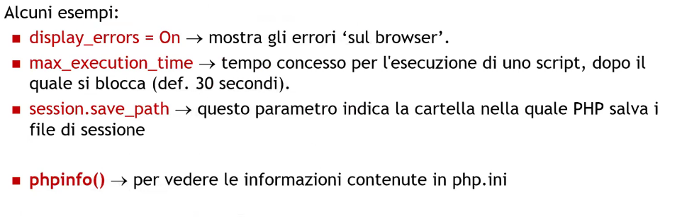

### Division between behavior and structure

PHP allows us to mix PHP code with HTML code:

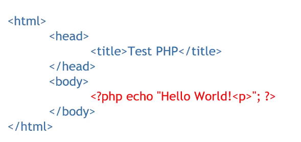

This example shows us a wrong implementation because it mixes behavior and structure

Hint for accademical project: NO PHP in HTML

### File input and output management

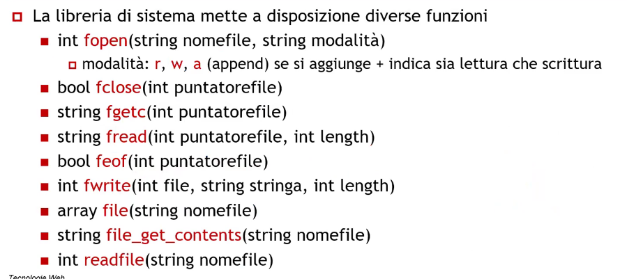

### Bad code integration

This example shows how to not integrate PHP into HTML:

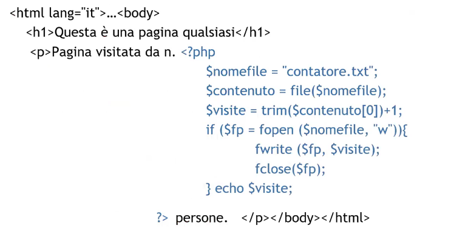

This is the correct version:

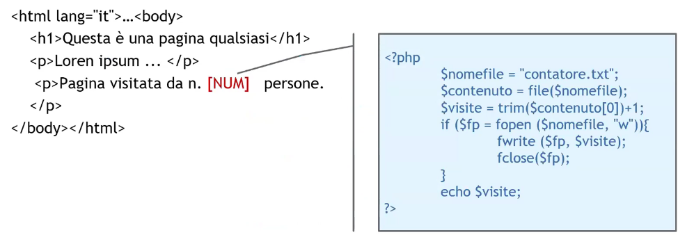

The red [NUM] we see in the example is called placeholder operator

### Substitution operators 

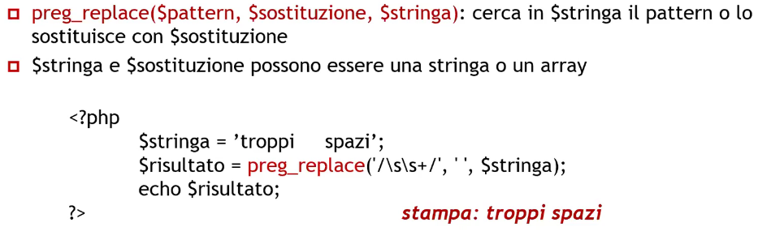

To better understand it, we can use the previous correct example where the HTML would go in $string, the [NUM] placeholder would be $pattern and the result of the PHP computation would go into $substitution

str_replace($toSubstitute, $substitution, $string) works as the previous one but uses strings instead of regex for the pattern/toSubtitute

### Regular expressions (Regex)

These followings are special characters and quantifiers:

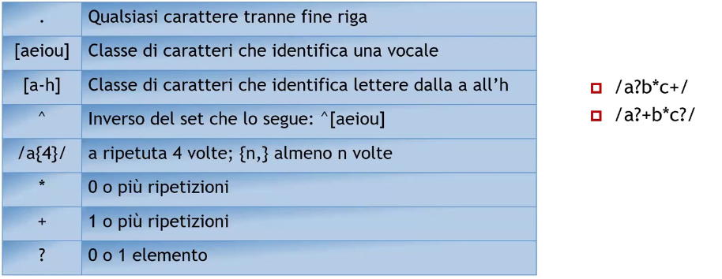

And these are the default classes:

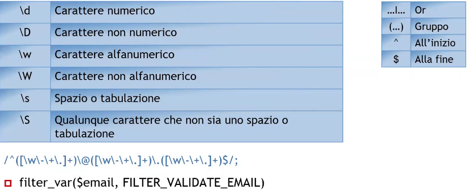

### Modifiers

1. /Mario/i; has positive outcome also if exists a variable that contains "mario" with different capitalization
2. /^parola$/m; has positive outcome if exists a variable that contains a single word or even a line ending past the word
3. /pattern/g; finds every occurrence of a pattern

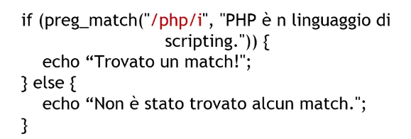

## MySQLi library

MySQLi is a PHP API used to access MySQL databases, it is a wrapper around a C efficent library;

Attention: past PHP 7 version there's no more support for mysql library

It allows you to:
1. Connect to a database
2. Return connections erorr
3. Query execution
4. Close an active connection

### Parameters for connection
1. const HOST_DB
2. const DATABASE_NAME
3. const USERNAME
4. const PASSWORD

In order to connect a database:

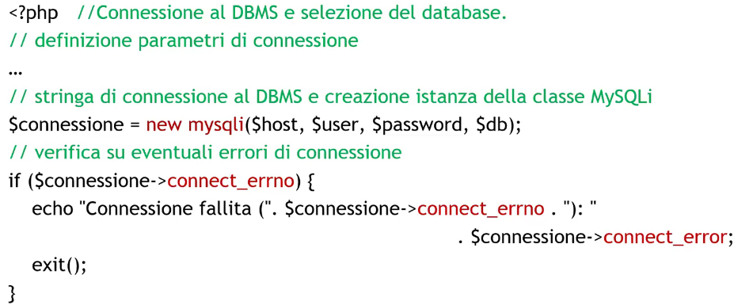