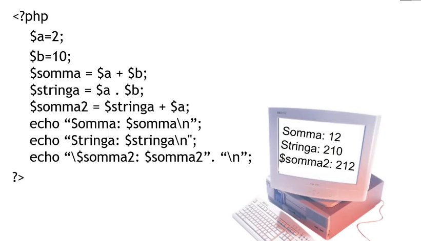
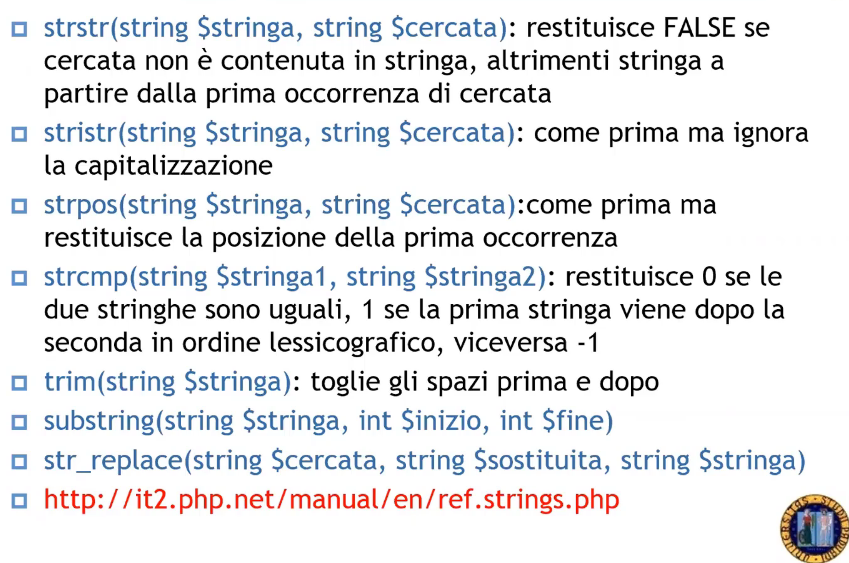
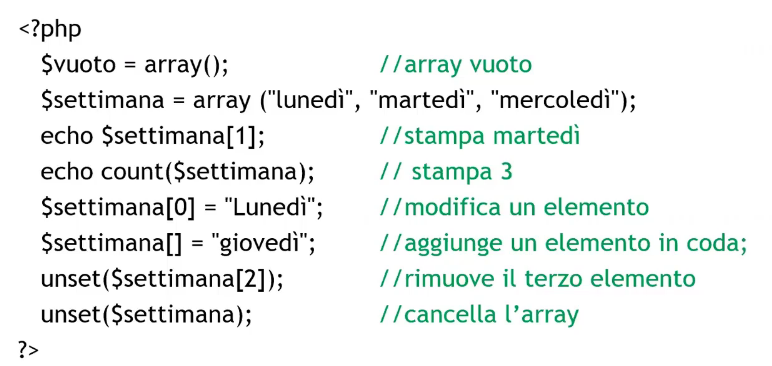
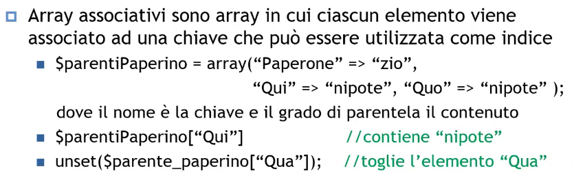
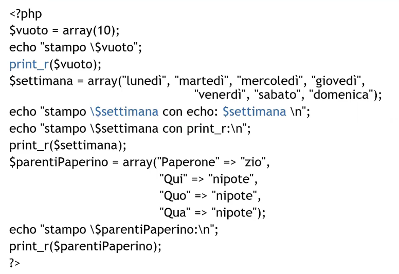
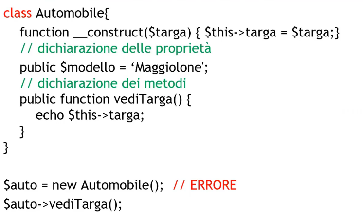

# Description

A.A. 2021-22 - PHP part 2

## Variables

Variable definition are based on the $ symbol followed by the var_name, these names can only start with a letter or a _ mark;

It is case sensitive so $a is different from $A.

They're declatration isn't mandatory but is well reccomended (you can use isset() checks if it is declared and initialized, unset() destroys a variable)

There are some default variables:
1. $_SERVER["HTTP_HOST"] which contains the website name
2. $_SERVER["PHP_SELF"] which contains the name of the file containing the script

## Types

Data types in PHP are deducted by their use case, it supports 8 primitives:
1. boolean
2. integer
3. float
4. string
5. array
6. object
7. callable
8. resource
9. NULL

resource data type are there to represent external complex structure that are not directly manipulable but its then demanded to specific libraries

### Strings interpretation

Strings can be define with " " or ' '.

When using "" the string content is interpreted, for eg. $age=12, the string "Pippo is $age years old" gets printed as follows: Pippo is 12 years old

When using '' the string content is not interpreted, for eg. $one=1 and $two=2 so the string echo '$one + $two \n' will be printed as follows: $one + $two\n

Other examples:

### Strings manipulation functions

These are examples of functions that helps with string manipulation:

## Arrays

PHP offers 2 types of arrays:
1. Array which can be addressed by an index
2. Associative arrays

array() is the constructor and count() returns the array length

This example showcase associative arrays (hash):

This example showcase an array printing:

## Objects

Like many others languages PHP is also object-oriented, for example: 

It allows us to declare static classes (static) and sub-classes (extends)