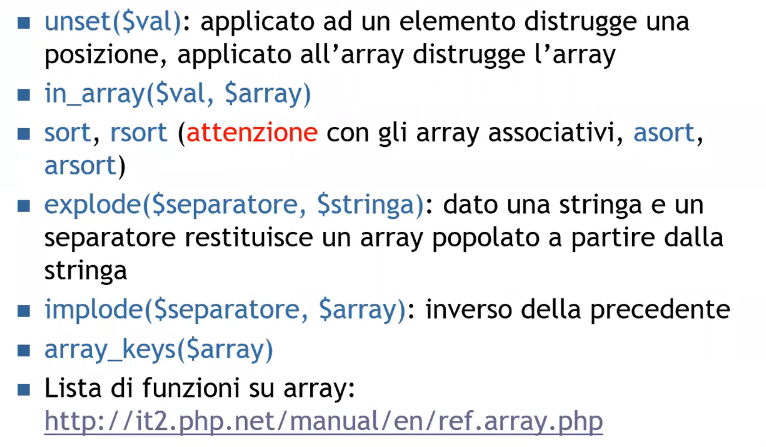
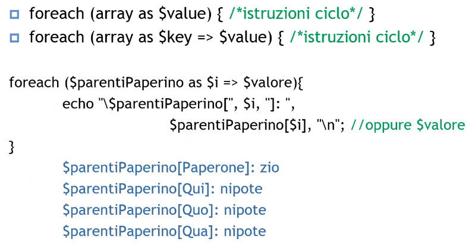
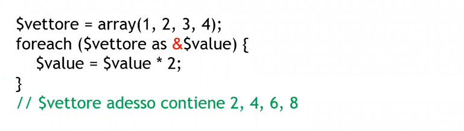
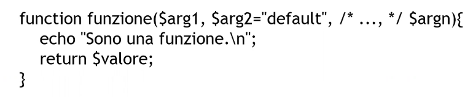
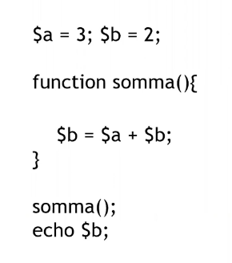
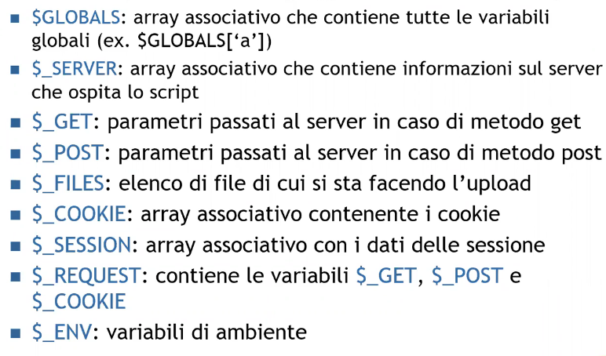
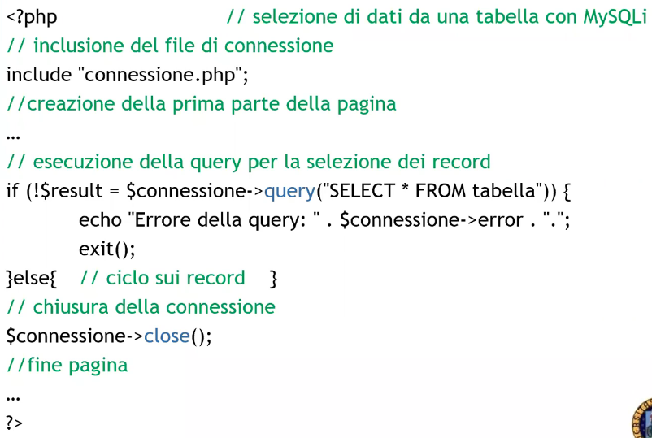
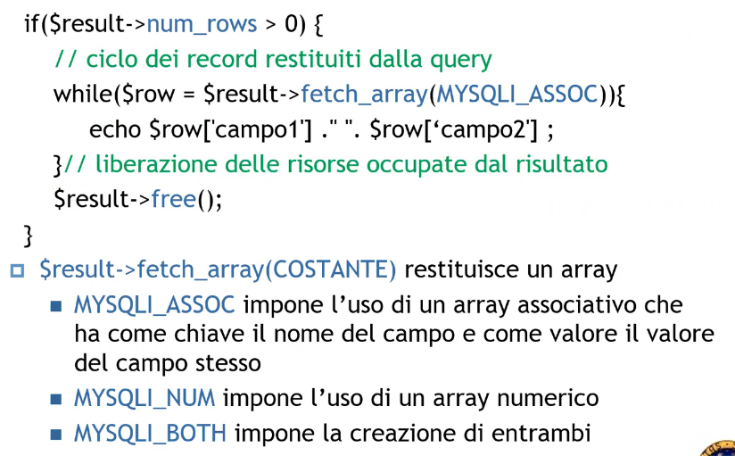
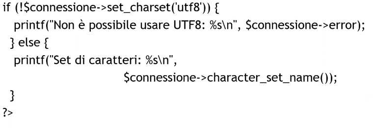

# Description

A.A. 2021-22 - PHP part 3

## Array's functions

PHP allows us to perform many actions on an array

### Array-specific cycles

This syntax is designed to print an array:

And this is for editing it too:

For associative arrays we can only edit the value but not the key

## Functions

Functions are defined using the function keyword and parameters are passed as value:

We can also pass them as a reference using &

## Variables scope

The default variable scope is the PHP script itself, but global variables are not visible inside funcitons if  they aren't defined as explicit global

in this case we should decalre global $a, $b

## Superglobal variables

These variables are accessible everywhere:

## Returning query results

The query result can be very big in terms of bytes, for scalability reasons it is necessary to bufferize the result on the client-side in order to be able to navigate throught it.

The query() function occupies both of executing a query and then bufferizing the result.

And here how you can cycle the returned results:

## Setting up characters set

