# Description

A.A. 2021-22 - PHP part 4

## HTMls forms

form action="http://server/path/file.php" method = "post">

### GET

The GET method is the default one, the browser simply attaches the query string to the url, as saw earlier during the course:
1. http://server/path/file.php?parameter=value
2. Limited string length (256 chars)
3. Vulnerable

It is usally used to read data and the completed url can be saved as a bookmark

### POST

The POST method: the query string is passed as a standard input

It is usually used to send data (eg. files), it has no limits.

## Parameters management

PHP save parameters in 3 different variables:
1. When using GET method the string is stored into the superglobal variable $_GET
2. When using POST method the string is stored into the superglobal associative array $_POST
3. Data is always stored inside the $_REQUEST array which allows us to develop a form that works even if we change the method

ATTENTION: they are 3 unrelated variables that means editing one of those won't affect the others 

## Complete example: pulling data from a database

In order to print data pulled from a database we have to:
1. Open a connection with the database
2. Extract the data
3. Close the connection
4. Print the data from the page or return the error message

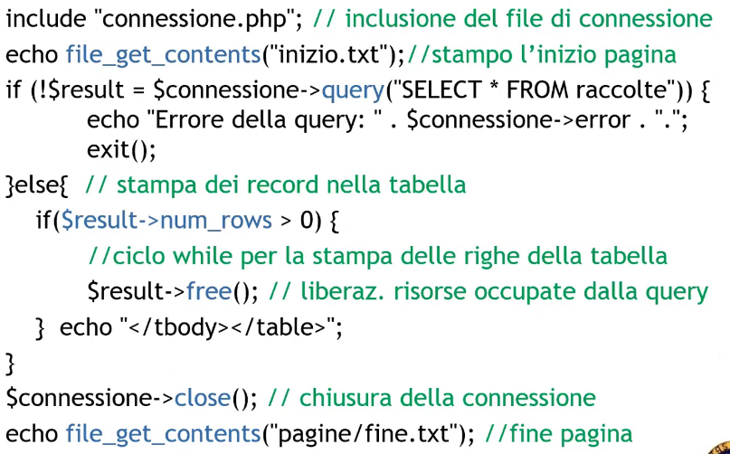

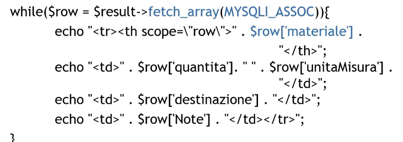

## Inserting into a database

The first step is to clean out the input:

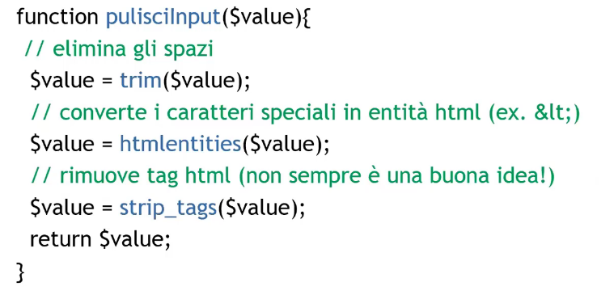

### Dangers

Every time we allow the user to insert data into a database we expose ourself to many different attack types.

On this topic we should always consider every user as a malicious user.

A classic attack type is SQL injection which allows the user to insert malicous code:

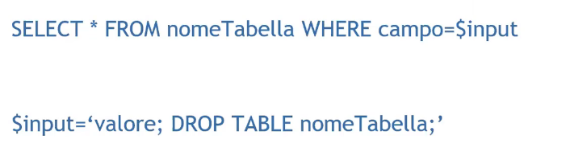

This exposes us to two problems:
1. Non-filtered input
2. The user used to access the db should not have the permit to delete tables

Solutions: 
1. Filtering input
2. Escape output
3. Dedicated user

### Input filtering

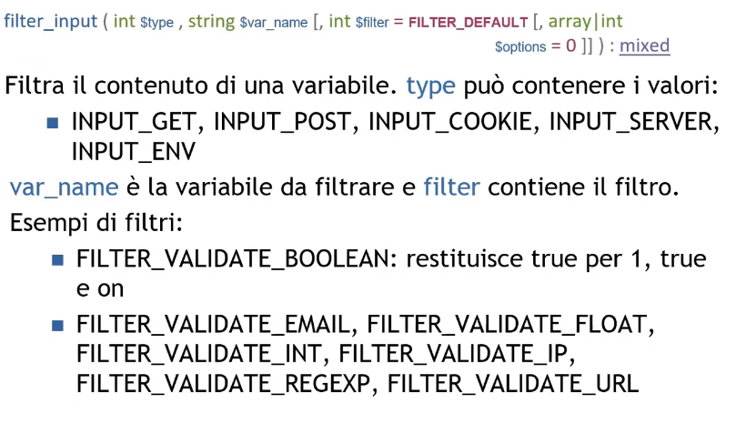

### Consts for data sanitize

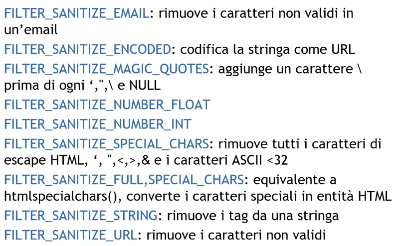

### Cross-Site Scripting attack

A Cross-Site Scripting attack (XSS) allows to inject malicious code (usually JS) into a webpage, this exposes the website to many different attack types:

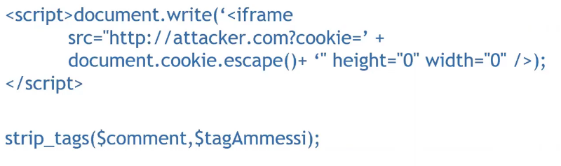

### Escape Output

This technique allow us to translate every special character into a its UTF-8 translation ensuring that malicious code won't ever be executed 

HTML Purifier is a library used for data filtering to reduce the exposure to XSS attacks: http://htmlpurifier.org

Two main functions are:
1. htmlspecialchars()
2. htmlentities()

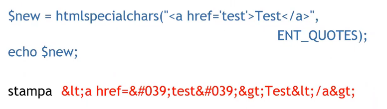

## Database insertion: using objects

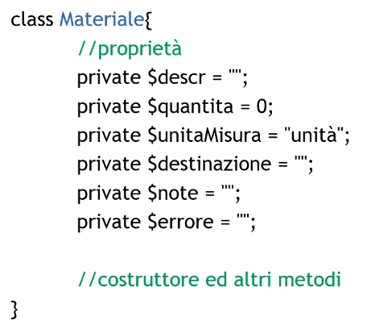

Here is the constructor:

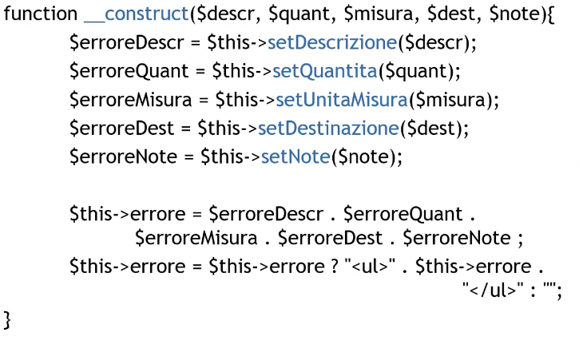

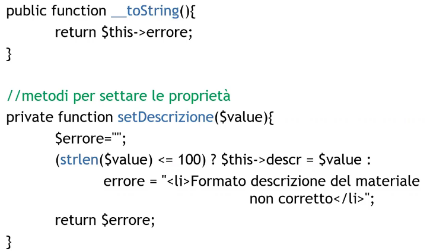

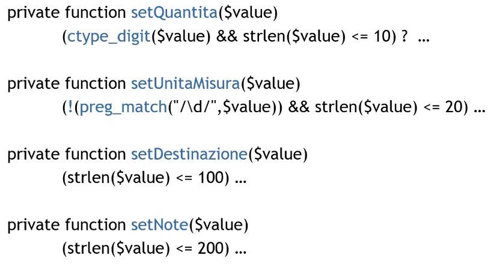

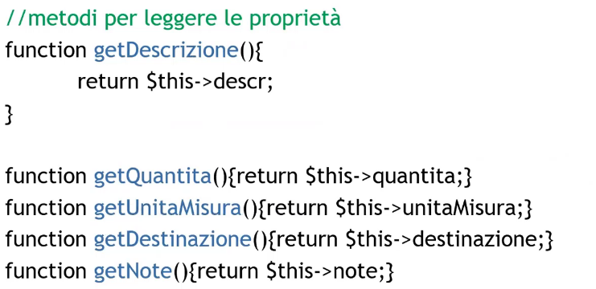

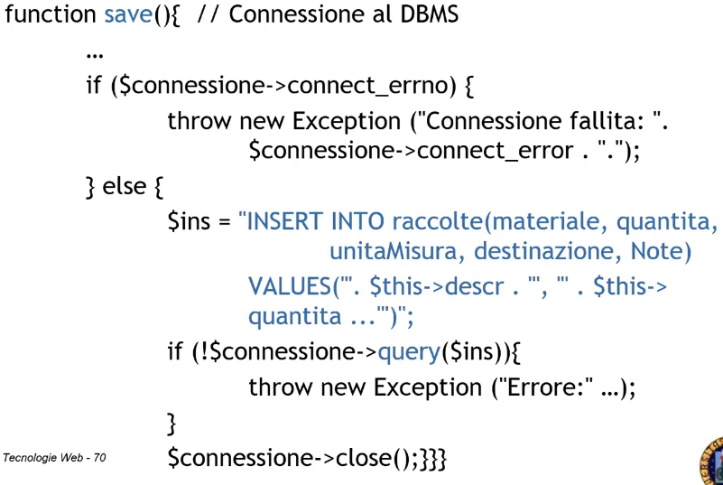

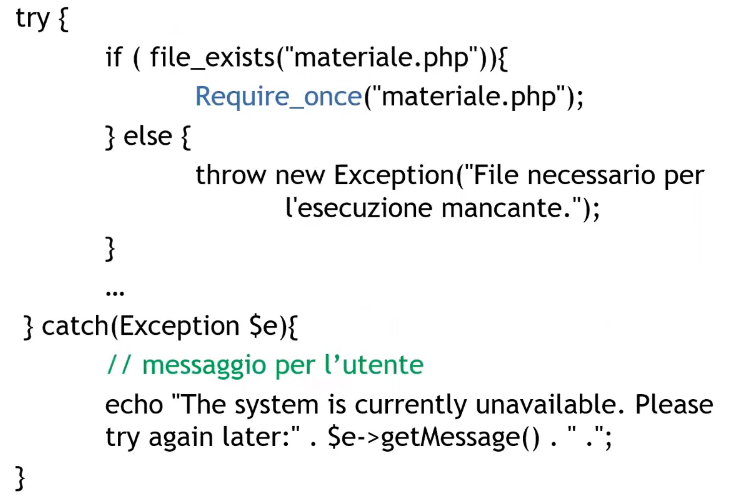

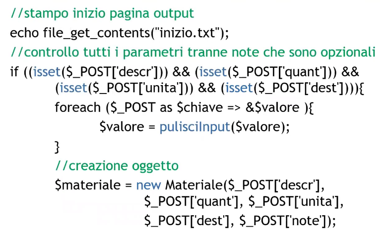

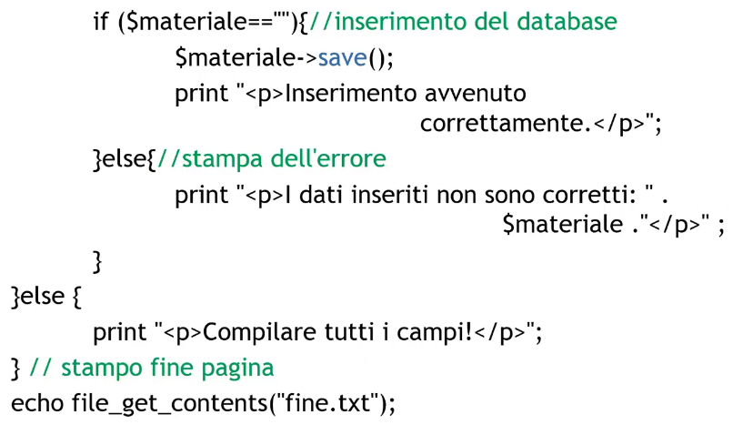

## Sessions

The HTTP protocol is stateless, in order to pass informations between pages there are 3 ways:
1. The hidden data fields
2. Cookies (client)
3. Sessions

Sessions are more secure than the others because data get stored on the server.

Every data relative to a session is saved onto an associative array $_SESSION which as we saw is superglobal variable

### Session creation and reading

Upon the first request a new session is created which is identified by session id (sid) that is passed to the client (cookie)

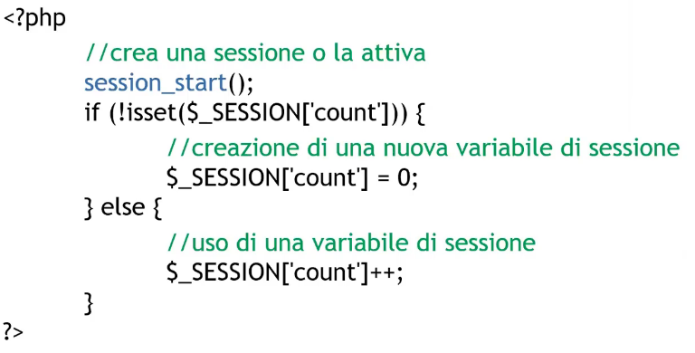

### Session destruction

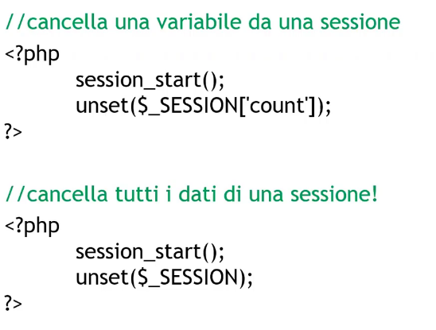