# Description

15 Dec. 2025 - JavaScript part 1

## JavaScript

It allows us to create scripts, that can even inserted inside a document;

It supports object but not classes, it ha no inheritance feature.

It has dynamic typing so it does not require (even if it reccomended to do so) to declare variables.

It allows you to transfer some compute tasks to the client and then validate it on the server:

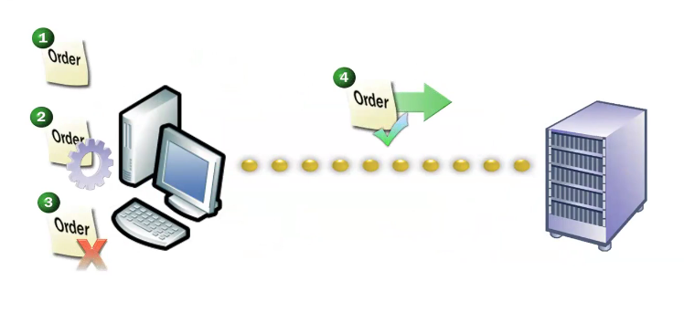

JavaScript do not support networking nor file operations (partially supported from  File API in HTML5)

DOM (Document Object Models) allows to the JavaScript scripts to have access to content and widget inside the HTML document that contains them.

It also allows us to excute an event-driven approach;

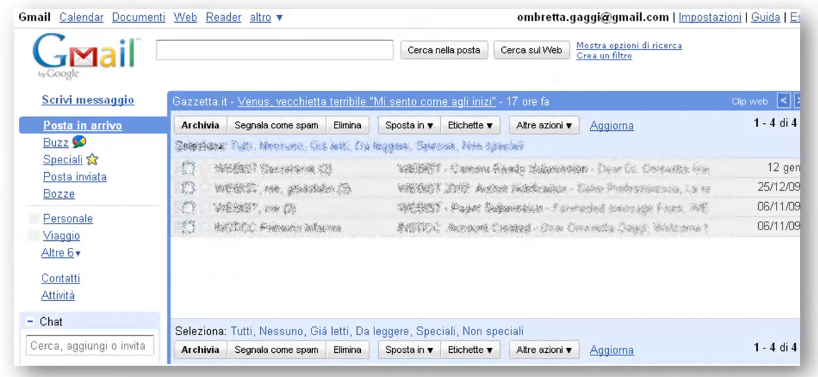

### Script inside web pages

They can both be into the header or body of a HTML page with many different functions:
1. header: useful to produce content on demand or they manage the user's interaction; you primarly want to define here functions that are going to be reused many times (eg. form elements related code)
2. body: script to be interpreted only one time (eg. check on a specific data)

As CSS does, header's scripts must be inserted through comments

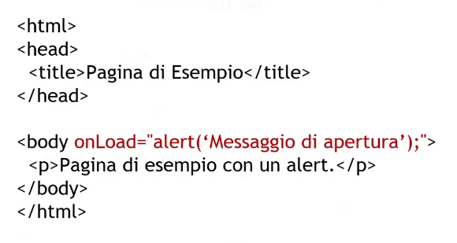

## Objects and variables 

Every object has its own set of data and methods and non-object types are called primitive.

To use an object's property you use the form "variable_name.property_name"
1. automobile.modello
2. automobile.gira(90)

Variables name can contain letters, numbers (not on the first place), _, $, etc...

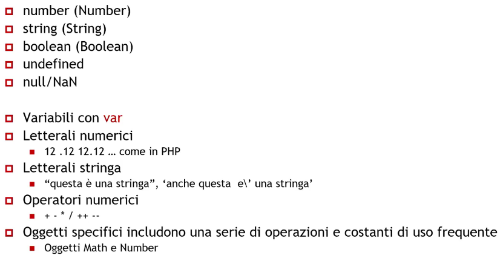

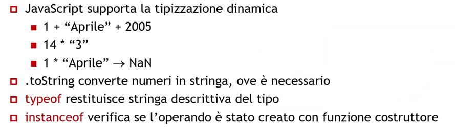

### Object creation and edit

When a new object get created it is empty and with no properties:
1. var occhiale = new Object()

Properties are dynamically istanced:
1. occhiale.tipo = "solari"
2. occhiale.marca = "rayban"

In order to access those properties:
1. for (var prop in occhiale) instruction

And the properties can also be deleted

## Output & conditional instructions

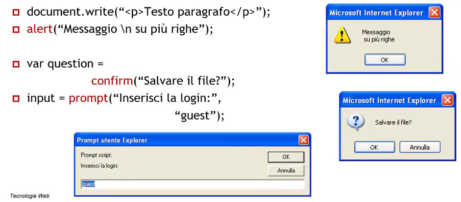

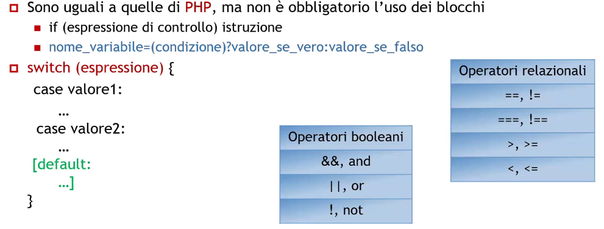

## Arrays

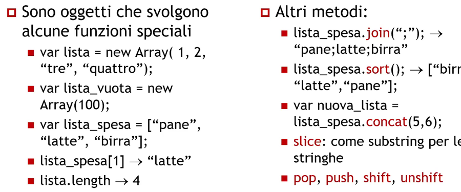

There are also associative arrays in JavaScript

## Variables scope

Variables are delcared using the keyword var:
1. var x = 5, y = 7, month = 'april'

Variables can be defined:
1. Inside a function -> its scope is the function itself
2. Outside a function -> global scope
3. If a variable isn't declared (using the var keyword) it is automatically global

## Functions

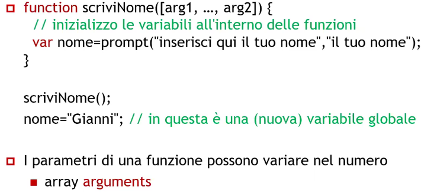

## Pattern corrispondence

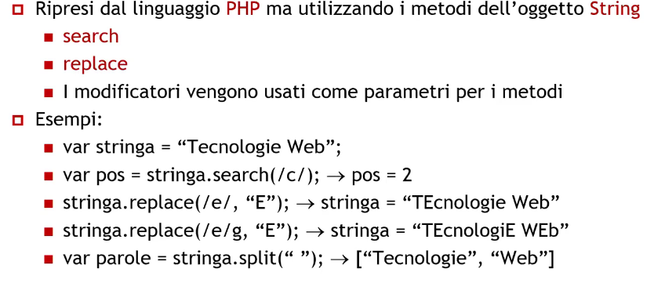

## BOM (Browser Object Model)

BOM is an object model, it is not standardized but it allows us to interact with the browser:

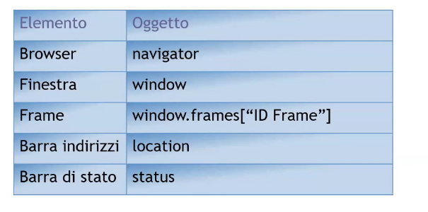

### Opening a link in a new window

In case JavaScript is disabled it opens on the same window:

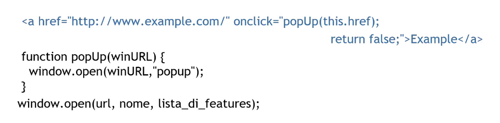

onclick become ontouched;

But this solution was not great, now we want something that keep the separation between behavior and structure

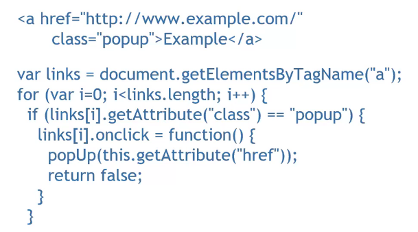

This, as is should be declared on the header section of the HTML page but that will invalidate our separation between presentation and structure so we need to move it on a separate file.

In a separate file then:

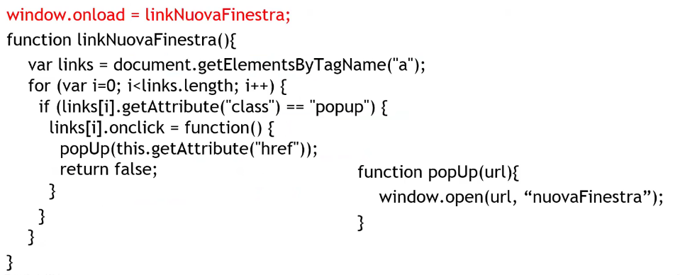

This showcase the feature on a popup but we can use it on everything (forms, images, videos, etc...)

## DOM (Document Object Model)

It is a fully-supported standard which allows us to access to different web pages elements:

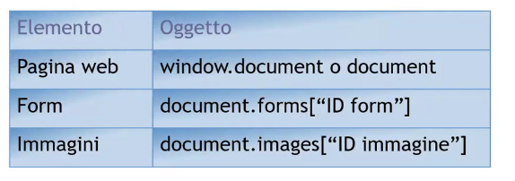

HTML DOM allows us to edit, add or remove HTML elements in a standard way:

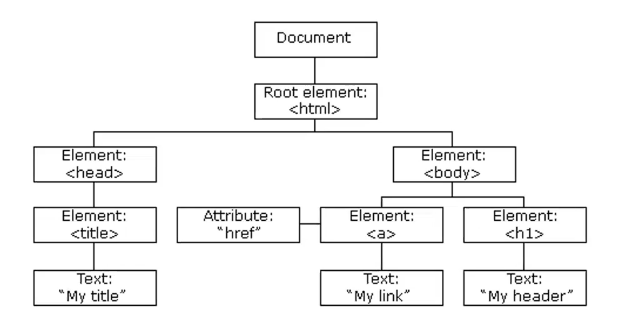

### JavaScript and HTML

1. You can access a tag using getElementsByTagName or getElementById
2. Every element in a form's array contains an elements array with every form element in it (buttons, text boxes, etc...)

DOM document has a tree-shaped structure:

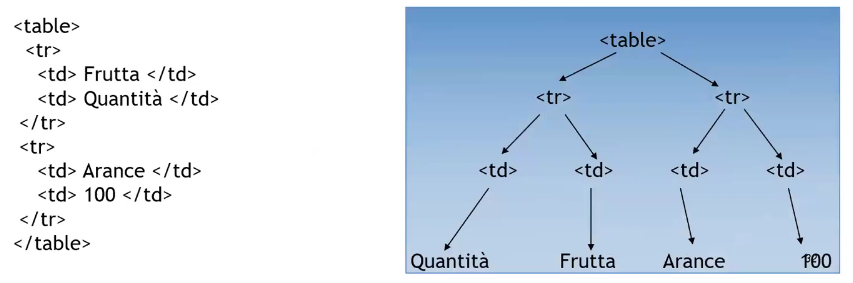

### Properties and methods

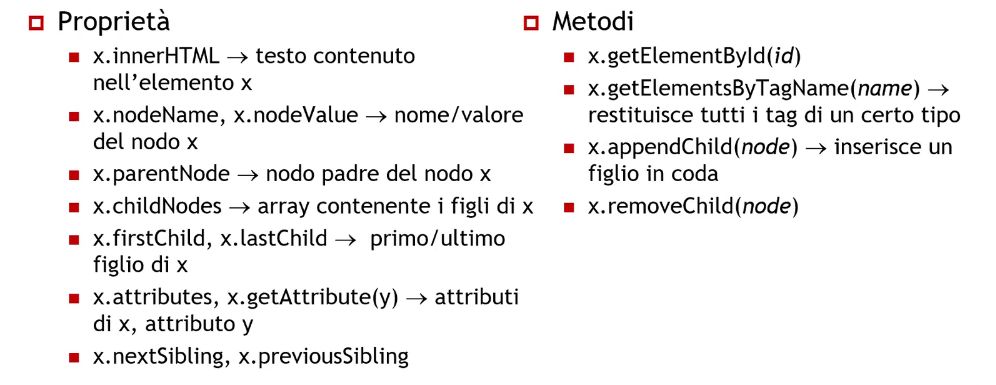

## Events

Traditional programming code has an implict order of execution related to its writing order.

In event-driven programming you define functions (event handler) which are executed just when that specific event happens:
1. Similaar to the exception handling
2. function unload_saluto(){alert("Grazie per aver vistitato il sito")}

Event handler or function call on a specific attribute: onclick="alert('Stai uscendo dal sito')"

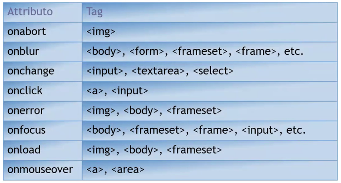

### Event handler example

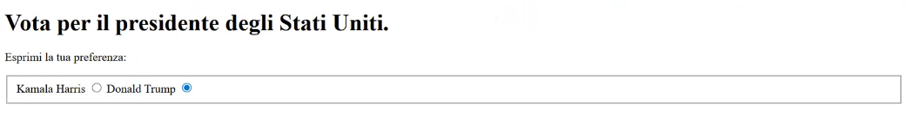

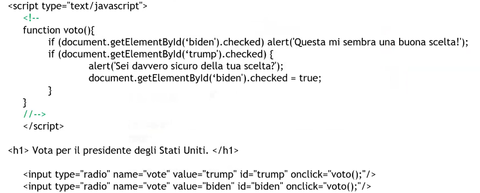

Or we can check if a CF (Codice Fiscale) is correct:

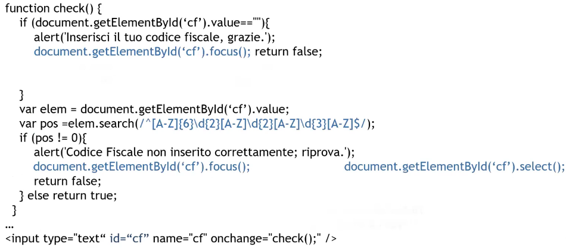

## Manage different input devices

The pointer event are an abstraction for pointer-based action (mouse, stylus, touch, etc..) which uses generic event not related to the pointer:

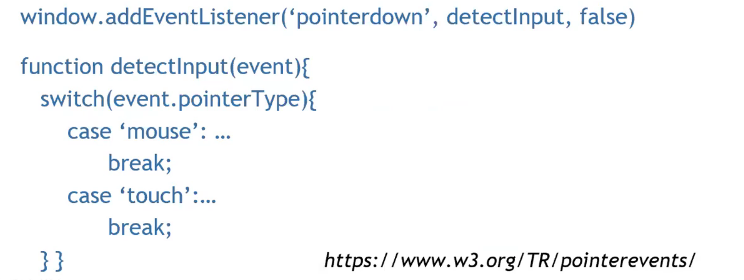

## Dynamic pages on JavaScript

JavaScript allows us to position and size objects inside a HTML document

It can:
1. Edit the elements dimensions and locations
2. Edit their sytle features (color,fonts, etc..)
3. Edit content and structure
4. Output warning and messages
