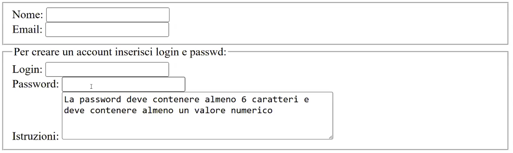
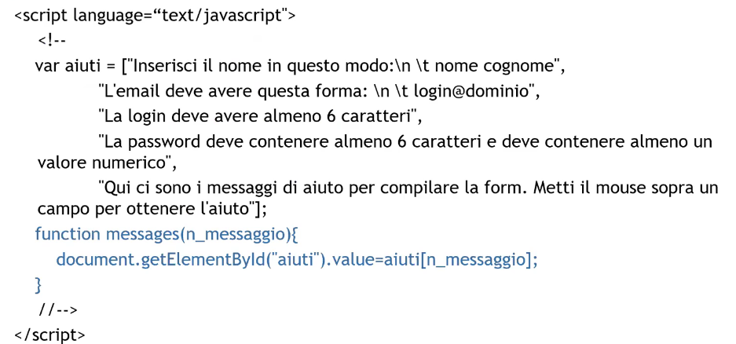
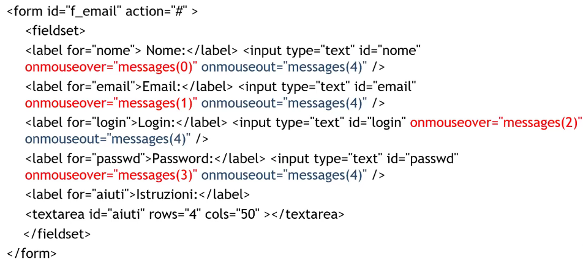
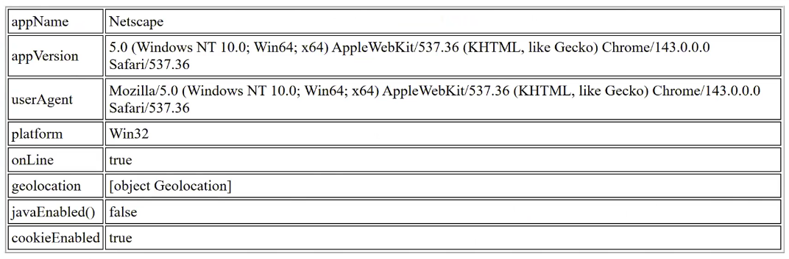
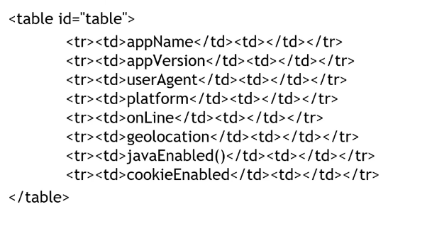
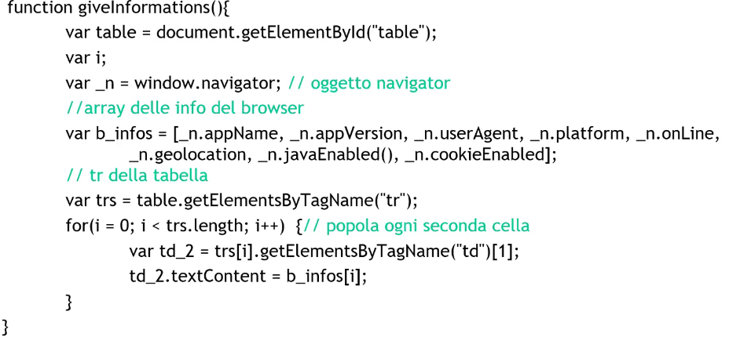
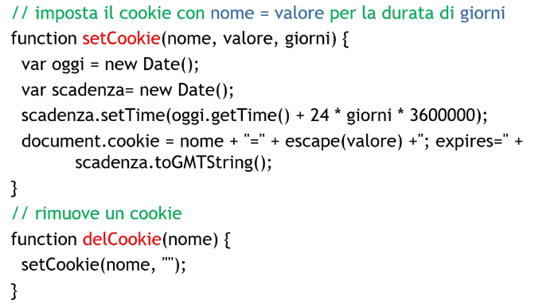
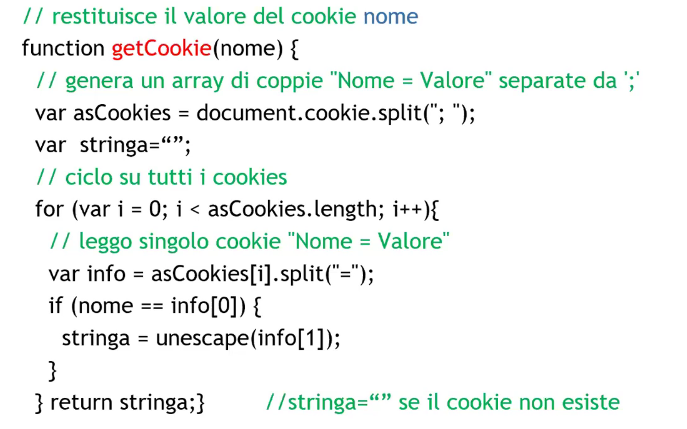
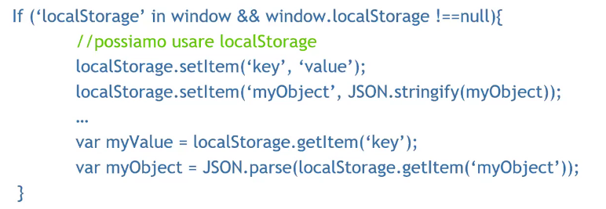

# Description

16 Dec. 2025 - JavaScript part 2

## JavaScript form example

## Another example

## Cookies

Cookies are small text files stored on the user's pc , they are exchanged between client and server and they contain saved informations about websites.

They are used to store unique infomations about the user to enable the website to recognize the user and to reuse those information (this introduces a privacy problem);

You have to pay attention to the fact that the user can disable or delete them!

Every cookie has some parameters:
1. Name: identifies the cookie
2. Value: the value to store
3. Expiration date: optional, past this date the cookie will be deleted from the user machine

### Creating and destroying a cookie

### Accessing a cookie

## Alternative ways to store data on client

Nowadays mobile phones usage has increased so much we can't always rely on the internet connection when building up a website.

Cookies have a 4093kb limit per domain, so we can use:
1. localStorage: kept in storage until the user delete the cache (browser related)
2. sessionStorage: deleted when closing the tab
3. indexedDB

