# Description

6 oct. 2025 - HTML5 part 2

## id vs class 

class defines a belonging group, id identifies an element uniquely;

Giving the id tag to an element allows it to be used as:
1. Selector in a stylesheet
2. Inside a script
3. Destination anchor for a link
4. Generic tool for data treatment

An id must always start with a letter o the "_" character. In order to use it inside Javascript spacings,apostrophe and punctuation are not allowed

## Generalsitic tags

div and span do not provide any semanthic meaning, they are used as a container for specific blocks of the page; precisely:
1. div: generic container for linking specific blocks of stylesheet to the div (the text starts a new line after the div block)
    - 
2. span: suports styles and it works inline
    - 

## Structural Markups

1. header, footer: they act as headers and footer, they can be used multiple times between the same page and the same section. Footer includes information about the website owner
2. main: main content
3. nav: contains supporting elements for the navigation; it could also be placed inside an header
4. aside: sidebar, support content not necessarely on the right or left. It identifies a portion of the content which can be removed without damaging the page core but that is linked to the nested tag content (eg. author biografy)
5. section: used to group content within the same theme o logically linked (eg. book article)
6. article: portion of text selfcontained and independent which could be distributed in an autonomous way (eg. blogpost, magazine article etc...)

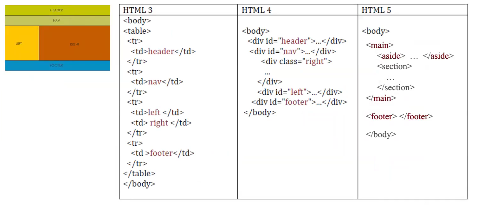

### Structural Markups rules

There are no reasons to use section or article if not strictly necessary, in every other case div is preferred

article, nav, section and aside are "sectioning elements", which means contain header,nav and footer

## Header implementations

Here we have the old vs new header implementation:

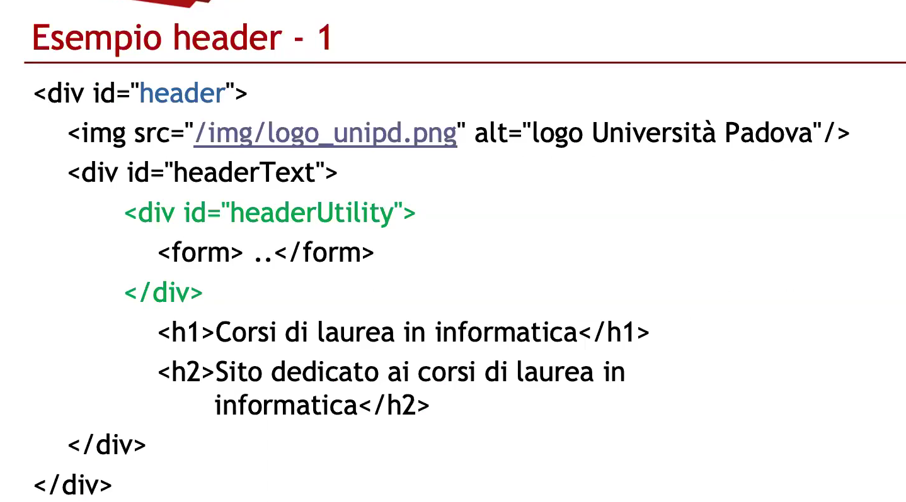

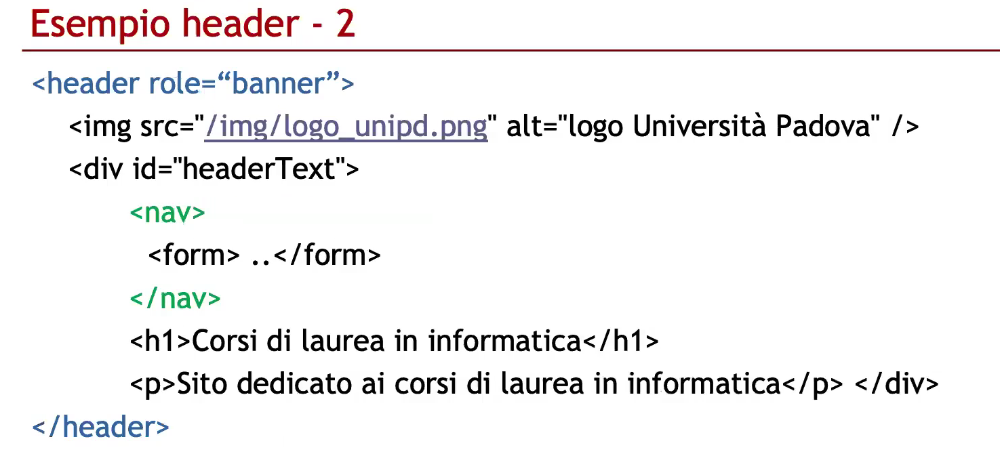

In the new one, the ' role = "banner" ' inside the header tag is a common error because is redaundant; 
Header itself defines the banner section, ' role = "banner" ' was commonly used before HTML5 (usually inside a div tag) to specify its role.
(tldr; HTML5 vs ARIA)

## Text

The main content of the page is primarly text, which is contained between p> and p/> and the p stands for paragraph. 
Between two paragraphs the browser display some spacing: to break line inside the same paragraph you use the br/> tag. (Usually if you really need to break line you should use a new paragraph)
To get even more spacing, you can use hr/> which displays an horizontal line 

### Special characters and cosmetics

Here some solution to display special characters on your page:
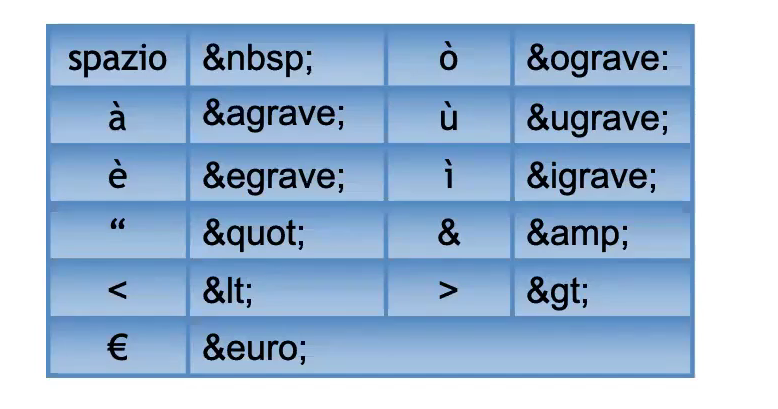

In order to make a page easier to read and emphasize we use some cosmetics:
1. /em> = emphasis
2. /strong> = strong emphasis
(this replaces i> and b> and provides more easily understandable hierarchy)

## Headers

There are a total of 6 levels of headers: h1,h2,...,h6
They MUST be used by their order and structure-based on the document, and not by their default visualization; That can be edited:

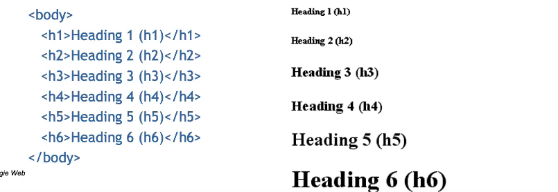

### How to write GOOD titles

Headers, especially h1 are one of the most important parameters for ranking, so it is good practice to write them correctly:
1. Just a single title per page
2. Concise and descriptive
3. Avoid vague or generic titles
4. Capitalize the first letter of the title or the first letter of each word
5. Create worth-clicking titles and avoid clickbaits
6. Search-based design
8. Use keyowrds just when needed
7. <60 characters

Bad example:

## Citation

In order to quote something or citate an author you should use blockquote, q or cite tags;
1. blockquote (div-equivalent): full block quote
2. q (span): in-line quote
3. cite>: is used to link a source but it necessarely require a URL

### Abbreviations, acronyms and addresses
1. abbr: indicates abbreviations
2. address: indicates and address
3. code: ...
4. var: ... 
5. samp: ...
6. pre: ....
7. ins: ...
8. del: ...

### Other semanthics tags

HTML5 introduces many more tags to specify data display on a webpage: 
1. figure/picture
2. mark
3. time (datetime in XML format)
4. meter: indicates a mesurement on a scale between a max (max) and a min (min)
5. progress: indicates a changing value
6. small: indicates footnotes

## Unordered lists (bullet lists)

We use these sort of lists when there is no hierarchy between the elements
ul> is the list itself
li> is the list item

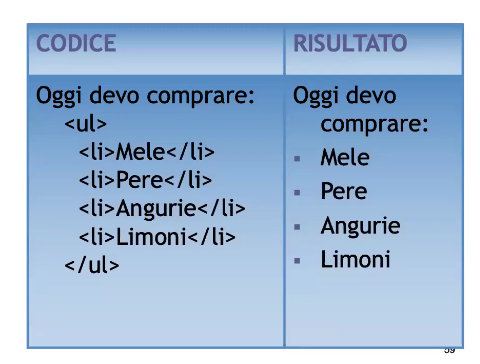

## Ordered lists 

We use these sort of lists when there is a precise hierarchy between the elements
ol> is the list itself
li> is the list item

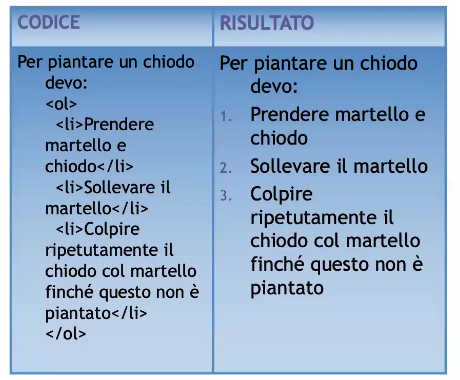

## Definition lists 

No bullets or numers used, it is useful for defining a term;
dl> is the list itself
dt> is the the term to be defined 
dd> is the definition

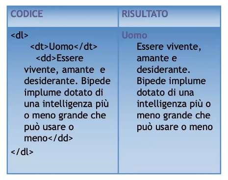

## Lists and navigation

Navbars are basically lists of links:

If they have submenus: 
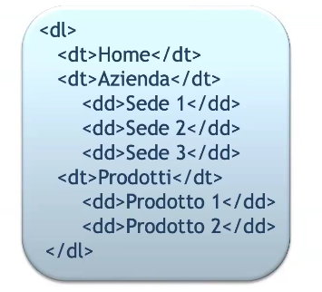

## Images

In order to insert an image we use the img src="xxx.yyy"/> tag where xxx is the filename and yyy its extension
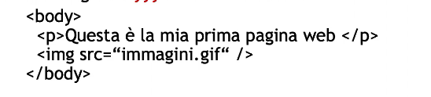

Attributes:
1. alt: alternative text (mandatory)
2. longdesc: URL to a page where the image is described (deprecated)
3. width and height: let the browser know the image size before downloading it

The width and height can be defined either in CSS and HTML, but HTML is preferrable because the rendering is much faster (many images), irrelevant if there are just 1 or 2 images per page.

### Lazy loading 

The images weight obviously affect the page load time so the user experience aswell

Using the loading attribute we can decide when the browser download the image:
1. eager: right now (default value)
2. lazy: the image is downloaded when visible

TIP: in order to not add unadditional weight to the page, we should use lazy only when they are "below the fold"  (without scrolling)

### figure and figcaption

figure and figcaption allows to define figures and descriptions
A figure not necessarely contains an image!

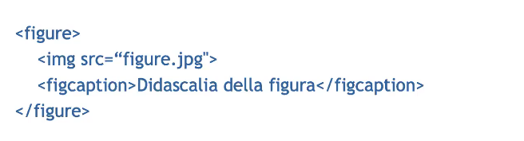

(alt attribute not needed if there's also a description)

### picture tag

It allows to insert different format images (primarly used fopr responsive desing)

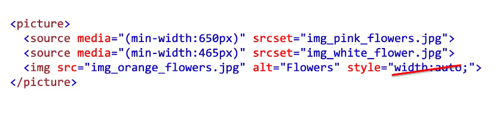