# Description

7 oct. 2025 - HTML5 part 3

## Links

In order to insert a link we use the a> tag
The source link could either be a text (hot word), or a set of more complex elements such as images (thumbnail).
Destination could be a webpage or an anchor:

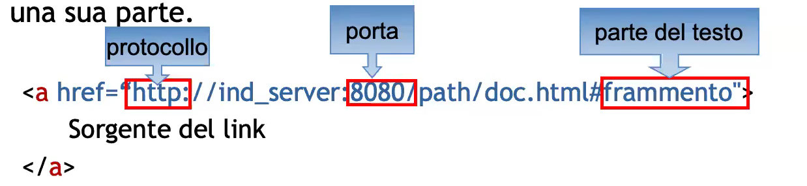

The alt text MUST be used to be relevant! 
For example if a website logo we do not use "logo" alt text, we either use "home" if that brings us back to the home or empty alt text.

References could be relative or absolute ("base" tag)
Target indicates the destination frame (if that doesn't exists it opens a new window)

HTML5: media (media query), download

### Section access

I requires the definition of an id:
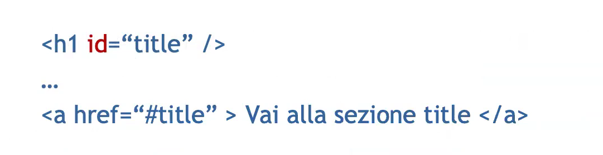

### Keyboard link access

It is very important that links are reachable even without the use of the mouse.
To do so, we use:
1. accesskey: a character to access that section
2. tabindex: tabulation ordering (for links or forms or anything the user can interact with), 0 allows div to be "tabbable" and -1 remove the ability to be "tabbable"

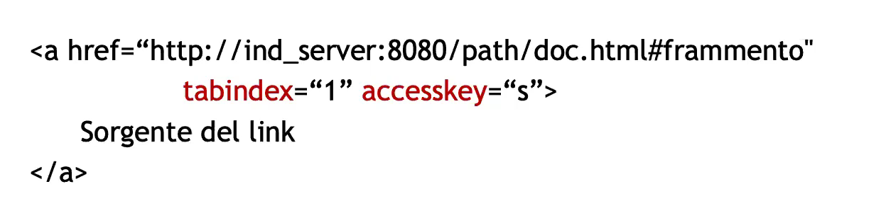

## Tables

Tables are useful to tabulate columns of data; 
Unfortunately they are frequently used as container for better positioning texts and images into a webpage leading to low quality code;

Tables are created with the table> tag.
tr> and td> (data, o th> for headers)  indicates respectively rows and columns;
Tables can then be nested inside other tables.
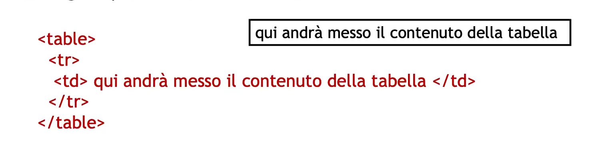

### Table rules

There couldn't be any cell without content;
Columns are not defined in an expilcit way but we define cells inside rows using td>.

We can define cells that occupies more than a column (colspan, e.g. colspan = 2) or row (rowspan)
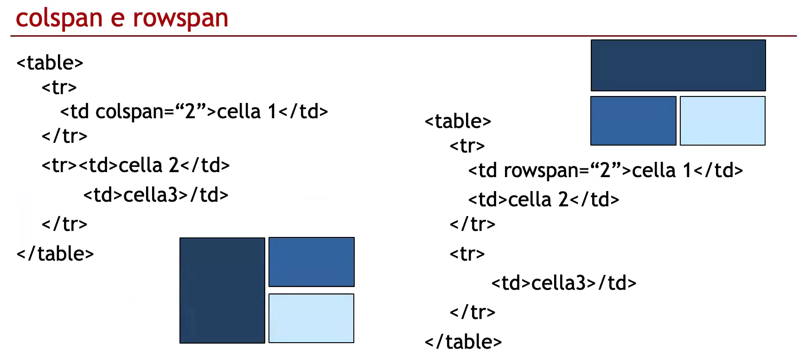

The caption> tag right after the table> tag allows to insert a title to be displayed above the table.

You have to describe the content and structure of the table using the "aria-describedby" attribute 
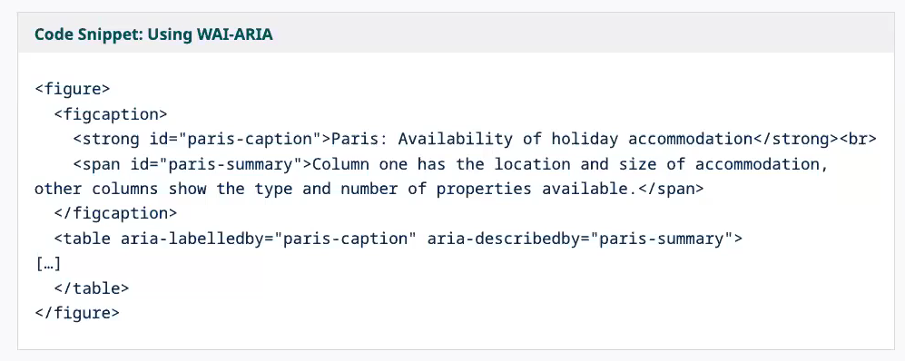

### Rows grouping

It is possible to group some rows dividing then the table in header, body and footer.
Whenever the table gets interrupted in any way (eg. print) header and footer are repeated.

For example:
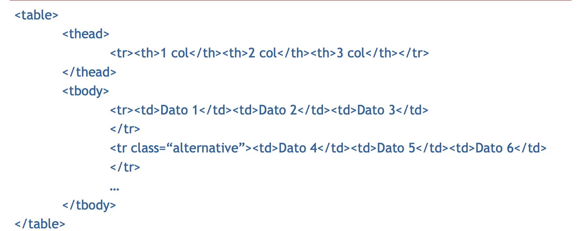

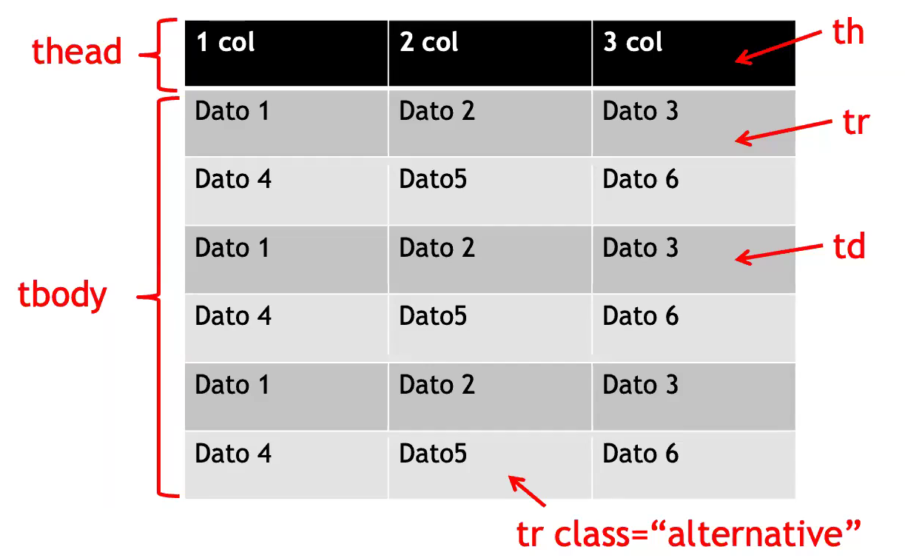

### Addressing columns

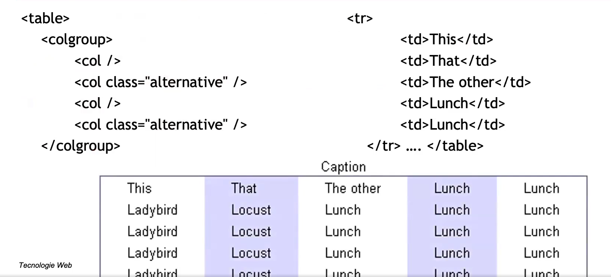

It is possbile to address columns in order to create layouts effects linked to them.

"colgroup" allows you to apply a set of column identified by span attribute;

"col" allows you to select a single column.
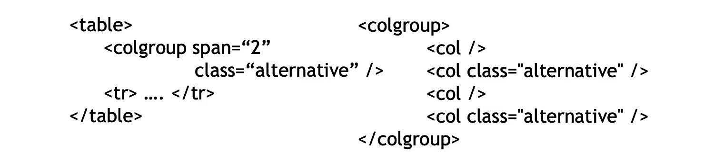

## Forms

Forms contains everything we can interact with

The form has 2 main attributes:
1. action: who answer to that form, such as a PHP script that compute the data received from the form itself or a local compute with a Javascript script

### Definition

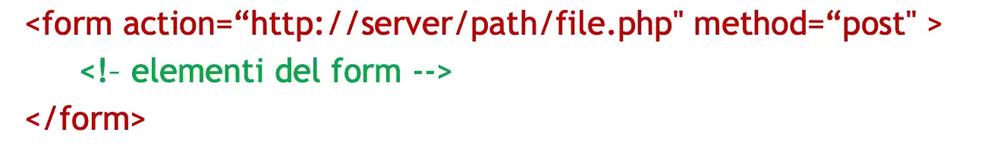

The "method" attribute may have 2 values:
1. get: (default), it is used to read data; the browser attach the query to the CGI (action script) program URL
    
    1.1 eg. http://server/path/file.cgi?parameter=value
    
    1.2 String length limitation

    1.3 Access vulnerability (clearly visibile on the URL)

    1.4 If data is not sensitive it is preferrable because it can be saved as a bookmark (eg. trains departure hours on friday)

2. post: it is used to send data; the query is passed as a standard input (stored into environment variables (more secure), send files)

### Query string format

It contains the data sent using the "Submit" button;
Names and values of each element are coded as assignments

eg. nome=Mario&cognome=Rossi

Special characters are coded as hex preceded by % symbol

eg. nome=Mario%20Rossi

### Buttons and Fields

The elements we can insert in a form are basically 3:
1. input
2. textarea
3. select

which can use the following attributes:
1. name: used to identify the sent input. Every element is sent as pair name/value. Name is retrieved by this attribute, value is the input inserted by the user.
2. readonly="readonly": each field marked with this attribute can't be edited by the user
3. disabled="disabled": each field marked with this attribute can't be edited by the user and the input value won't be sent to the server.

XML readonly="readonly", HTML readonly;

### Input tag

This tag allows you to create a wide variety of elements based on the "type" attribute:
1. text: a single line of text with maxlength elements
2. password
3. checkbox
4. radio: allows you to select one or more
5. sumbit
6. reset
7. hiddeen: not-shown data or not editable
8. file: allows you to upload a file
9. button: to call the script on client-side (JS) (eg. social number verifier on JS)
10. image

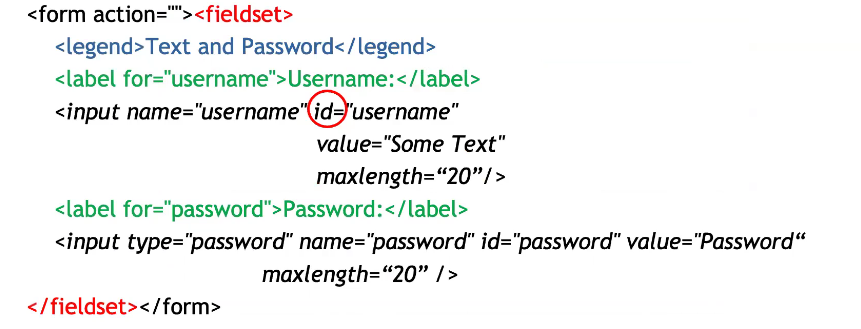

BEST PRACTICE: 24x24px, 44x30px for checkbox;
Using label instead of paragraphs for label you can click on the whole spacing between the name and checkbox instead of just the checkbox.