# Description

8 oct. 2025 - HTML5 part 4 and CSS

## Checkbox and Radio

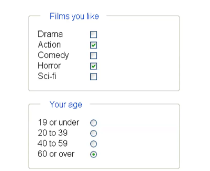

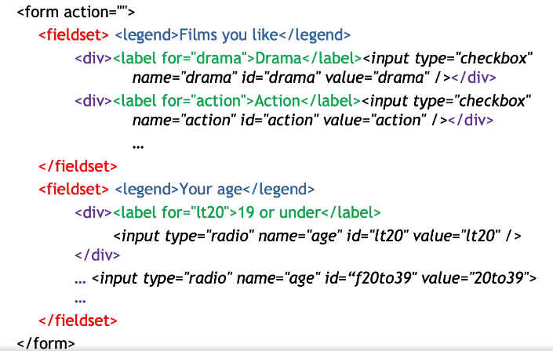

Radio buttons allow to select a single choice, where checkboxes allows multiple selections.

checked = "checked" allow to specify the default state for the choice buttons;
If a checkbox button is't select it won't be sent out to the server, otherwise it would send the "on" value to the associated control name (or the attribute value if present).

Radio buttons need a defined attribute value which gets sent to the server in case of a selection;
eg. age = lt20

## Hidden

Input tags maked as hidden will not be show onto the form and cannot be interacted by the user in any way;
They can be used for: 
1. Wizard: instead of having a huge form you usually want to create smaller sub-forms (steps), to do so you need to transport "previous page" compiled forms all the way to the end using hidden attribute 
2. Saving information calculate from the user's input
3. Variable definitions

## Files

Allows the user to select a file to upload from their pc.
In order to use file input tag, the opening tag form must contain the following attribute: 

enctype = "multipart/form-data" 

which tells the server it is going to receive both key-value pair data and binary data;

It cannot be used with method = "get"

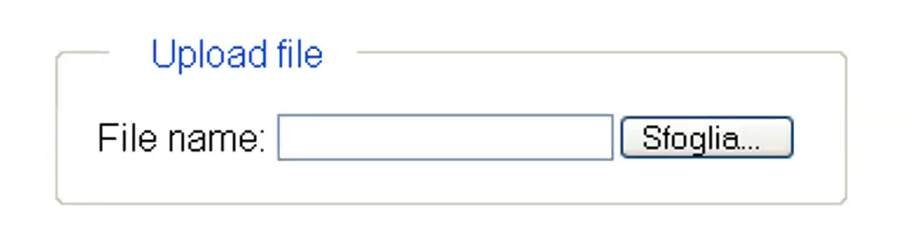

## textarea tag

The textarea tag allows the udser to type a text longer than a single line:

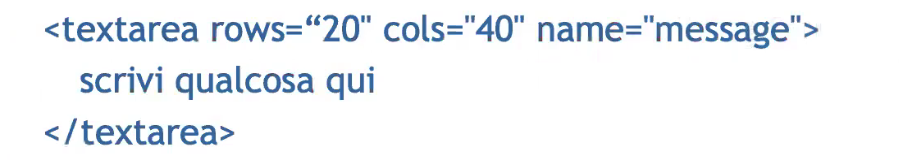

Where the rows and cols attributes are mandatory and textarea has an opening and closing tag

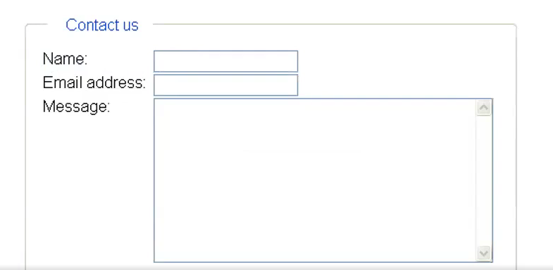

## select tag

It allows you to create a set of data, usually displayed as a dropdown menu where one or more selection can occour:

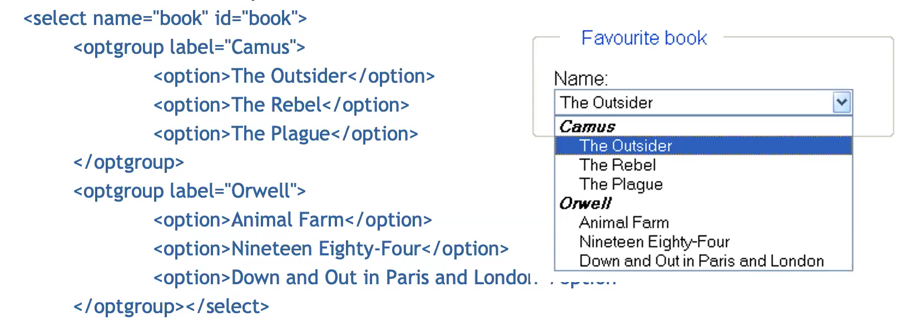

By default only the first choice is displayed but can be overwritten by the size atribute;
Once submitted it sends the tagname/chosen-content pair or its attribute value if present;
eg. book = "The Outsider"

## Datalists

They are quite similar to the select tag but it also allows you to type in the wanted selection and get prompted the most similar selection available

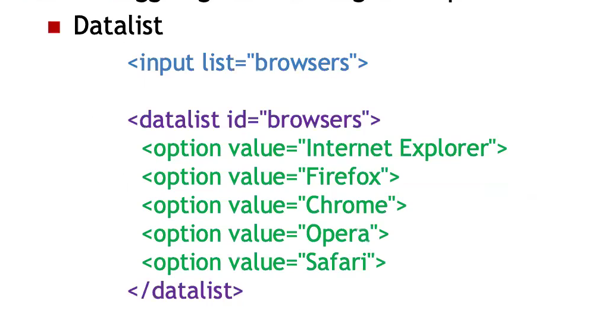

## Forms' innovations

New attributes added to the form> tag:
1. target: indicates where the reply should be shown (_blank, _self, _parent, _top, _iframename)
2. autocomplete
    
    - name: complete name
    - given-name: name
    - family-name: surname
    - (Do no ask for title)
    - (Use spellcheck="false")

3. Novalidate

And new tags:
1. keygen: allow you to create keys for a cryptographic system
2. menu: for contextual menus
3. output: works as a placeholder for  calculation results

New attributes added for the type attributes inside an input> tag:
1. number: added 2 arrows to increase and decrease the value while mantaining direct typing, and "range" value
2. color
3. email
4. url
5. tel
6. search
7. datetime, datetime-local, date, month, time, week

### New security attributes

1. required
2. formvalidate
3. pattern: contains a regular expression to validate input data
4. autocomplete, autofocus
5. spellcheck
6. min, max, step
7. multiple
8. placeholder: contains a suggestion

### DO NOT USE THIS TAGS

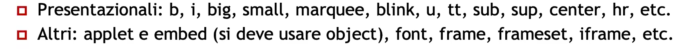

## Canvas

It is a bitmap element which allows you to draw elements in order to create animated images.
It must be used only when strictly necessary and need some fallbacks:

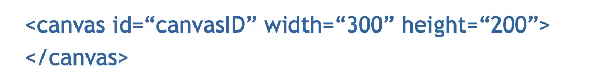

You can:
1. Draw shapes, texts, lines and curves
2. Color shapes, texts, lines and curves
3. Create gradients and patterns
4. Copy images, images from a video or even other canvas
5. Manipulate pixels
6. Export content

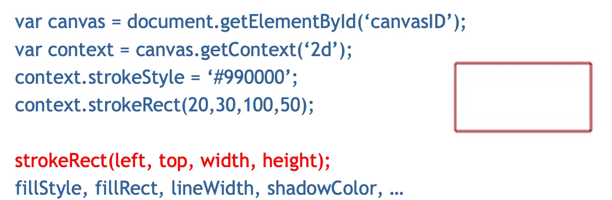

## Audio

HTML5 natively supports audio playback

audio src = "song.mp3" autoplay loop controls />

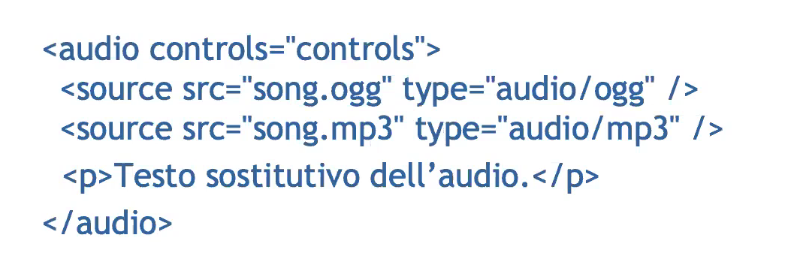

## Videos

HTML5 also supports video/audio playback, it is pretty similar to the audio tag

As it was for images, if you define the width and height directly onto the HTML file it will be a little bit faster to compute

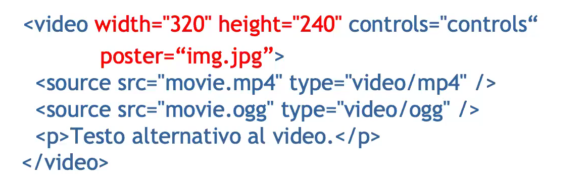

## Local features

In order to store client data HTML5 offer 5 different alternatives:
1. Web Storage: offers 2 objects "sessionStorage" (gets destroyed when the user closes the tab) and "localStorage" (gets destroyed when the user deletes cached data) which store data structured as a pair name,value> (the most simple one)
2. Web SQL Database: is a relational database
3. IndexedDB: it is based upon an object-oriented storage indexed very quickly and efficently

The ability to work offline is a need coming primarly from smartphones where it can occasionaly occour that they find themself without any internet access;

To allow them to continue their work we can use the "cache manifest" (.manifest) lists the resource accessible even without any connection.
It is a file where the first line must alway be:

CACHE MANIFEST

Comments are marked by # and must be on a different line;
The actual file is divided in sections: 
1. CACHE: every page defined in this section aris pre-downloaded and ready to be opened offline
2. NETWORK: every page defined in this section will not be downloaded since they require internet connection 
3. FALLBACK: this section allows you to define both the possibility, the page it is supposed to show when the network is available and its fallback if the network is not available.

Here's an example of a cache.manifest file:
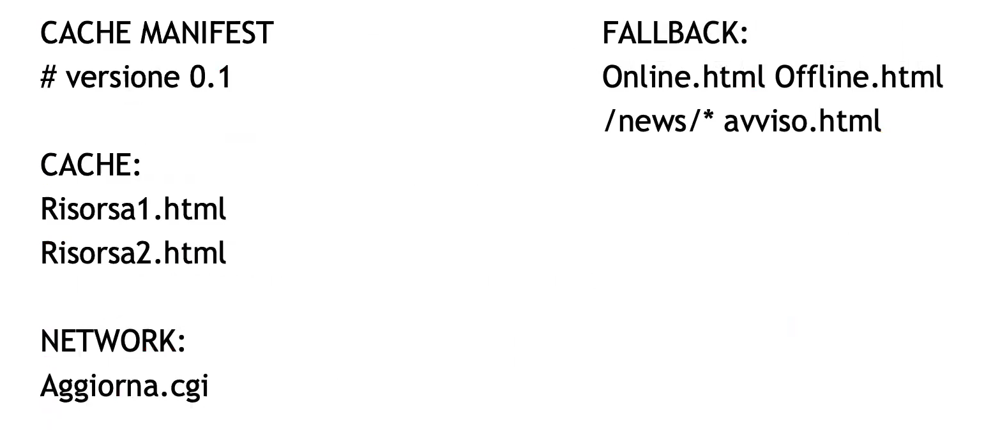

## CSS

CSS stands for Cascading Style Sheets, which allows us to apply different stile of visulization to HTML documents. 

It allows the developer to have full control over visual aspects of a webpages keeping well apart its presentation from his structure;
The C letter (cascading) indicates that the a document's layout information can be strucutred upon a stack of level and propagates from top level to the lower ones.

### Style sheet

A style sheet is a set of rules that defines a type of formatting to apply.
It can be defined inside an HTML file (using the "style" attribute) or in a separate file using the .css extension;

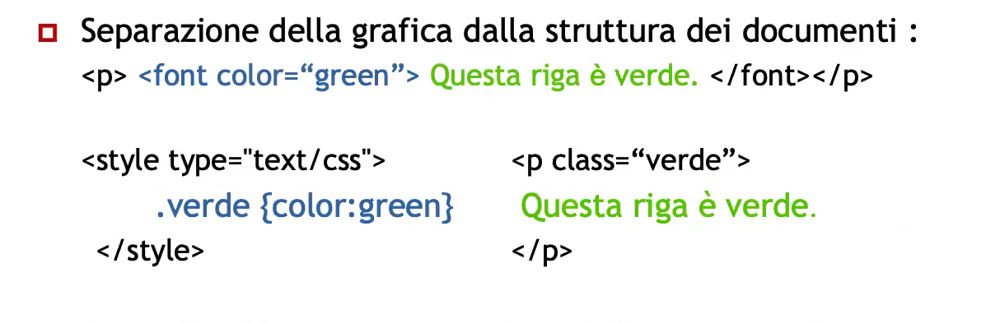

More precise control over the graphical interface, easier maintainability, smaller sizes and easy to use.

Here are some possibilities that CSS offers:

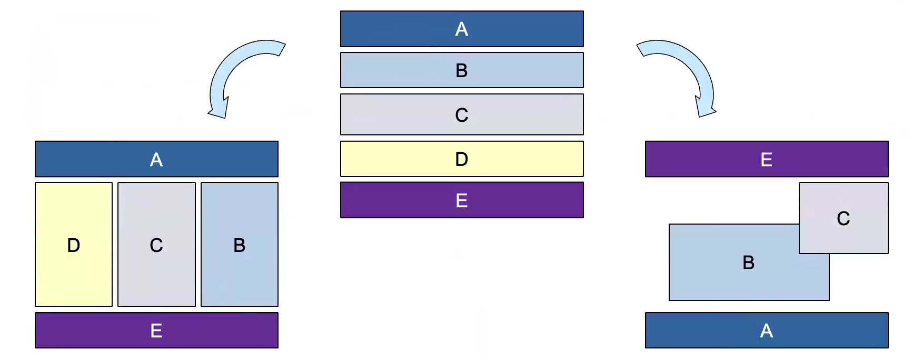

Pure CSS layouts gives us more freedom, such as: 
1. Side-by-side horizontal/vertical placement (no matter the definition order)
2. Hidden
3. Overlapped

The definition order must consider:
1. Search engines
2. Smaller devices
3. Assistive technologies

## Syntax Rules

The rules' structure is: 

And an example is:

### Single-element style application (NOT RECOMMENDED) 

It is not recommended because there is no separation between content and presentation

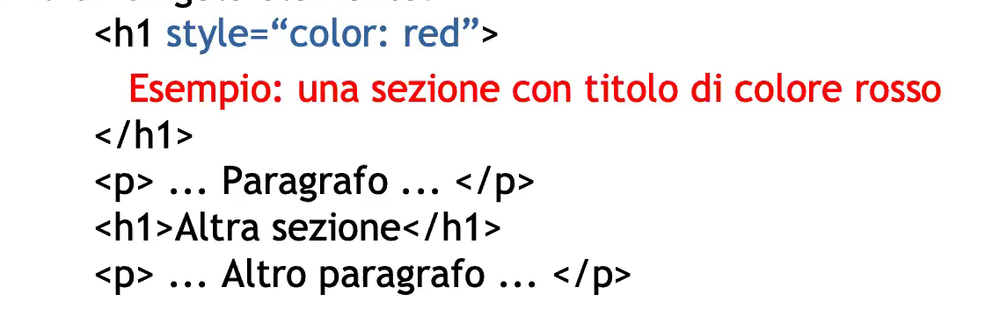

### Document-wise style application

This case shows the definition of CSS rules into the first lines of a document.

This apply only to the single page where it's defined.

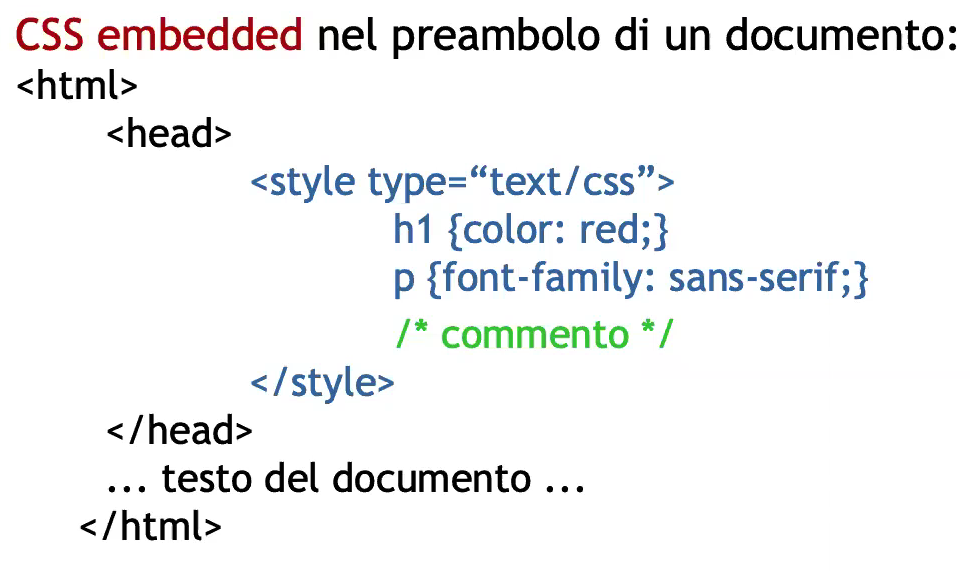

### External style sheets

This is the best practice for efficency and mantainability. It is possibile to import more than one style sheet and the last one takes the lead.

You need to link the HTML document to the style sheet this way:

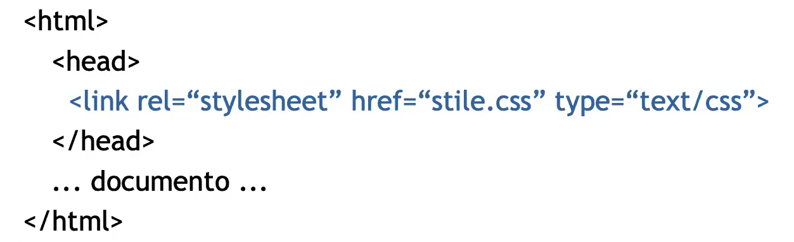

IMPORTANT: we need to define at least 2 stylesheets for screen (based on the size) and 1 for printable and screenreaders

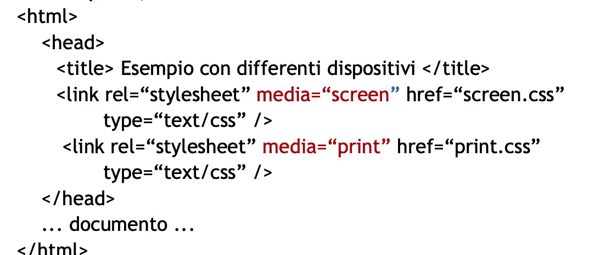

To address the first problem for screen this could be a valuable solution:

