# Description

13 oct. 2025 - CSS part 2

## @ rules (At rule): import

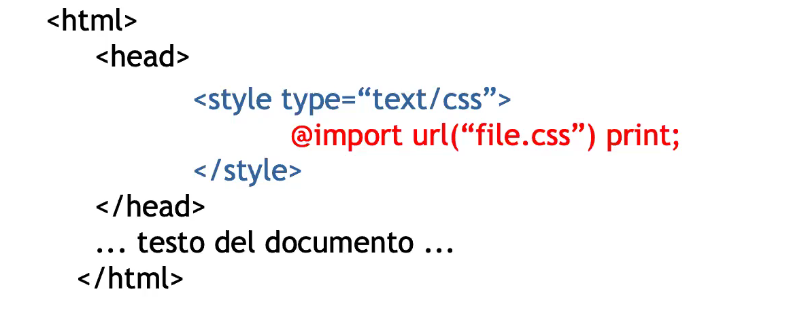

It is not reccomended for any situation apart from importing fonts where it is the only way to do it.

It can be useful to "hide" certain blocks of code since old browser (pre 5.0) do not interpret that keyword.

### Best practice? 

The obvious best practice for production is to use external style sheets files linked to the HTML ones.

### Rules application order

Once a style is defined for an element it gets applied to its subelements too. This is the case exept for a more "specific" override directly onto the subelements, as the eg. shows:

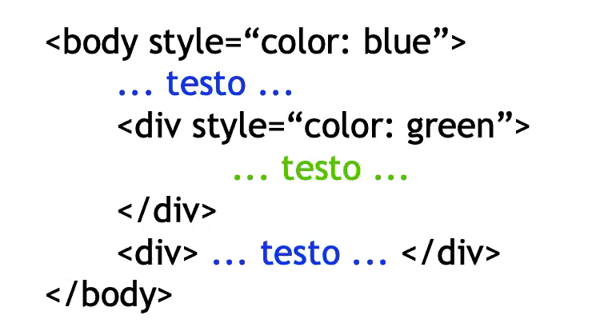

### Priority

1. User settings
2. (Declarations marked by !)
2. Inline-defined style settings 
3. Embedded-defined style sheets
4. Externally-defined style sheets
5. Default browser settings
    - used for undefined things or unsupported browsers

If you read it backwards you have the application order;

If you add the !important mark next to the value that will bring the rule to the 2nd position.

selector{property: value !important}

## Selectors 

They can be:
1. Type selectors
2. Attribute selectors

Type selectors refers to the element they want to format
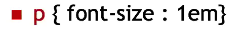

Attribute selectors refers to values of classes and ids attributes
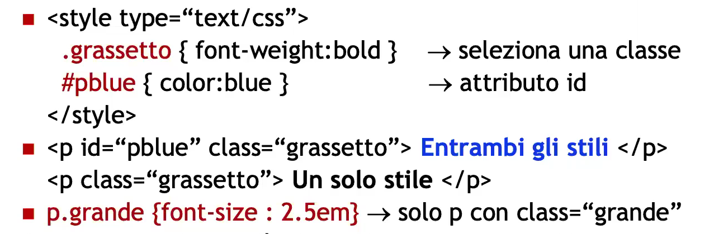

You can also apply them to more than one class into a single HTML element by spacing them correctly:
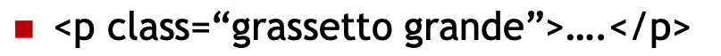

You can use * as a "universal selector" that means that everything defined in it will be applied to everything:
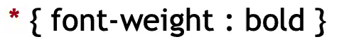

Selector grouping allows you to apply the same style to more than one type/attribute in a single definition:
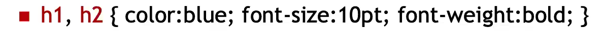

You can also define rules for direct children and descendants: 
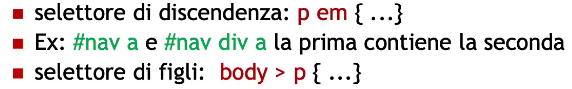
This basically means that, if you apply for eg. a rule like: "div em", that rule will apply to directly "div em" but also to "div p em" etc..
It also means that if an "em" has, at a some point a "div" ancestor, this rule will definitely apply to it.

There also exists something called adjacency selectors which work this way:
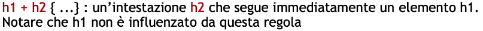

## Attribute selectors: deep dive 

Their structure is:

They allow you to select an element base on its value on a given attribute, for example:
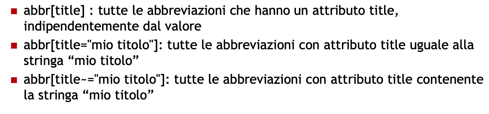

## Inheritance and specificity
Inheritance: every children inherit his father's settings

If two or more rules are defined for the same element (same relevance) the last defined will be applied 

In this particular case, every element with id="nav" will be orange-coloured because the first rule is the most specific one

## Specificity

In order to calculate the specificity for each rule we use this formula:
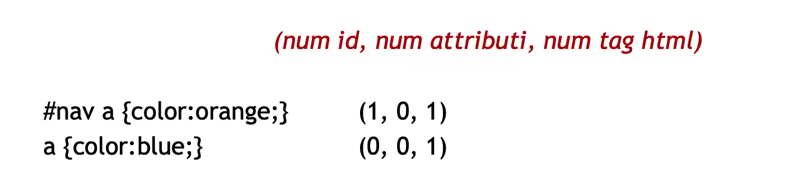

If any rule uses the !imortant mark, the specificity is then calculated upon 4 values, which the presence of the !important mark has more priority than anything else

## Pseudo-classes

They do not define a specific element itself but one or more states

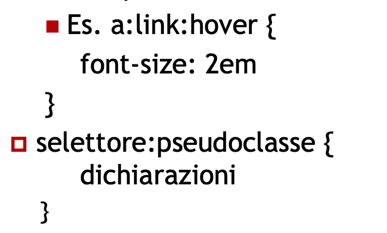

These are the most important ones:
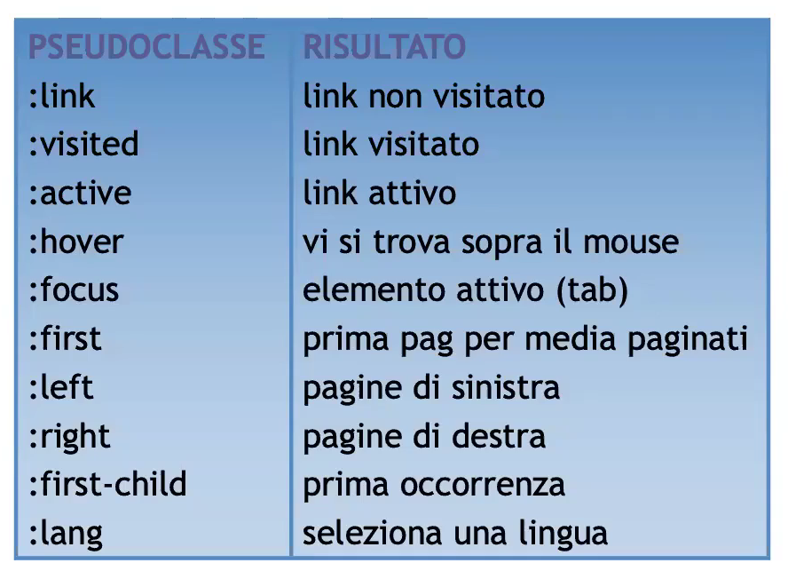

Others are:
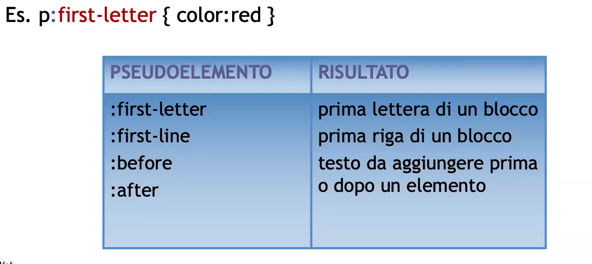

## Measurements systems

There are different measurments units, which are primarly divided into 2 categories:
1. relative: ex, em, percentage, rem, vh (viewport height), vw(viewport width)
2. absolute: cm, mm, in, pt, px, pc

Here is the table and some examples:
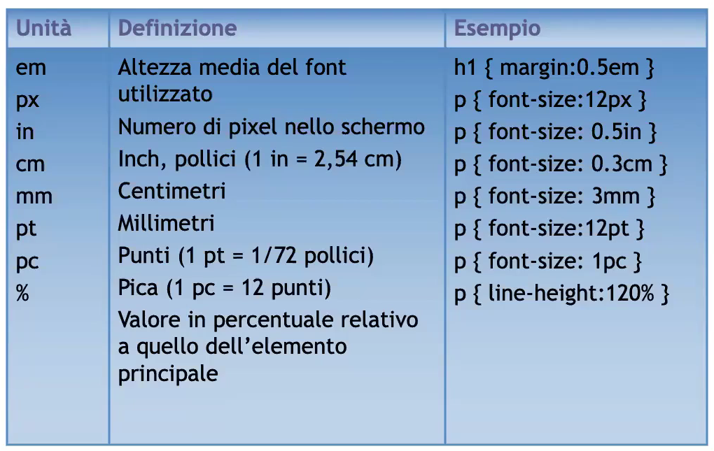

## Colors definition

Default colors are:
1. White
2. Red
3. Green

We can represent them as RGB
1. #RRGGBB
2. rgb(y,y,y) or rgb(y%,y%,y%)