# Description

14 oct. 2025 - CSS part 3

## URLs definition

They are defined this way:

url(protocol://server/path)

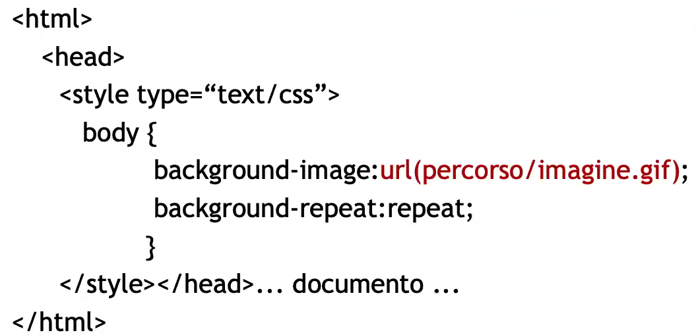

## Font choice

If no font is declared the browser take the lead and use its default one; In any other case, the "font-family" property allows you to specify the character type:
1. font-family: Arial, Helvetica, sans-serif
2. font-family: "Times New Roman", Symbol

A good practice is to always provide a set of fonts instead of just one to ensure the largest possbile case coverage.

It is really important to prefer readability over a more stylistic but unacessibile font!

Fonts can be grouped in 2 main categories: 
1. Proportional: each character occupy a different amount of spacing
    - Times, Helvetica, Arial, etc..
2. Fixed: each character uses the same amount of spacing
    - Courier, Monaco, etc..

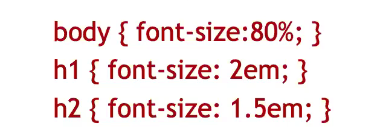

It is also a good practice to only use relative dimensions for text using em. Having to deal also with printings you may want to define another style sheet where you user absolute dimensions using pixels

### Font styling

1. Dimesions: font-size
2. Interline: line-height (must be at least 1.5)
3. Overlap: z-index
4. Italic: font-style 
5. Boldness: font-weight(bold,normal,bolder,lighter)
6. Variant: font-variant (eg. small-caps "maiuscoletto")

We can also define every property in a single selector:
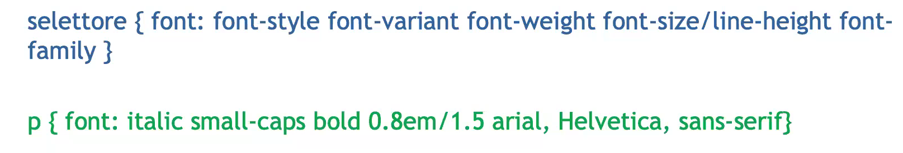

### Other styling elements

1. Letters spacing: letter-spacing
2. Word spacing: word-spacing
3. Indentation: text-indent
4. Horizontal alignement: text-align
5. Vertical alignement: vertical-align

## Importing external fonts

The @font-face rule allows us to download and use custom fonts:

@font-face{font description>}

The font description contains "describer:value" pairs where the describer could be:
1. font-family: font naming
2. src: local(LOCAL_PATH)/ url(URL)
3. font-style, font-weight, font-variant, font-stretch etc...

## CSS images

Images' properties can both be defined via CSS and via HTML using img tag; The only reasonable way to chose which one to use is based on the image purpose:
if the image brings some content to the page, such as infograph, descriptive etc.. you should ALWAYS use the HTML implementation via img tag since it also allows you to define an "alt-text" to make the content accessibile;

On the other hand, if the image is purely decorative you can use the CSS implementation with no risks of losing infomation.

This is how you implment and image via CSS:
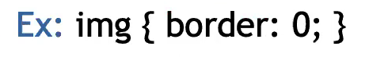

In order to keep structure and presentation detached from each other a good practice is to set images as a background for div or others elements:
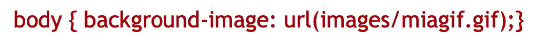

Properties:
1. background-attachment: establish where the image should or not follow the page scrolling 
2. background-repeat
3. background-position

We can also define every property in a single selector:
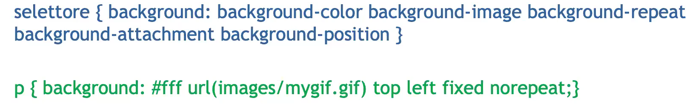

ATTENTION: unlike the fonts, the definition order is irrelevant

## Box model

It is a rectangle where an element is shown

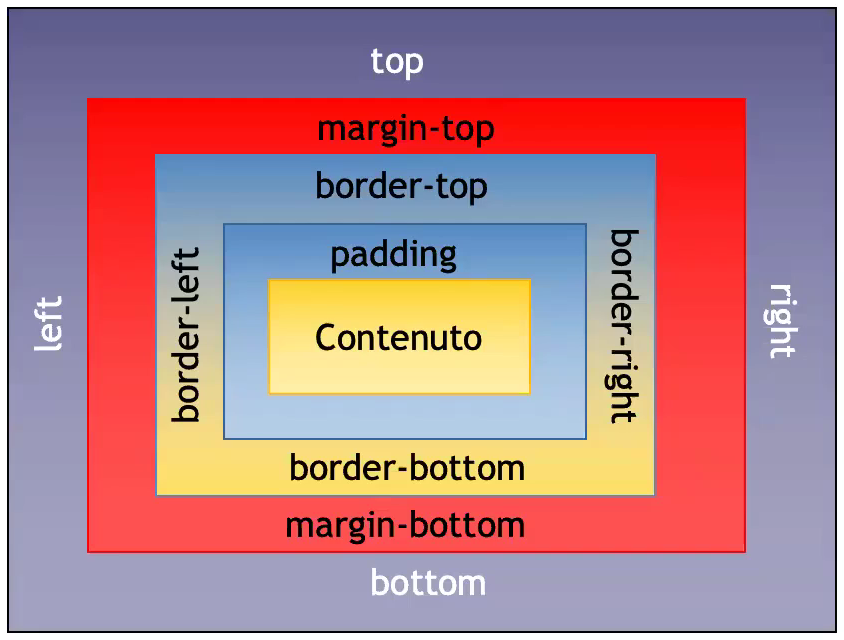

Using width and height we are not actually defining an element's dimensions, instead we're only defining its contents' one. 

For example: if we declare an element with 100x50 dimensions with borders,padding and margins dimensions of 50px on each side, the actual measurment is 400x350px

CSS also define min-width and min-height

Overflow: if the box doesn't fit into the viewport, overflow controls what to do with the exceeding box dimensions;
Its possible values are:
1. visible
2. hidden
3. scroll
4. auto

Backgrounds and colors occupy both the content and padding area!

### Rounded corners

To achieve rounded corners you can use this properties via CSS:
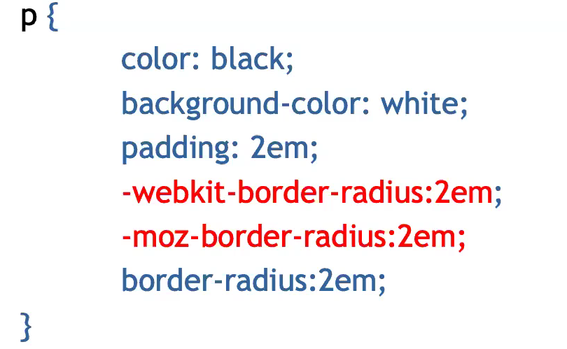

To calculate the radius that best fits your needs you can use this website: http://border-radius.com/

### Rollover effects

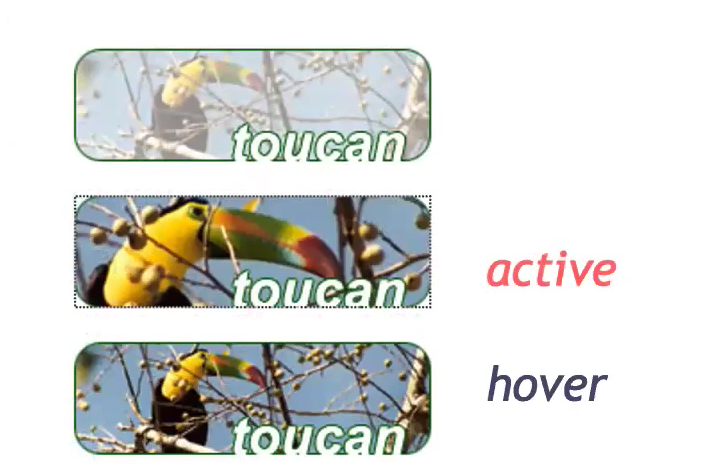

The implementation for this layout is: 
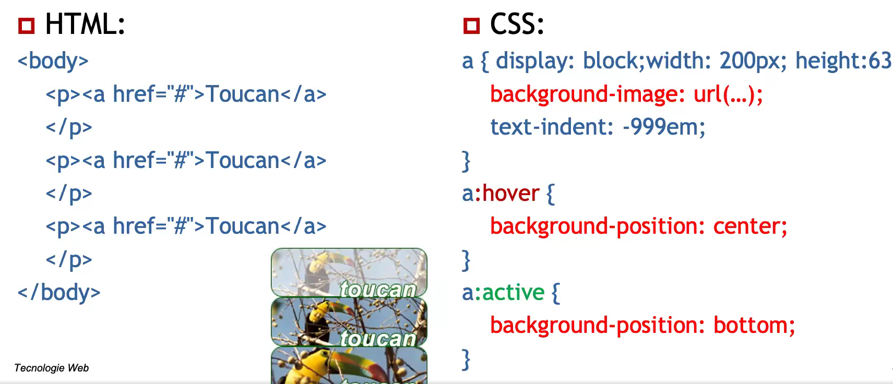

## Padding, borders and margins (abbr syntax)

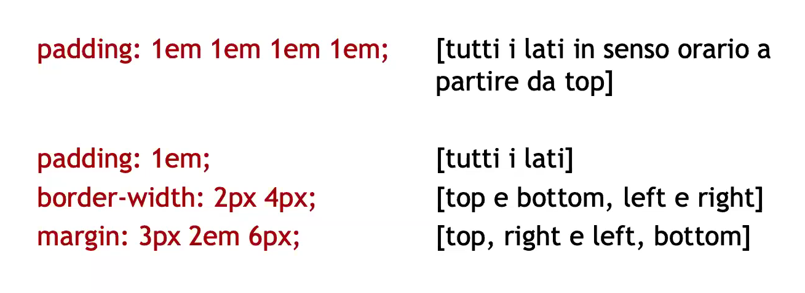

### Borders properties

1. Width: border-top-width, border-right-width, etc...
2. Style: border-style (solid, dotted, dashed,  etc...)
3. Color: border-color

### Margin collapsing

If 2 or more margins touch each other on the Y axis, the smaller one collapses and won't be displayed

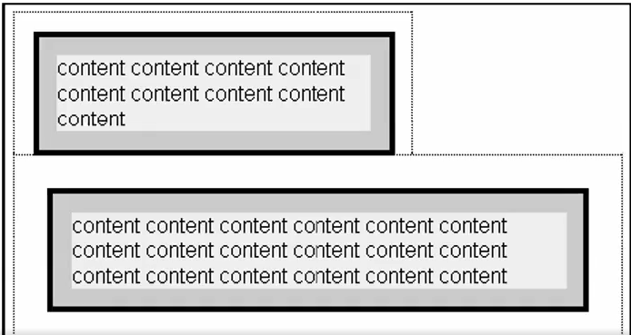

## Display

The display clause allows us to change and inline element into a block element and viceversa;

Elements are diveded in two categories:
1. Block elements: div, p, etc..
2. Inline elements: em, span, etc...

display:none prevent the item to be shown and can be used to delete some elements when printing the page and should not be used frequently because it hides the element to the screen-readers too

## Position and float properties

CSS2 allows to act directly onto the elements displacement across the page, the different modes are defined using the position property:
1. static: box displaced according to the normal flow
2. relative: as the previous one initally but then calculate top,bottom,right and left (do not affect the following boxes)
3. absolute: box are positioned according to the top left corner 
4. fixed: as the previous one but do not move upon scrolling
5. float property

Static vs relative positioning:
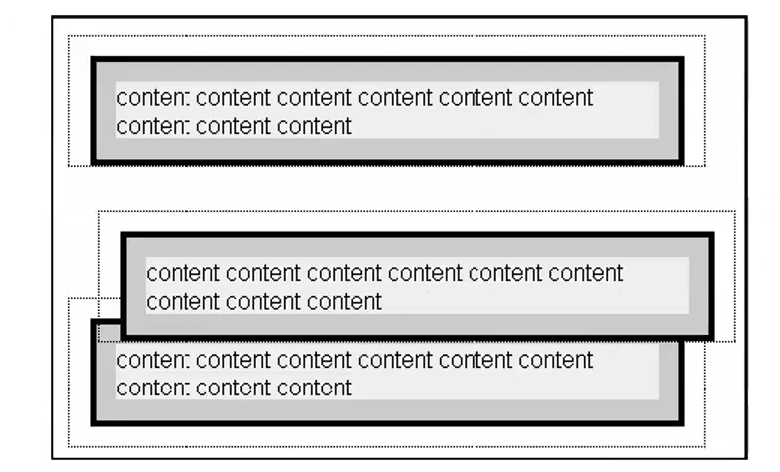

### Float property

A floating-defined block moves to the right or left according to its container and allows the rest of the content flows around and below it;
A floating box behaves as a block box.

The "clear" property allow the containing box starts below the floating box
1. clear:right/left: position itself after all the floating box to their previous right/left boxes
2. clear:both: position itself after all the floating previous boxes

CSS3 introduced "shape-outside"
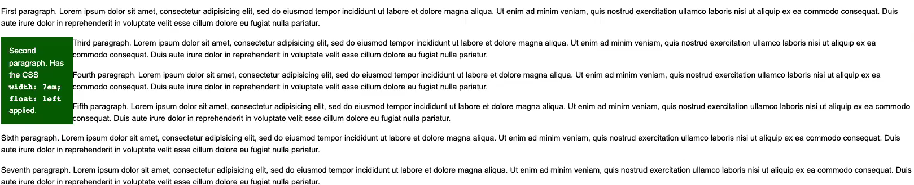