# Description

22 oct. 2025 - CSS part 4

## Main style sheet

We want to create this exact website:
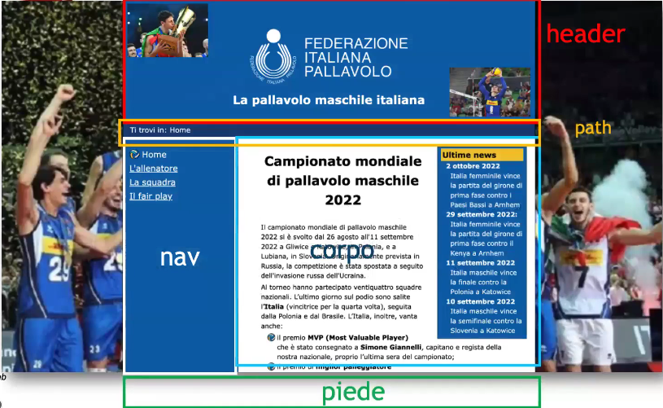

As you can see from the following example we:
1. Set everywhere padding and margin to 0em (overrides default browsers preferences)
2. Apply to html and body the same properties 
3. Add a background image to the whole page (background-size could be auto,contain,cover, % or px)
4. Define properties for the h2 contained inside the header

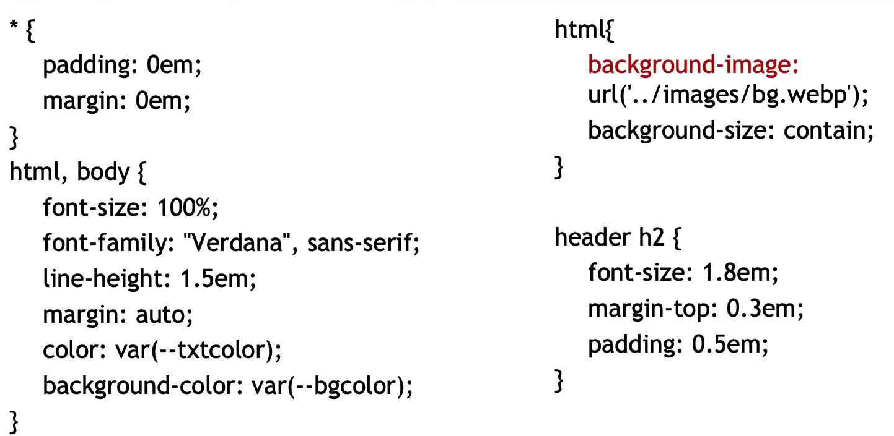

Continuing:
1. Styling the menu with the "old method" (pre-grid) using float and adjusting its size to 25% 
2. main is used to let the menu has some room below the entries
3. Styling the breaking news using float method again

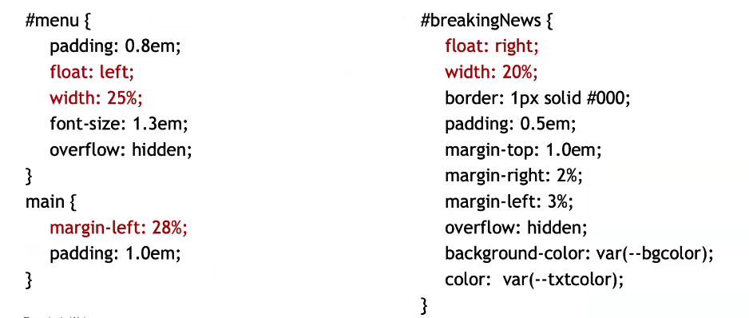

## Printings

The core idea is to create a CSS able to make the "default" auto created printing view in something more eye-pleasing as follows:
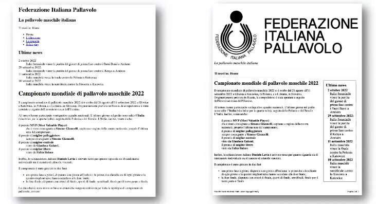

As you can see from the following example we:
1. Used a serif font (easier to read on printings)
2. No need to use relative measures (we can use px or pt etc..)
3. Hide the the menu (useless on printings)

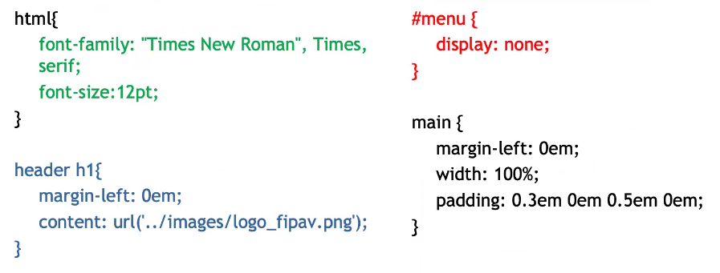

## CSS3 
### New attribute selectors
1. elem[attr]: applies the rule to every elem tag who has an attribute attr
2. elem[attr=value]: applies the rule to every elem tag who has an attribute attr with value = "value"
3. elem[attr~=value]: applies the rule to every elem tag who has an attribute attr with in value a set of words divided by spacing containing the substring "value"
4. elem[attr|=value]: applies the rule to every elem tag who has an attribute attr with in value a set of words divided by | where the first word is "value" or one in them is "value"
5. elem[attr*=value]: applies the rule to every elem tag who has an attribute attr with value containing the substring "value"
6. elem[attr€=value]: applies the rule to every elem tag who has an attribute attr with value ending with the the substring "value" (or ^ for starting)

### New pseudo-classes
1. :target acts on the link anchor, that means on the link's destination on its activation (for eg. if you have a link to a header, on click that header you are redirected to from the link can change)
2. :enable, :disable, :checked act on the inputs forms (radio,checkboxes, or options) when they are in one of these states
3. :not (selector)
4. :default
5. etc...

### Position-based pseudo-classes
1. :nth-child(n) is the n-th child element of his father
    - eg. li:nth-child(3) every bulleted list element in 3rd position (third child of an ul)
2. :nth-last-child(n)
3. :nth-of-type(n) (eg. p>) is the n-th child element of the same type (eg. the n-th p> child) of his father
4. :only-child is the only child element of his father
5. :only-of-type is the only child element of his father of that type

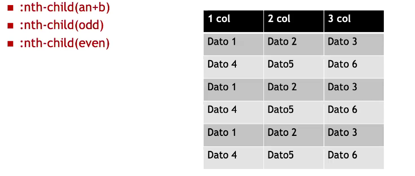

And that's how you implement it
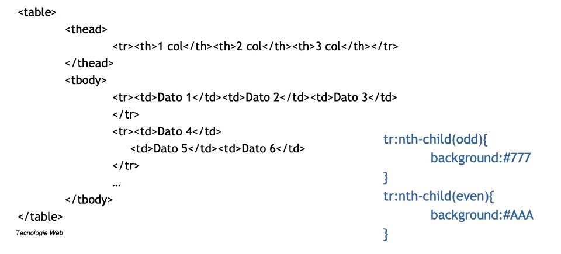

## CSS variables

Often, in layout definition you can see some common traits as:
1. Colors
2. Font dimensions 
3. etc...

Pre-processors requires prefixes: eg. $ in Sass and @ in LESS

You define variables as --variableName, and you can use them with the function var(--variableName)

By design variables are local (exists only inside that specific block) but you can also define them globally inside the :root selector
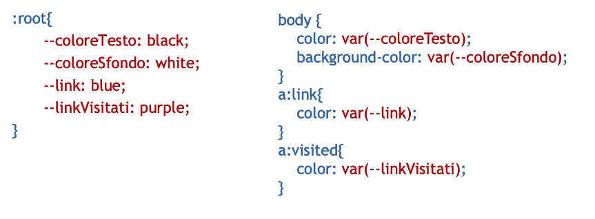

## RGBA & Opacity

CSS3 defines a new color model which is called RGBA where A stands for Alpha channel where A is representing the opacity. 
The A value is has to be set in a range between 0 (transparent) and 1 (opaque).

If you want to do that to an element you can use the opacity attribute:
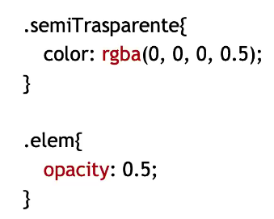

## Shadows

You can use shadows on text and elements, it allows you to specify the direction, radius and shade of color:

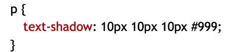

The syntax is similar for elements (especially boxes) too: 
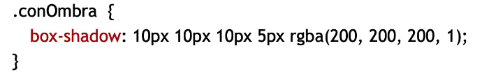

You can create your custom shadows at https://css3generator.com

## Transitions

Here there are some example:
1. transition-property: the property to apply
2. transition-duration
3. transition-timing-function: function that model the transition's behaviour (ease, linear, ease-in, ease-out, cubic-beizer, etc..)

### HTML

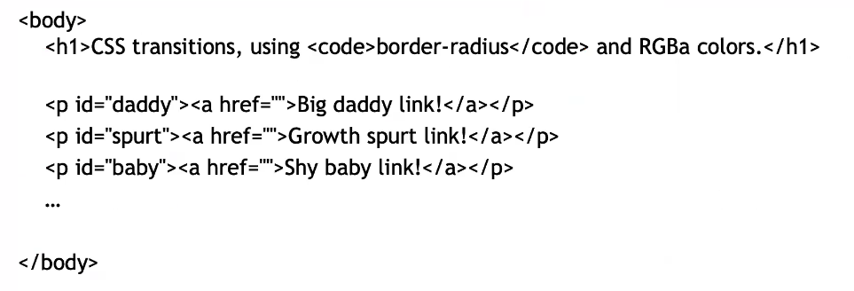

### CSS

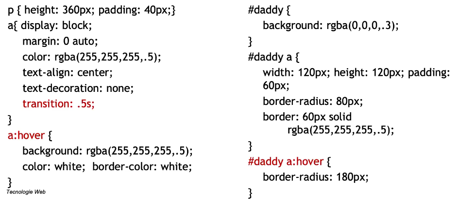

In order to be accessible and to be assured it will work on any modern browser we use 
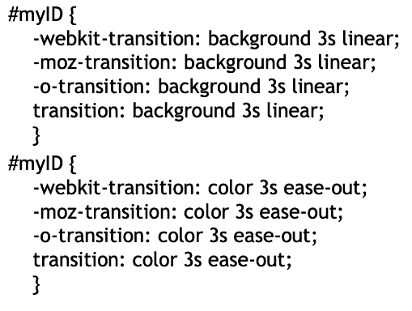

## Media queries

Media queries can be found inside CSS with @media or as an attribute for a tag link; They are used to assign different style sheets based on different possibilities:
1. screen vs print
2. desktop vs mobile etc...

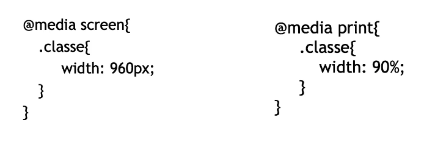

or in CSS3: 

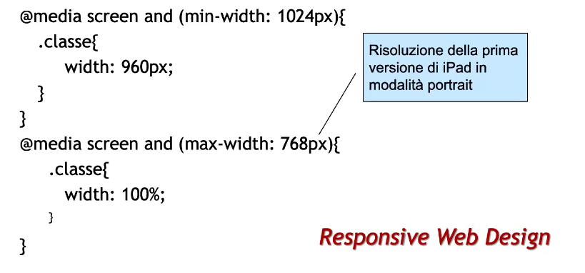

and also allows to manage device orientation:

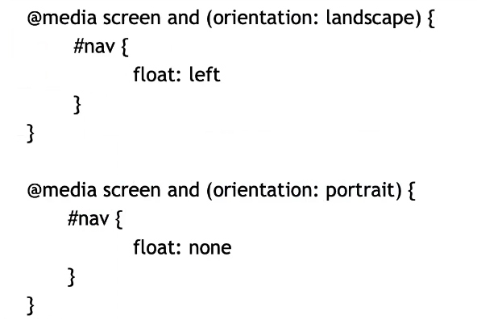