# Description

22 oct. 2025 - CSS part 5, and Accessibility part 1

## Page layout in CSS3

CSS3 defines 3 new layout models:
1. Multi-column layout
2. Flexible Box Layout
3. Grid Layout

They are fully supported now  so can be used freely, just know that they are quite heavy on the rendering side so be careful to no nest them too much;

### Text columns

It is used to display text on a column-based layout; it has 4 main properties:
1. column-count
2. column-width
3. column-gap: the gap between 2 columns (in px or em)
4. column-row-style

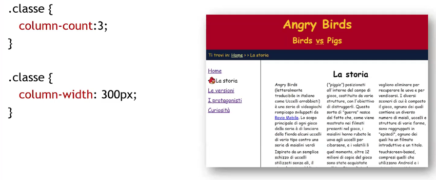

## Multi-column layout

The result we want to achive is something like this:
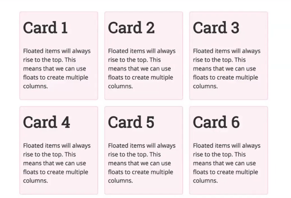

We can achive this using the "old way" using floats:
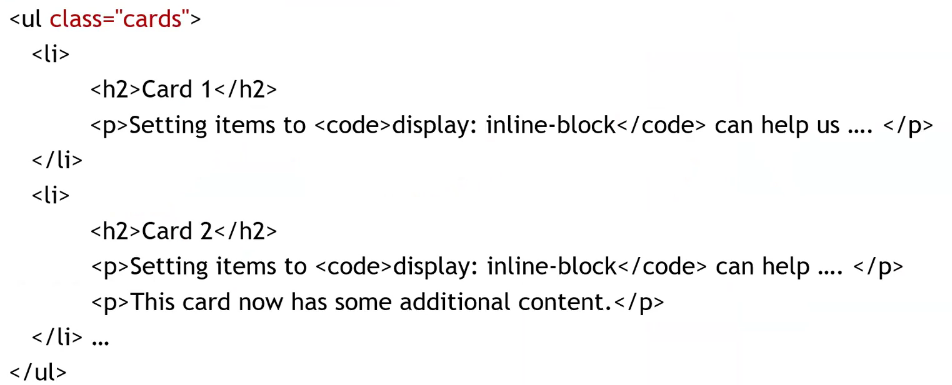

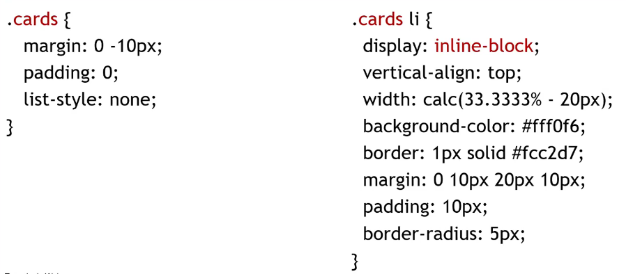
We use "inline-block" to get the card item the property of acting both as an inline (no new line) element while having its own dimension

The other way we can (and should) do it is using the FlexBox

### FlexBox
---

They allow to obtain the same result without editing the structure and it is way better interpreted by any device format.

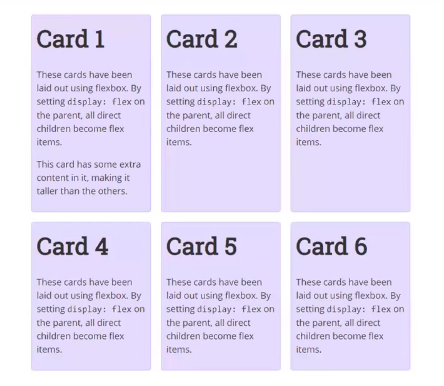

We keep using the same HTML as before with the updated CSS to implement FlexBox; the new display value is "flex" that means that it is a flexible container.

flex-wrap attribute is used to let it know how to behave on the end of the line, on the "no-wrap" value it will try to make everything fit on a line. On the other hand, if the value is set to "wrap" it will behave like a text and go on a new line when the spacing ends.

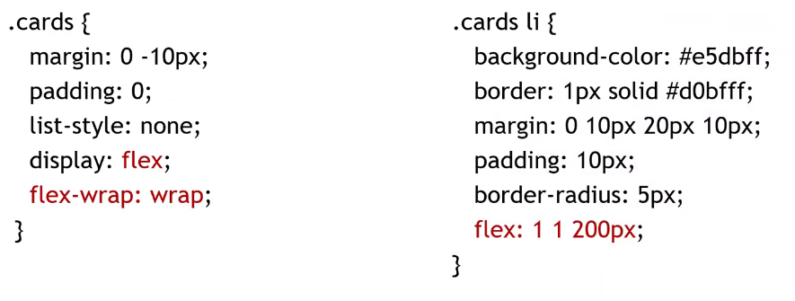

Once we define something to be "flex" we need also define flex for everyone of its children: it defines how the behave on the width side, in this case it will try to create 200px elements, and use the remaining space as follows:
1. If the first number is >= 1 it will use the remaining space to enlarge the boxes 
2. If the second number is >=1 it will use the remaining space to try and shrink the boxes (?)
3. If both of them are set to 0 they will ALWAYS use the 200px setted size;

### Flex properties

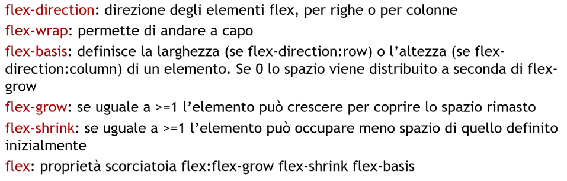

### Flex alignment

align-items: specify where every element is aligned (align-self is only referred to itself)

1. flex-start: at the start of the container
2. flex-end: at the end of the  container
3. center
4. stretch: fill the container

align-content: asks for a flex-wrap:wrap to be defined, and acts on the y axis when the container is bigger than the content (default value: stretch)

### Grids
---

Grids are very powerful strucutres that allows us to create a bidimensional grid where we can insert elements.

The measurment unit is "fr", and its defined as "fraction of the available space":
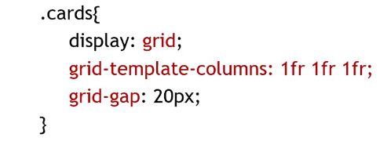

The fig1.2 one is called "grid-line", the fig1.3 is called "track", fig1.4 is a "cell" and fig1.5 is a "cells area"

### Grid properties

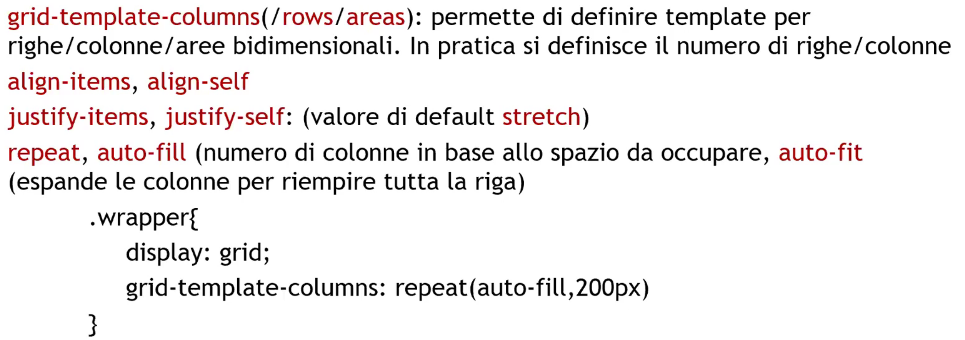

On the following example we now give the display attribute the grid value and then define their size inside eache card element (eg. card1 is occupying from the 1st column included to the 3rd column excluded) etc...

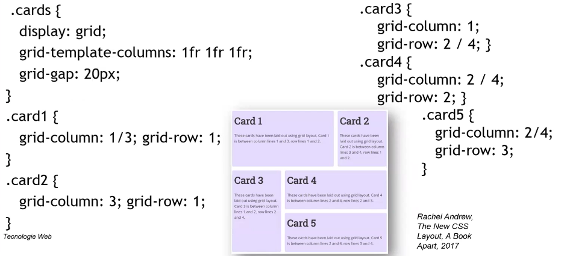

Or we can define areas and then assign each card to that specific area as follow:
(note that the "." means that cell won't ever be occupied)

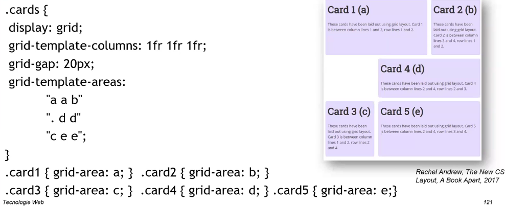

## Accessiblity for the web

"Accessibility is a product's usability with the widest radius of ability"

For the alt-image attribute is a good practice to stay within 100 characters.